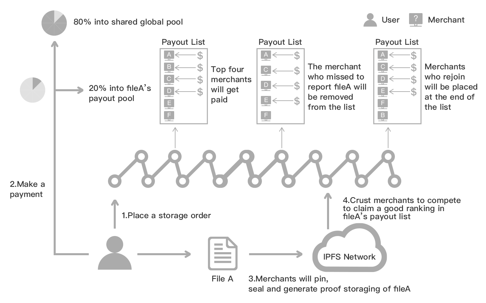

DSM (Decentralized Storage Market) provides a decentralized version of IPFS pinning service. It allows storage users to place storage orders on the chain, and the files (IPFS CID list) specified in a particular storage order will be stored by nodes. DSM also takes care of incentivizing storage nodes to provide retrieving service.

DSM contains 4 major mechanisms. For more details refer to [Crust economy whitepaper](https://ipfs-hk.decoo.io/ipfs/QmRYJN6V5BzwnXp7A2Avcp5WXkgzyunQwqP3Es2Q789phF):

## 1. Storage Order Mechanism
* Currently, each storage order would be stored on the Crust Network for six months. The duration of storage order can be decided by the demoncracy to extend or shorten.
* Any node that submits corresponding storage proof will be added to the payout queue of the file payment queue, the top four nodes in the queue will get the reward of this file's reward.
* Any node that submits corresponding storage proof will get a delay staking limit increasement (by 2x to 10x). Those nodes will be able to get additional staking income from the overall staking reward.

## 2. Price Mechanism
### Component

1. **Base Fee**: Crust Network need payout some network resource and neccessary compute resource to serve each file, thus a base fee would be charged.
2. **Byte Fee**: Each file has different size and would cost different space resource, thus a byte fee is reasonable. The unit for byte fee is CRU/MB.
3. **Key Count Fee**: Crust Network need store on-chain data for each file. Too many on-chain data would decrease the performance of the whole Crust Network. The Key Count fee would be charged for on-chain state.
4. **Tips**: User can give arbitrary tips for each file when he places a new order.

### Dynamic Adjustment Mechanism

| **Fee**                 | **Resource Cost**                              | **Update Frequency** | **Speed of Variation**   ｜
| :---------------------- | :--------------------------------------------- | :------------------- | :----------------------  |
| **Base Fee**            | Network and computing resource                 | 1 hour               | Fast (-3% ~ 9%)          |
| **Byte Fee**            | Disk space resource                            | 1 minute             | Low (-0.0005% ~ 0.0006%) |
| **Key Count Fee**       | On-Chain db space and performance              | 1 minute             | Low (-0.0005% ~ 0.0006%) |

Except for the tips, the other three components of the price will dynamically adjust according to the network/compute resource, storage usage and the on-chain state usage.

**Base Fee**: In a period of time, the number of storage orders that can be served by Crust Network is limited due to the current network and compute resource. So if too much storage orders are placed in a limited period of time, the base fee would increase. If the Crust Network is not busy, the base fee would decrease. 

If the Crust Network is not busy, according to the global network and compute resource, each file would be stored and have more than 50 replicas. If the Crust Network is busy right now, the whole network cannot serve all storage orders, then each file's replica would decrease.

Specifically, the number of new storage order, denoted as alpha, in the last hour would be recorded. Meanwhile, the total number of replicas served by the Crust Network, denoted as beta, would be recorded as well. The ratio between beta and alpha would decide the base fee. If the ratio is larger than 50, the base fee would decrease. If the ratio is less than 30, the base fee would increase. The smaller the ratio, the faster the rise speed of the price.

The adjustment speed of base fee is high. The base fee would update per hour. If the network condition continues to be congested, the base fee would be doubled in hours. If the network condition is free right now, the base fee would be halved in one day.

**Byte Fee**: Each file need cost the disk space, if the whole disk space is not enough, the byte fee would increase. In the early stage of the Crust Network, the byte fee would keep falling down.

Specifically, the ratio between the total size of the meaningful files and the total disk space decides the byte fee. If the ratio is less 75%, the byte fee would fall down. Otherwise, it goes up.

The adjustment speed of byte fee is low. The byte fee only change when new storage order appears. The byte fee would be double if there are continues new storate orders in one week meanwhile the ratio is higher than 75% and vise verse.

**Key Count Fee**: Each file need store some data on the Crust Network Chain. The adjustment mechanism for key count fee is similar with the byte fee. Only the ratio is the number of current active storage orders. If the ratio is higher than 20 million, the key count fee would increase and vise verse.

**Tips**: It's an arbitrary value. User can decide how much he wants to give.

### Price Flow
In order to maintain the interests of all parties and maintain the long-term and stable development of the crust network, different fee would be allocated to different parties.

**Base Fee**: Base fee would enter the market revenue pot. No one can recieve the base fee directly. The democratic module will vote on the use of the revenue from the market revenue pot.

**Byte Fee and Key Count Fee**: Part of the fee will enter the file reward pot, which would be allocated to the merchants who store the files. The remaining part will join the entire network staking reward pot. All validators and candidates would recieve this part.

**Tips**: Tips are voluntarily provided by users to storage merchants, and all fees will enter the file reward pot.

## 3. File Order Assurance, Settlement and Discount
* File Order Assurance:
In the Crust network, each file has a file assurance pool. Users can pre-paid CRU to this assurance pool. At any time, other agents in the network (including users themselves) can use the funds in the assurance pool to renew files. When the file is still valid, there is no benefit from the agent's operation to renew the order. When the file expires, the agent will receive the agent income when operating the renewal order.

* File Order Settlement:
After the user places an order and stores the file, the first 4 merchants who submit the storage proof can continue to obtain order revenue, and this revenue needs to be claimed before it can be collected by the merchant. The order settlement mechanism is a mechanism designed by Crust Network to better manage the file order system. Any Crust user can act as a clearer to settle unsettled orders in the network. When the settled order isan order that has expired, the clearer will receive the agent settlement income. The clearer can lock CRU to obtain the fee reduction for settlement transaction. More details can be found in [orderSettlement](orderSettlement.md)

* File Order Discount: Users can get the discount rate for file orders by locking the CRU, and the locked CRU can also get a the fee reduction for settlement transaction. Discounts can reduce file base fees, dynamic file size fees, and dynamic key-value fees. The maximum discount rate is 10%.

## 4. Retrieval Mechanism
As a data storage system, besides the storage market, DSM also takes the responsibility of incentivizing the nodes to provide retrieval service. Therefore, DSM includes another layer of incentives to encourage nodes to support data retrieval:

   * The data retrieval mechanism in Crust Network follows the [IPFS Bitswap Protocol](https://docs.ipfs.io/concepts/bitswap/). By such, data can be shared and exchanged among the nodes of the entire IPFS Network.

   * Crust Network provides a highly efficient retrieval pointing mechanism. Enabled by the Bitswap protocol and using a “credit” mechanism, nodes can resist those “free-riding” nodes that only seek to pull data without providing retrieval services. Building on the Bitswap credit mechanism, Crust Network makes the access to trusted on-chain information available for nodes, further boosting the Crust Network credit mechanism.

   * Crust Network nodes provide reliable retrieval services. The initial earning of Crust Network nodes comes from [Network Staking——GPoS](GPoS.md), and storing more user files can translate into increased effective stake limits for nodes. Driven by such a bonus and coupled with Crust Network credit mechanism, nodes offer to provide corresponding retrieval services so as to receive more user files.

Users can experience DSM in [Crust Apps](https://apps.crust.network/#/storage).
