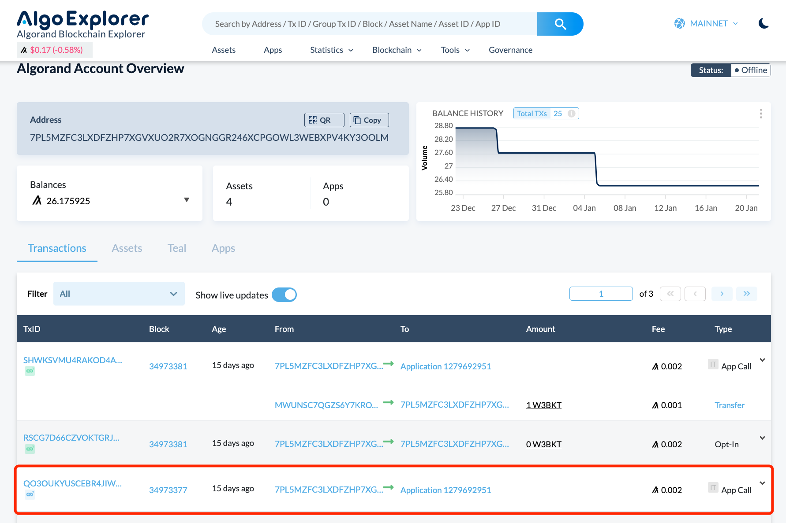
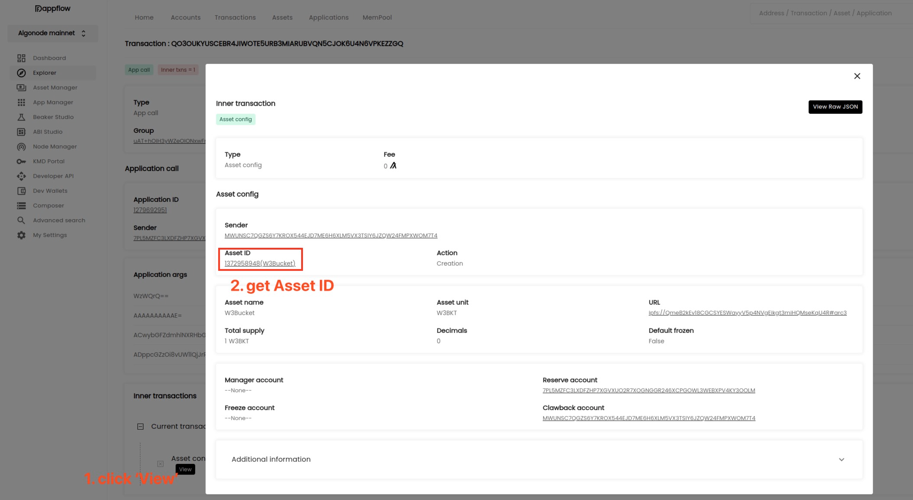
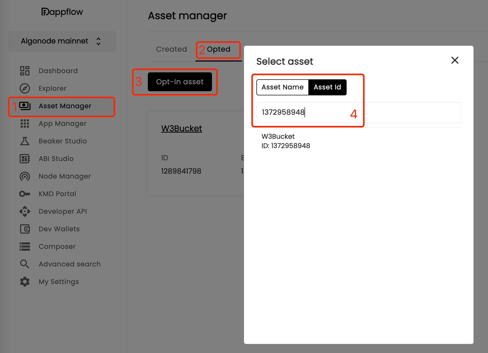
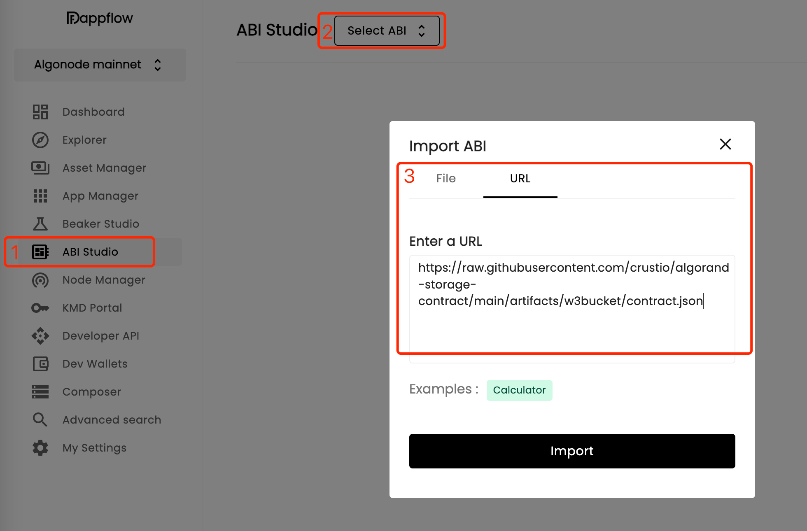
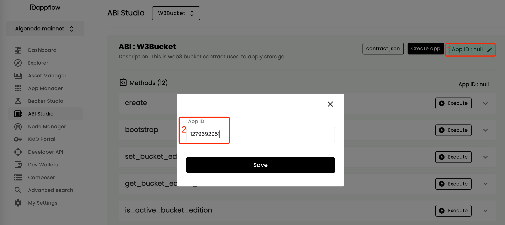

## Crust Cloud

### No bucket after payment for Algorand

There are two signings needed for minting w3Bucket, one for payment, another for claiming the generated NFT asset. If user misses the second signing(sometimes error occurs because of network delay), the mint progress will fail. In this situation the bucket NFT has been generated, but have not been claimed by user. To get the bucket NFT, please follow the steps below.

1. Find your mint transaction in [algorand explorer](https://algoexplorer.io/), for example:

2. In the mint transaction find the minted NFT asset id, in this example we can see the asset id is **1372958948**

3. Login [dapp flow apps](https://app.dappflow.org/explorer/home), then opt-in the asset id (If you have done this, skip to next step):
  - select 'Assset Manager' on the left sidebar
  - select 'Opted'
  - click 'Opt-In asset'
  - select 'Asset Id' and input the asset id(in this example it's 1372958948) in the blank

4. Import the contract ABI:
  - select 'ABI Studio' on the left sidebar
  - click 'Select ABI'
  - select 'URL' in the 'Import ABI' pop-up window and input **`https://raw.githubusercontent.com/crustio/algorand-storage-contract/main/artifacts/w3bucket/contract.json`** into the blank.
  - click 'Import' to import the contract ABI

5. Edit w3Bucket application Id. After the contract ABI loaded, you can see the ABIs.
  - click 'App ID:null' on the top right corner
  - input the w3Bucket application Id: **1279692951** and save

6. Execute claim method:
  - click 'Execute' on claim method.
  - input the bucket NFT asset id(in this example it's 1372958948) into the 'token(asset)' blank
  - click 'Execute' button to claim your w3Bucket NFT
