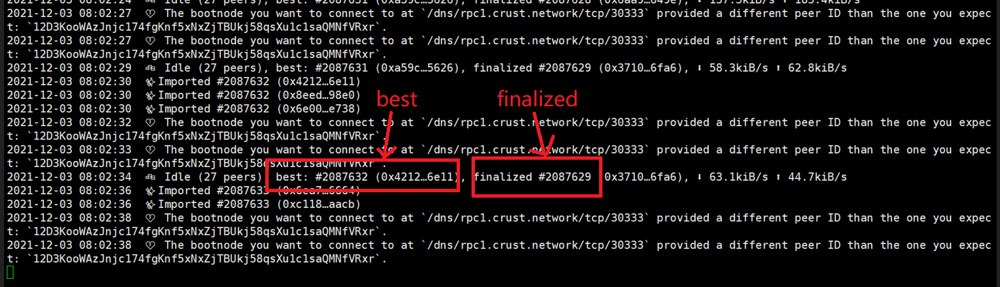

## 1 Owner & Isolation node

### 1.1 Confirm that the chain synchronization is normal

View the log of the chain with the following command:

```shell
sudo crust logs chain
```

If the best block reaches the highest block (the highest can be viewed on [APPs](https://apps.crust.network/?rpc=wss%3A%2F%2Frpc.crust.network#/explorer), and the gap between  finalized block and best block is less than 5 blocks, that indicates the chain is in normal condition. As shown below:



If there is an abnormality, **please shovel the chain data**. It is recommended to use the db of the normal Owner node for synchronization acceleration, or you can use the following command to download the synchronized Owner db for replacement:

```shell
wget https://gw.crustapps.net/ipfs/QmdyD9QqAF9FLWFk1dvKzFnoQ4LH1nU4BrGQUtWu5bC3Q5
sudo crust stop chain
sudo rm -rf /opt/crust/data/chain/chains/crust/db/
sudo tar -xvf QmdyD9QqAF9FLWFk1dvKzFnoQ4LH1nU4BrGQUtWu5bC3Q5 -C /opt/crust/data/chain/chains/crust/
sudo crust start chain
```

### 1.2 Become a Validator again

Before performing this step, please double check whether the node is synchronized to the highest block, and the gap between finalized and best is less than 5 blocks. As shown below:


If the synchronization is completed successfully, execute the validate operation in [APPs](https://apps.crust.network/?rpc=wss%3A%2F%2Frpc.crust.network#/staking/actions) to become a validator again

## 2 Member

View the log of the chain with the following command:

```shell
sudo crust logs chain
```

If the best block reaches the highest block (the highest can be viewed on [APPs](https://apps.crust.network/?rpc=wss%3A%2F%2Frpc.crust.network#/explorer), the gap between  finalized block and best block is less than 5 blocks, that indicates the chain is in normal condition. As shown below:


If there is an abnormality, **please shovel the chain data**.It is recommended to use the db of the normal Owner node for synchronization acceleration, or you can use the following command to download the synchronized Owner db for replacement:

```shell
wget https://gw.crustapps.net/ipfs/QmQT8nszrtJ4MNApFpKMXoo4D18c2F447txzKuxHDMaXER
sudo crust stop chain
sudo rm -rf /opt/crust/data/chain/chains/crust/db/
sudo tar -xvf QmQT8nszrtJ4MNApFpKMXoo4D18c2F447txzKuxHDMaXER -C /opt/crust/data/chain/chains/crust/
sudo crust start chain
```
