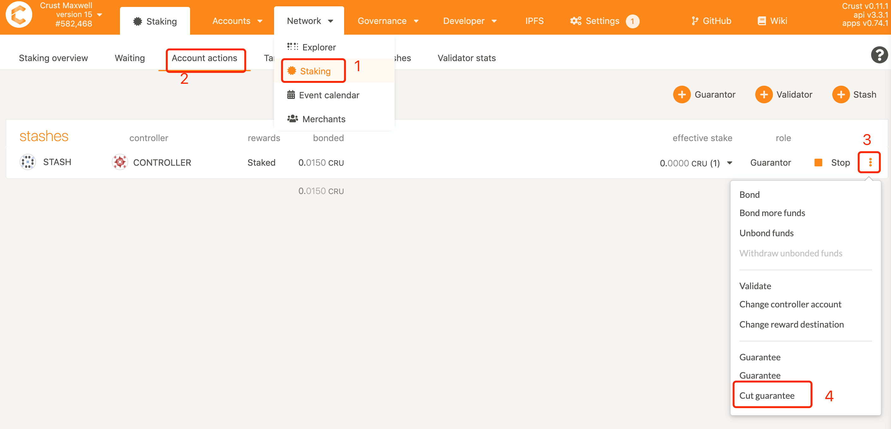
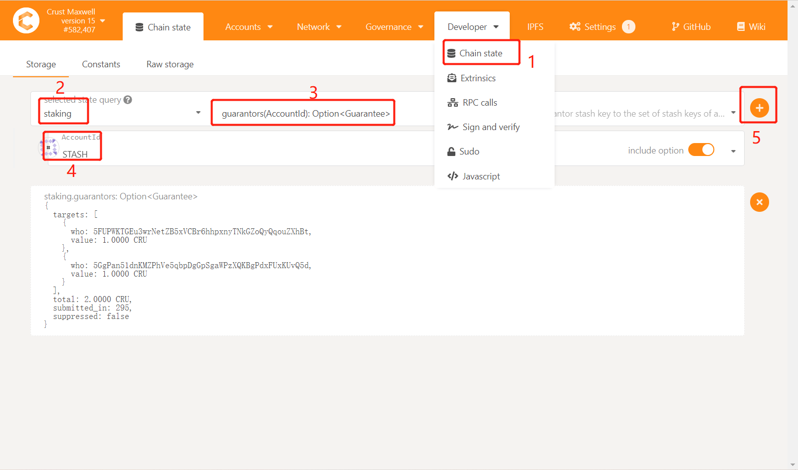

## 1 How to change the guarantee object?

1) First cancel the guarantee object A

2) Re-select guarantor B for guaranty

## 2 How to vouch for multiple validators/candidates?

When the amount of guarantee is sufficient, the guarantee operation can be performed multiple times, and a maximum of 16 validators (candidates) can be guaranteed

## 2 How many people can a validator/candidate be sponsored at most?

The upper limit is 64

## 3 As a guarantor, how to revoke the guarantee?

> Note: Dosing operations are temporarily not supported, and if multiple guarantees are guaranteed, the guarantees need to be revoked one by one

1) Through the STASH account of the guarantor, check out all the node accounts guaranteed by the account and the guarantee limit

2) Withdraw the guarantee for each node

3) Query through the account of the guaranteed person found in step 1 and click on the account to enter the "guaranteed account", enter the amount of cancellation of the guarantee in the "amount", and click CutGuarantee.

