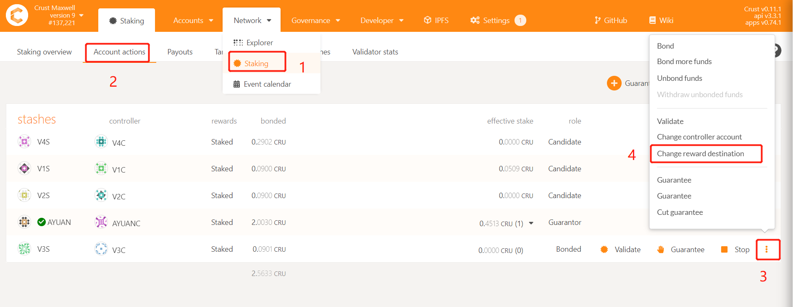
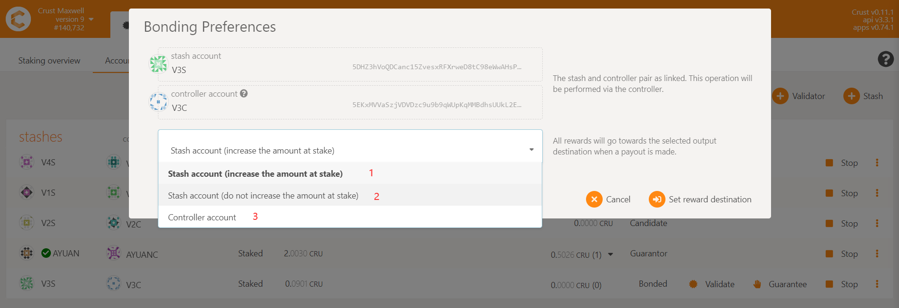

## Perview Network Maxwell

### Overview of benefits and rewards？
The preview network provides staking and authoring rewards (total 540,000 CRU), and storage market rewards (the specific amount is to be determined). The staking and authoring rewards are distributed in 2 years. The initial reward for each era (6 hours) is 750CRU, including 600CRU staking reward and 150CRU authoring reward. The era reward is halved every 90 days. All rewards need to be collected manually.

### Types of rewards？
There are three main types of rewards: authoring reward, staking reward and storage reward. All rewards will be distributed in the form of CRU.

## Validators and candidates

### How a candidate becomes a validator？
Through competition, nodes with larger "effective stake" (effective stake = other effective stake + own effective stake) will be selected as validators. "effective stake" is determined by two parameters. One is that you need to increase the "staking limit" by adding storage; the other is that you need to increase the "effective stake" by staking CRU or letting someone else guarantee the CRU for you. The selection of the validator is recalculated for each era. Check [this](validatorGuidance.md) for details

### The difference between validators and candidates？
Validators have authoring rewards, candidates do not have authoring rewards, but they all have staking rewards

### The total number of validators？
During the preview network, the total number of validators will be dynamically adjusted. This setting is to ensure sufficient competition between nodes

### The icon meaning of validator page？

- 1 Your node will compete to become a validator competition in next era
- 2 The number of blocks produced in a session，one era has 36 sessions
- 3 The effective amount of CRU staked by others
- 4 The effective amount of CRU staked by yourself. The sum of parameter 3 and parameter 4 are used to compete to become a validator
- 5 The node's hard disk capacity and meaningful files determines the upper limit that the node can stake
- 6 The guarantee fee rate set by the node, assuming you set 90%, the node will draw 10% of the money from the guarantor’s income
- 7 The block score determines the profit of era. The data is the same for each validator in terms of probability
- 8 The latest block currently generated by the node

### The "stake limit" and "effective stake" are still 0 long after the node is started？
The "stake limit" is updated every half an hour, and the "effective stake" is updated every 6 hours. If the node is doing SRD, the "stake limit" increases linearly every half an hour. If the SRD is completed, the "stake limit" will remain unchanged. There is a drop, please check the cause in time

## Group

### How to create group？
Enter [CRUST APPs](https://apps.crust.network/), select 'Extrinsics', select the Owner's Controller account, select 'swork' for the submit group, select 'createGroup()' for the submit method, and finally click 'Submit Transaction' to send the transaction to create the Group.

### How to join a group？
Wait for the member to report the work report for the first time (about half an hour after the member is started), enter the [CRUST APPs](https://apps.crust.network/), select 'Extrinsics', select the account of the Member, select the submit group as 'swork', select the 'joinGroup()' method, and then select the controller address of the Owner of the group you want to join, and finally click 'Submit transaction' to send the transaction

### How to query the members joined under the group？
Enter [CRUST APPs](https://apps.crust.network/), select 'Chain state', select 'swork' under the selected state query group, select the 'groups(AccountId)' method, and finally click "+" to query, the returned result is all member accounts under the group

### How to leave a group？
Enter [CRUST APPs](https://apps.crust.network/), select 'Extrinsics', select Member account, select 'swork' for submit group, then select 'quitGroup()', and finally click Submit Transaction to send the transaction to exit the group

## Reward

### How the group distributes revenue？
The storage income is settled separately, while other income chains do not distribute income and need to be settled privately by the owner

### How to receive reward?
The process of receiving rewards is as follows:
Enter [Crust APPS](https://apps.crust.network/#/explorer), choose"Staking", choose"Payouts"

### How to check the reward?
Open [Subscan](https://crust.subscan.io/)
Use your income account to query, you can see the amount received in "Profit and Penalty"

### How to change income account?
1) Enter [Crust APPS](https://apps.crust.network/#/explorer), select Staking under the Network module, select Account actions, select the target you want to change, click the three points on the right, and select "change reword destination"
2) Select the income account you set, click "set reward desination" to send the transaction

## Others 

### How to set SRD rate and node storage capacity?
SRD rate (optional) sets the disk usage rate, such as a 1000G disk, if you set the SRD rate to 80%, that is, the disk can only use 800G to store SRD at most, if not set, the default is 70% Usage rate.
Node storage capacity (required) is to set specific disk capacity and issue SRD tasks to encapsulate data.

### How to modify guarantee fee?
------era1------era2------
The guarantee fee set during era1 will take effect during era2
If the validator has set the guarantee fee multiple times during era1, the last setting will take effect

### Member joins the group and reports "swork.IdentityNotExist" error, how to solve it?
This is because joining a group requires a unique identity on the chain, so you need to wait for the first report of the work report (about half a hour), and then perform the operation of joining

