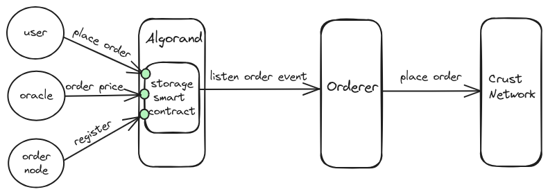

## I. Crust Network Algorand storage

Crust Network is a decentralized storage platform in Web3 ecosystem. It has provided reliable storage service for Polkadot ecosystem from launch of Mainnet(2021.10), and establish partnership with 100+ projects. To expand the storage functionality of Crust Network, we have already built EVM storage protocol for EVM ecosystem. For now, Crust Network brings storage service for Algorand ecosystem. Algorand is a secure, substainable blockchain. For more information about Algorand, please refer to [this link](https://algorandtechnologies.com/).

## II. Crust Network Algorand storage protocol

1. Algorand storage smart contract
[Algorand storage smart contract](https://github.com/crustio/algorand-storage-contract?tab=readme-ov-file#storage-order-smart-contract) is written in python with [Pyteal Beaker](https://algorand-devrel.github.io/beaker/html/index.html) library. User can place order with file cid(IPFS content id), file size and a boolean parameter called isPermanent indicated whether to store file permanently or not. Additionally, it features a payment settlement mechanism based on on-chain oracles. Anyone can be storage merchant by starting the [order service](https://github.com/crustio/storage-contract-node) and contacting crust team to register their algorand addresses to the storage smart contract.
1. Orderer
The orderer is an order node who has started the [order service](https://github.com/crustio/storage-contract-node) and registered its algorand address to algorand storage smart contract(short for storage contract below). The orderer will listen to the order event emitted by storage contract, which contains file cid, file size, isPermanent, merchant address parameters. With the order event, the orderer can place a storage order to Crust Network, and for the orderer it will receive the order service fee for its providing service.