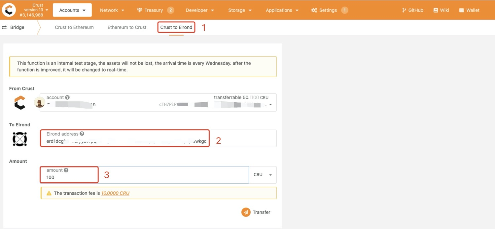
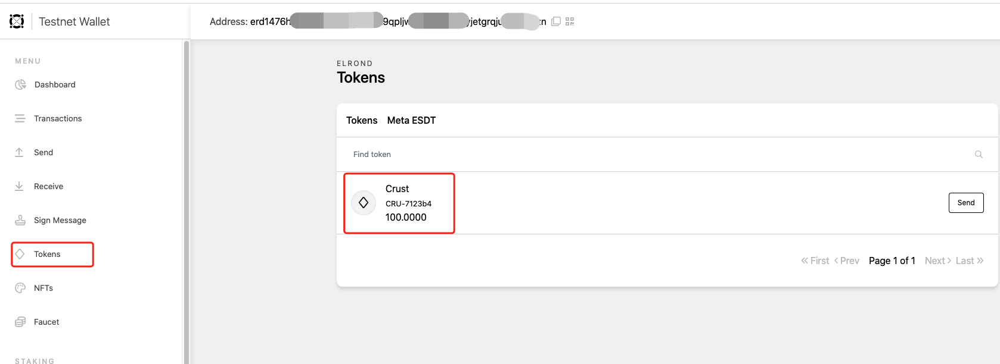
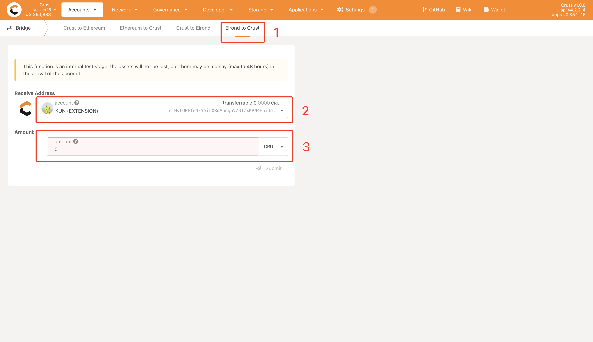
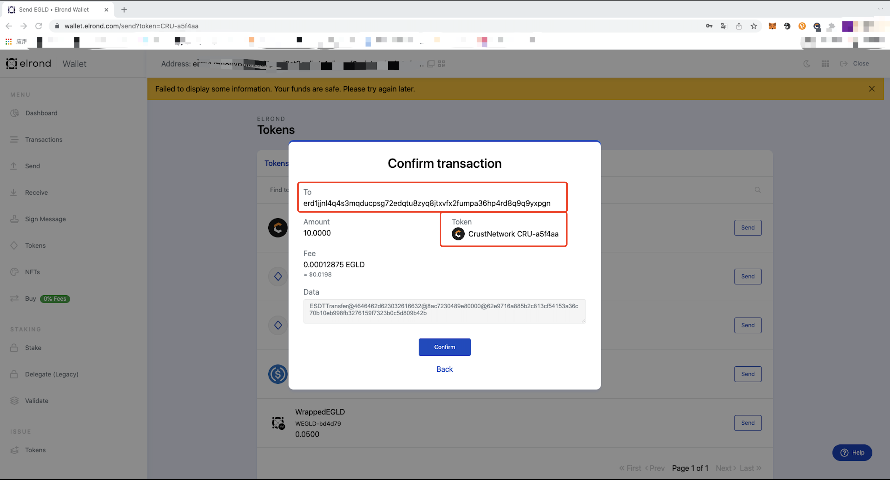
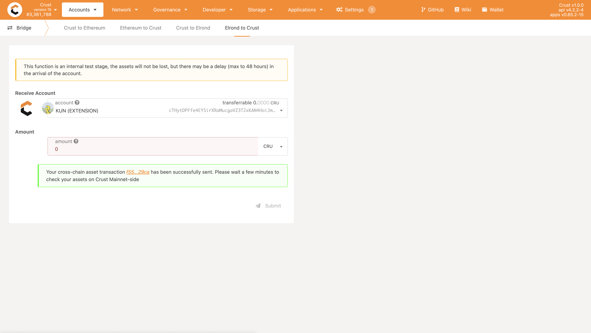
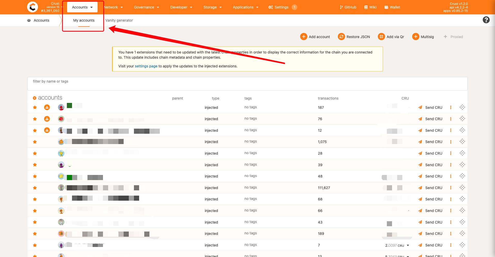
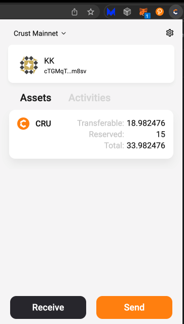
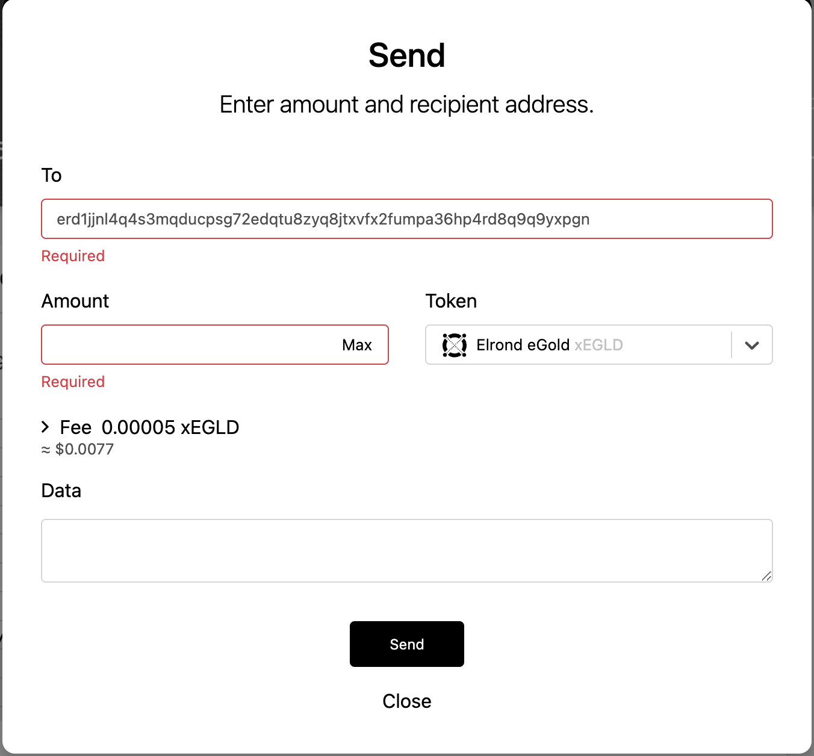

Crust Elrond Bridge provides a 2-way cross-chain service from Crust Mainnet CRU to Elrond ESDT CRU.

## Preparation

Make sure you have [Elrond account](https://wallet.elrond.com/) and [Crust account](https://wiki.crust.network/docs/en/crustAccount) before start bridging CRU token.

1. Elrond Web Wallet: https://wallet.elrond.com/
2. Create Crust Mainnet account:
   1. Use Crust web wallet: https://apps.crust.network/#/accounts
   2. Use Crust chrome extension wallet: https://chrome.google.com/webstore/detail/crust-wallet/jccapkebeeiajkkdemacblkjhhhboiek

## Crust Mainnet ➡️ Elrond

Go to Crust `Apps-->Accounts-->Bridge`(https://apps.crust.network/#/bridge) page, the browser will open the Ethereum wallet at this time. It is not necessary to connect an Ethereum wallet for cross-chain transactions from Crust Mainnet to Elrond.

Choose “Crust to Elrond", enter the Elrond address to receive your CRU in frame 2, enter the amount that you want to transfer in frame 3, click “Transfer” after you confirm there is no mistake above, then sign and complete the transaction.

Please note that the transaction is automatically executed through a smart contract, waiting for the final confirmation block to arrive, which will take about a few minutes

After the cross-chain transaction is completed, CRU tokens will appear in your wallet.

## Elrond ➡️ Crust Mainnet

Go to Crust `Apps-->Accounts-->Bridge`(https://apps.crust.network/#/bridge) page, the browser will open the Ethereum wallet at this time. It is not necessary to connect an Ethereum wallet for cross-chain transactions from Elrond to Crust Mainnet.

Choose "Elrond to Crust", choose the Crust account you want to receive your CRU in frame 2, enter the amount that you want to transfer in frame 3, click "Submit" after you confirmed there is no mistake above, then you'll jump to Elrond web wallet.

In elrond web wallet, you'll make a transfer with ESDT-type CRU to [Crust-Elrond Bridge Account](https://explorer.elrond.com/accounts/erd1jjnl4q4s3mqducpsg72edqtu8zyq8jtxvfx2fumpa36hp4rd8q9q9yxpgn) (`erd1jjnl4q4s3mqducpsg72edqtu8zyq8jtxvfx2fumpa36hp4rd8q9q9yxpgn`).

After transaction confirmed on Elrond-side, you'll jump back to Crust apps.

Wait a few minutes, you'll received the CRU token on Crust Mainnet-side. You can check it either in [Crust web wallet](https://apps.crust.network/?rpc=wss%3A%2F%2Fcrust.api.onfinality.io%2Fpublic-ws#/accounts) or [Crust chrome extension wallet](https://chrome.google.com/webstore/detail/crust-wallet/jccapkebeeiajkkdemacblkjhhhboiek)

- Crust web wallet

- Crust chrome extension wallet

### Extra attension

When you encounter the following problem when you jump into Elrond web wallet, please press "Close" and try it again.

## References

1. [ChainSafe Bridge](https://github.com/ChainSafe/ChainBridge)
2. [Crust Bridge Pallet](https://github.com/crustio/crust/tree/mainnet/cstrml/bridge)
3. [Crust ChainBridge Service](https://github.com/crustio/ChainBridge)
4. [Crust ChainBridge Types](https://github.com/crustio/chainbridge-substrate-events)
5. [Crust ETH Bridge Contract](https://github.com/crustio/chainbridge-solidity)
