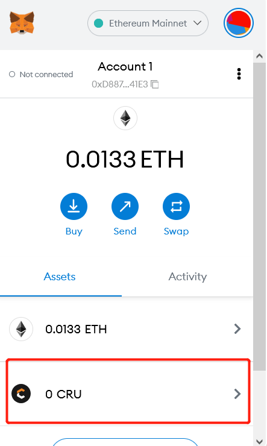
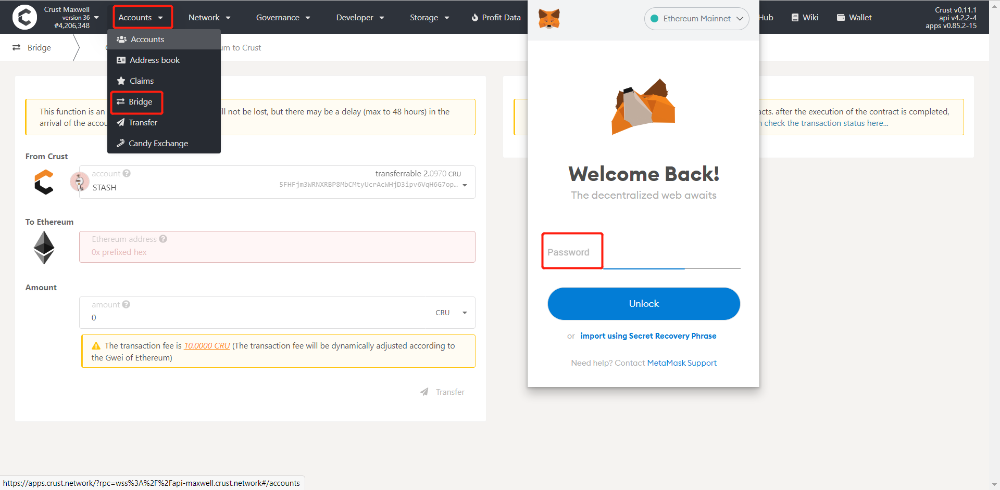
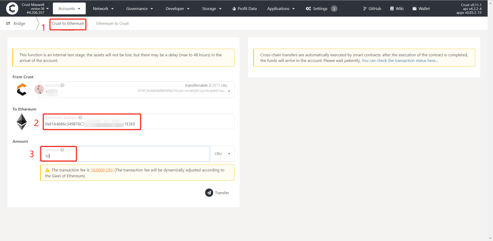
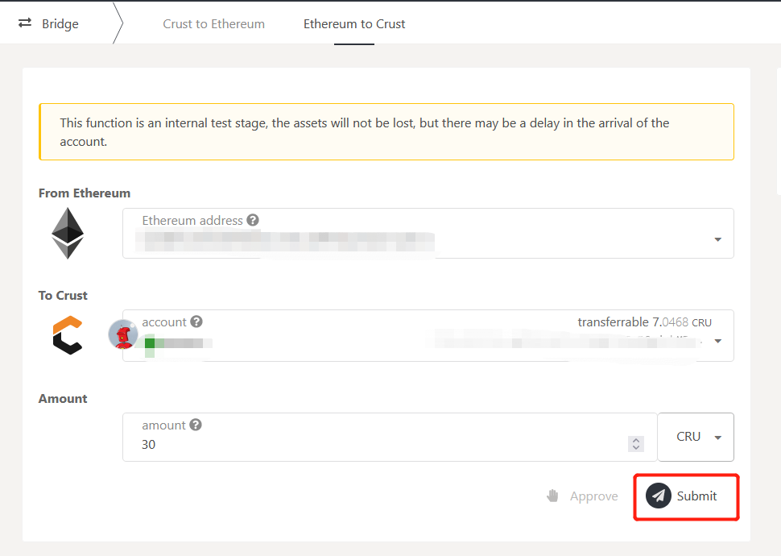

Crust Maxwell provides an asset cross-chain bridge that allows users to transfer CRU on Maxwell to Ethereum, and CRU (ERC20) on Ethereum to Maxwell in real-time. Please follow the steps below for CRU cross-chain transactions.

## Preparation

1. Install an Ethereum wallet extension. Metamask is recommended. Please refer to the official Metamask website for download links: https://metamask.io
2. Add CRU tokens in the wallet:

Open Metamask, click “Add Token”.

Enter CRU in "Search", or enter the contract address of the CRU token in "Custom Token": `0x32a7c02e79c4ea1008dd6564b35f131428673c41`

Click “Next” to add the token to your wallet. After successfully adding the token, CRU will appear in your wallet list.

## Cross-chain Transactions from Maxwell to Ethereum

Go to Maxwell Apps -->Accounts-->Bridge, the browser will open the Ethereum wallet at this time. It is not necessary to connect an Ethereum wallet for cross-chain transactions from Maxwell to Ethereum, however, it is recommended to keep the extension open to easily confirm if the transaction was successful.

Choose “Crust to Ethereum”, enter the Ethereum address to receive your CRU in frame 2, enter the amount that you want to transfer in frame 3, click “Transfer” after you confirm there are no mistakes above, then sign and complete the transaction.

Please note that the transaction is automatically executed through a smart contract, and 10CRU is charged as a transaction fee. Please wait patiently as there might be a certain delay. You can click the link on the right side to check the transaction status.

After the cross-chain transaction is completed, CRU tokens will appear in your wallet.

## Cross-chain Transaction from Ethereum to Maxwell

Go to Maxwell Apps -->Accounts-->Bridge-->Ethereum to Crust. Please make sure to connect your Ethereum wallet if you want to transfer from Ethereum to Maxwell.

Choose the Maxwell address to receive the CRU in frame 1, enter the number of CRU you want to transfer in frame 2, and click "Approve" for signature authorization.

The signature will cost a certain amount of ETH as a transaction fee. Please keep enough ETH balance in your Ethereum account for the transaction.

After completing the “Approve” signature authorization, “Submit” will become operable. Click "Submit" to sign the cross-chain transaction.

Every cross-chain transaction requires users to complete:

1. "Approve" signature authorization;
2. "Submit" signature transaction.

For users' safety, Maxwell pages will automatically refresh at regular intervals. After refreshing, the "Approve" signature authorization needs to be performed again. Therefore,  please click "Submit" as soon as possible and complete the signature and transaction after the "Approve" authorization is completed to avoid wasting any transaction fees.

## References

1. [ChainSafe Bridge](https://github.com/ChainSafe/ChainBridge)
2. [Crust Maxwell Bridge Pallet](https://github.com/crustio/crust/tree/maxwell/cstrml/bridge)
3. [Crust Maxwell ChainBridge Service](https://github.com/crustio/ChainBridge)
4. [Crust Maxwell ChainBridge Types](https://github.com/crustio/chainbridge-substrate-events)
5. [Crust Maxwell ETH Bridge Contract](https://github.com/crustio/chainbridge-solidity)
