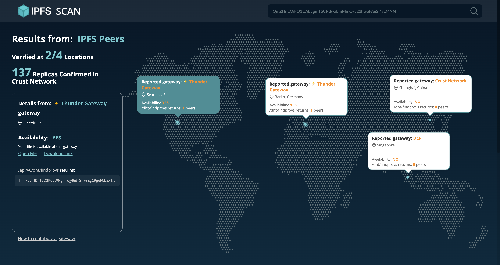

Want to store files on Crust but still get confused? No worries, this article will give you a brief introduction to the storage process of Crust Network! You'll learn:

1. How to upload your file to IPFS and pin the file on Crust
2. How to add balance and extend the expiry of your storage order
3. How to check the storage status of your file

The following pictures show the Crust storage process in general:

### STEP 1. Upload file to IPFS

First, you need to upload the file to the IPFS network(cached on a long-running IPFS node). There are 2 ways to upload the file to IPFS:

1. Upload the file to IPFS Gateway **through IPFS HTTP API**
2. Pin the file to a local IPFS node **through** **IPFS P2P protocol**

**For the 1st way,** Crust provides a [web3-oriented gateway](https://docs.ipfs.io/concepts/ipfs-gateway/#authenticated-gateways), which is provided by Crust storage nodes **for free** and **100% compatible with standard IPFS HTTP interfaces**. More details in below:

- Learn how to upload files through the Web3Auth gateway with code on [LINK](https://wiki.crust.network/docs/en/buildFileStoringDemo#1-upload-file-to-ipfs)
- Learn the tech detail of the Web3Auth gateway on [LINK](https://wiki.crust.network/docs/en/buildIPFSWeb3AuthGW)
- Get all FREE usable gateways on [LINK](https://github.com/crustio/ipfsscan/blob/main/lib/constans.ts#L29)
- Learn the gateways' performance on [LINK](https://github.com/crustio/ipfs-w3auth-gateway/blob/main/docs/PERFORMANCE.md#summary)
- More IPFS HTTP APIs on [LINK](https://docs.ipfs.io/reference/http/api/)

**For the 2nd way**, you need to install IPFS and keep it running background. More details can be referred to IPFS docs:

- Learn how to install IPFS on [LINK](https://docs.ipfs.io/install/)
- Learn how to pin(add) file on [LINK](https://docs.ipfs.io/how-to/pin-files/)

After uploading the file to IPFS, you will get a `cid`, which is the unique identity of the file. Crust storage nodes also use `cid` to retrieve the file.

### STEP 2. Pin the file on-chain and add balance

Then, you need to "tell" Crust storage nodes that the file is ready to be stored! To accomplish that, you need to send a transaction on the Crust chain. There are 2 different ways:

1. Directly send the transaction with Crust on-chain interface
2. Send cross-chain transaction with Crust IPFS pinning service

**For the 1st way**, you can simply follow the steps below to communicate with the Crust chain:

1. Create a Crust account on [LINK](https://wiki.crust.network/docs/en/crustAccount)
2. Get free storage quota:
    1. Join Crust [discord](https://discord.gg/WQQHnyKCmn)
    2. Follow the pinned message on `📦free-storage` channel
3. Send a transaction with typescript code on [LINK](https://wiki.crust.network/docs/en/buildFileStoringDemo#2-place-storage-order)

**The 2nd way is for cross-chain**, most public chains support directly calling Crust storage interface through standard IPFS pinning service, More details can be referred below:

- Learn how to call Crust cross-chain storage API with code on [LINK](https://wiki.crust.network/docs/en/buildFileStoringWithGWDemo#2-pin-file-through-ipfs-pinning-service)
- Learn Crust's cross-chain solution(How Crust IPFS pinning service work) on [LINK](https://medium.com/crustnetwork/crusts-cross-chain-dstorage-solution-f7ff837ed0ef)
- Supported platforms:
    - All Ethereum-compatible chains: Polygon, Moonriver, BSC, ...
    - All substrate-compatible chains: Polkadot, Kusama, Acala, Clover, ...
    - Others: Elrond, Solana, Flow, and Near

After you "told" Crust storage nodes, they're starting pulling the file through the IPFS network. After a few minutes, you can [query the file's storage status on-chain](https://apps.crust.network/?rpc=wss%3A%2F%2Frpc.crust.network#/chainstate):

- How many replicas of the file exist on the IPFS through Crust Network
- Which nodes are storing your file
- How long will the file be guaranteed to be stored on Crust Network
- How much is the file valued

The default storage time for a single transaction(order) **is 6 months**. If you want to extend the storage duration, Crust provides a **pre-paid pool for you to customize the file's storage time**, it allows you to add balance and automatically extend the file's expiry time. You can learn more details about the pre-paid pool below:

- Crust storage price calculator on [LINK](https://crust.subscan.io/tools/storage_calculator)
- Learn how to add balance to the pre-paid pool on [LINK](https://wiki.crust.network/docs/en/buildFileStoringDemo#4-add-file-assurance)
- Learn more about Crust’s pricing model on [LINK](https://wiki.crust.network/docs/en/DSM#2-price-mechanism)
- Get real-time Crust storage price on [LINK](https://crust.subscan.io/storage)

### STEP 3. Visually check storage status

At last, you can visually check the file's storage states via [IPFS Scan](https://ipfsscan.crustapps.net). IPFS Scan is a DApp that shows rich information of files on IPFS, including:

1. How is the file distributed in the world
2. Where to retrieve the file
3. Which nodes are storing the file
4. In which incentive layers the file are stored(Crust/Filecoin/Arweave)
5. How much the file valued

The 1st page of IPFS Scan shows ***1-2***

And the 2nd page shows ***3-5***

With IPFS Scan, you can easily track the status of files on decentralized storage networks and monitor files' on-chain status in incentive layers.

### At last

That's a brief introduction to Crust's storage process, but in the Crust world, we offer much more than that! The following toolkits and some example cases may give you some ideas on how to integrate Crust into your project.

**Toolkits**

1. [IPFS W3Auth gateway uploader Github action](https://github.com/marketplace/actions/crust-ipfs-upload): Auto-deploy the DApp/website through Github action
2. [Crust Pinner Github action](https://github.com/marketplace/actions/crust-ipfs-pin): Decentralized pin(send tx) to Crust chain through Github action
3. [Crust Pinner node package](https://github.com/crustio/crust.js/tree/mainnet/packages/crust-pin): Node.js package module provides decentralized pin(send tx) to Crust chain function
4. [Crust CLI:](https://github.com/crustio/crust-cli) Crust command-line tool, provides pin to local IPFS, pin to Crust(send tx), and query on-chain storage status function

**Case Examples**

1. [Uniswap release process](https://github.com/Uniswap/interface/blob/main/.github/workflows/release.yaml#L58-L64) with Crust Pinner Github action
2. [AAVE deploy process](https://github.com/aave/aave-ui/blob/master/.github/workflows/deploy_prod.yml#L28-L34) with Crust Pinner Github action
3. [Polkadot deploy process](https://github.com/polkadot-js/apps/blob/master/scripts/ipfsUpload.mjs#L94-L97) with Crust Pinner node package
4. [Crust Files](https://github.com/crustio/crust-files) - the E2E storage process

**Demos/Code Tutorials**

1. Crust demo on [LINK](https://github.com/crustio/crust-demo)
2. Crust workshop on [LINK](https://github.com/RoyTimes/crust-workshop)
