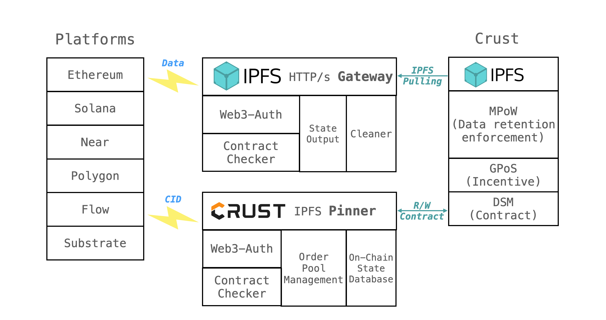
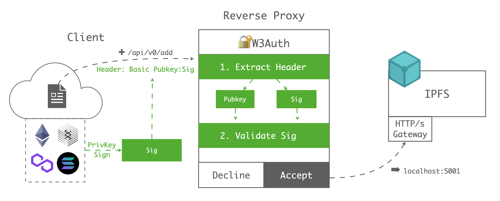

## Introduction

Decentralized storage(dStorage) is the fundamental of Web3 ecosystem. As a supplement to the costly on-chain storage, dStorage can scale horizontally as distributed network and store unlimited data theoretically.

[Ethereum's Web3 stack](https://ethereum.org/en/developers/docs/storage/) lists some important considerations about dStorage:

- Persistence mechanism and incentive structure
- Data retention enforcement
- Decentrality
- Consensus

Based on these thoughts, dStorage projects are usually a **standalone** **blockchain** with consensus supporting data retention ability, incentive mechanism, and data persistence. The chart below shows an analysis of several mainstream Storage projects and their strategies for data retention and data persistence.

[ ](https://www.notion.so/68b99ae146214e73b3ef3a8cfcb6727a)

As the fundamental of Web3 ecosystem, dStorage is designed to serve the entire web3 ecosystem, including DApp hosting, NFT metadata storage, GameFi and social media data storage, even hosting the Metaverse. So we want to use **a single web3 identity for** DApps and personal data storage rather than multiple accounts. ***It's very similar to SSO(Single Sign-On) in Web2 world.***

There are many smart contract platforms such as Ethereum, Polkadot, Near, Polygon, Solana... Every platform has its own DApp ecosystem. Web3 users use different identities to call smart contracts on each blockchain. And providing dStorage to users on different blockchains becomes a basic requirement for dStorage projects.

## Solution

Crust Network provides 2 integrated solutions:

- **xStorage pallet:** an XCMP-based Substrate pallet for all Polkadot parachains
- Native ***[IPFS](https://docs.ipfs.io/concepts/what-is-ipfs/)*** integrations for all smart contract platforms

### I. XCMP-based substrate pallet

As a dStorage project in the Polkadot ecosystem, Crust builds on top of S[ubstrate](https://github.com/paritytech/substrate) and provides a native cross-chain communication pallet based on [XCMP](https://wiki.polkadot.network/docs/learn-crosschain)(Cross-Chain Message Passing) called [***xStorage***](https://github.com/crustio/crust/tree/parachain/shadow/crust-collator/pallets/xstorage). The basic idea of xStorage shows below:


***Parachain-side***

This pallet allows all substrate-based parachains to:

- Send storage request messages(Extrinsics) to Crust
- Pay storage fees on Crust with native tokens by using the [xToken](https://github.com/open-web3-stack/open-runtime-module-library/tree/master/xtokens) module

*The XCM Transact of xStorage pallet*

```rust
let place_storage_order = (storage_pallet_id, method_id, cid, size).encode();

let transact = Xcm::Transact {
	origin_type: OriginKind::Superuser,
	require_weight_at_most: 1_000,
	call: place_storage_order.into()
};

T::XcmpMessageSender::send_xcm(MultiLocation::X2(Junction::Parent, Junction::Parachain(CrustChainId)), transact).map_err(|_| Error::<T>::FailedToSend)?;
```

***Crust-side***

After Crust's collator received the XCMs, Crust's DSM(Decentralized Storage Market) protocol will respond with storage requests and charge the cross-chain storage fees. Then, all the IPFS nodes in Crust will start pulling the data and do the consensus.

### II. Native IPFS integration

The 2nd way is more general, it is a combination of:

- W3Auth: handling the web3 identity authentication and storage contract authentication
- IPFS W3Auth gateway: an HTTP-compatible data uploading service
- IPFS W3Auth pinning service: an HTTP-compatible IPFS remote pinning service interacting with Crust blockchain

The basic workflow is based on 2 standard IPFS widgets - ***[gateway](https://docs.ipfs.io/concepts/ipfs-gateway/#authenticated-gateways) and remote [pinning service](https://docs.ipfs.io/how-to/work-with-pinning-services/)***. Users on these platforms only need to:

1. **Upload** data through gateways with `Web3Auth` , then get IPFS `cid`. Users' data will temporally be cached on gateways. After Crust IPFS nodes pull the data, the data will be deleted on gateways.
2. Request **remote pinning** service with `Web3Auth`. This service will interact with Crust blockchain, including placing storage orders on Crust and monitoring on-chain file status

After that, all the IPFS nodes in Crust will start pulling the data from gateways and do the consensus.

Here are the detailed sub-modules, let's focus on how it works:



#### 1. W3Auth

W3Auth is an auth widget collection which is responsible for:

- Verifying the identity of each blockchain
- Providing contract token deposit/release on each blockchain
- Charging storage fee on each blockchain

Here are the Auth's node.js packages, these packages are used as **authentication layer of gateways and pinning service.**

- [auth-ethereum](https://github.com/crustio/crust.js/tree/mainnet/packages/ipfs-w3auth/auth-ethereum): supporting all EVM-compatible chains, including Ethereum, Polygon, BSC, Heco, Avalanche C-chain, ...
- [auth-substrate](https://github.com/crustio/crust.js/tree/mainnet/packages/ipfs-w3auth/auth-substrate): supporting all substrate-based chains, including Polkadot, Kusama, Crust, Acala, Moonriver, ...
- [auth-near](https://github.com/crustio/crust.js/tree/mainnet/packages/ipfs-w3auth/auth-near): supporting Near
- [auth-solana](https://github.com/crustio/crust.js/tree/mainnet/packages/ipfs-w3auth/auth-solana): supporting Solana
- [auth-flow](https://github.com/crustio/crust.js/tree/mainnet/packages/ipfs-w3auth/auth-flow): supporting Flow
- [auth-avalanche](https://github.com/crustio/crust.js/tree/mainnet/packages/ipfs-w3auth/auth-avalanche): supporting avalanche X- and P- chain

#### 2. IPFS W3Auth gateway

Crust uses the standard [IPFS Authenticated Gateway](https://docs.ipfs.io/concepts/ipfs-gateway/#gateway-types) as **data interchange**, which **allows web3 users to store data without IPFS locally,** and because it is a standard IPFS widget. It is compatible with the [official IPFS API](https://docs.ipfs.io/reference/http/api/), you can request it with the same HTTP endpoints, flags, and arguments.

Basically, it exposes the IPFS writable interfaces with W3Auth. The whole process shows below:



***Client-side***

Let's say Alice(EVM user) wants to upload her file to IPFS, she only needs to do the following steps:

- **Step1.** Sign her Pubkey(`0x123`) with her private key in any Ethereum wallets, then she will get the Sig(`0x456`)
- **Step2.** Call original IPFS API(/api/v0/add) with basic auth header(`Basic eth-0x123:0x456`) and data-self

***Gateway-side***

After the W3Auth gateway received Alice's request:

- **Step1.** Parse the header, extract ChainType(`eth`) Pubkey(`0`c) and Sig(`0x456`)
- **Step2.** Parse Sig with Pubkey with `auth-ethereum`, then get the Msg(`0x123`), determine whether the Msg and Pubkey are the same
- **Step3**. Call local IPFS add

With gateways, users on all the smart contract platforms can easily upload and cached data on IPFS **without running IPFS locally**. The detailed usage and deployment process of the IPFS W3Auth gateway can be checked [here](https://wiki.crust.network/docs/en/buildIPFSWeb3AuthGW).

#### 3. IPFS W3Auth pinning service

[IPFS remote pinning services](https://docs.ipfs.io/how-to/work-with-pinning-services/) allow users to pin their IPFS files to remote stable IPFS nodes to ensure the file's reliability and accessibility. Crust uses this pinning service as a **data bridge**, which **allows Web3 users to place storage orders on Crust with their native platform account**.

Generally, this pinning service manages an order pool to send transactions on Crust chain and locally maintain a state database of on-chain order info. Here is the whole process:


***Client-side***

Let's say Alice(EVM user) wants to pin her IPFS file(`cid:QM123`), she only needs to do the following steps:

- **Step1.** Sign her Pubkey(`0x123`) with her private key in any Ethereum wallet, then she will get the Sig(`0x456`)
- **Step2.** Call original IPFS pinning service with bear auth header(`Basic eth-0x123:0x456`) with `cid:QM123`
- **Step3**. Monitor IPFS file status with querying Crust chain or calling standard IPFS pinning service API

***Pinner-side***

After the W3Auth pinning service received Alice's request:

- **Step1.** Parse the header, extract ChainType(`eth`) Pubkey(`0`c) and Sig(`0x456`)
- **Step2.** Parse Sig with Pubkey with `auth-ethereum`, then get the Msg(`0x123`), determine whether the Msg and Pubkey are the same
- **Step3**. Call on-chain place storage order transaction by order pool
- **Step4**. Monitor on-chain file status

With the pinning service, users on all the smart contract platforms can call Crust on-chain interface and distribute the IPFS file through Crust protocol **without interacting with the Crust chain**. The detailed usage and deployment process of the IPFS W3Auth pinning service can be checked [here](https://wiki.crust.network/docs/en/buildIPFSW3AuthPin).

## Cases now

Both XCMP-based pallet and native IPFS integration are already been used by several platforms including:

- [XCMP] [Acala Network](https://acala.network/)
- [XCMP] [Darwinia Network](https://darwinia.network/)
- [Native IPFS] [Polygon](https://polygon.technology/)
- [Native IPFS] [Near](https://near.org/)
- [Native IPFS] [Heco](https://www.hecochain.com/en-us/)
- [Native IPFS] [Elrond](https://elrond.com/)

Also, the IPFS W3Auth gateway(GW) and pinning service(PS) are integrated by several projects including:

- [PS] Uniswap: take it as release CD flow by using Github Action, details can be checked [here](https://github.com/Uniswap/interface/blob/main/.github/workflows/release.yaml#L58-L64)
- [PS] Liquity: take it as the only decentralized frontend, details can be checked [here](https://github.com/liquity/frontend-registry/blob/main/frontends/liquity_crust.md)
- [PS] Polkadot Apps: take it as release CD flow by using node.js script, details can be checked [here](https://github.com/polkadot-js/apps/blob/master/scripts/ipfsUpload.cjs)
- [PS] IPFS Docs: host by using command-line tool, details can be checked [here](https://github.com/ipfs/ipfs-docs)