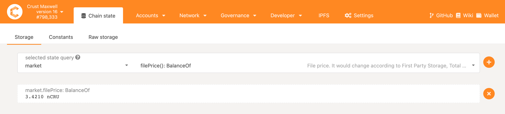

Crust provides PolkadotJS based SDK to access Crust Network functionalities. It is implemented as crust.js library to provide additional type definitions.

# crust.js

This library provides additional typing information for users to access Crust Network by using [polkadot.js](https://github.com/polkadot-js/api)

## Getting Started

1. Install dependencies

```shell
yarn add @polkadot/api @crustio/type-definitions
```

2. Create API instance

```ts
import {ApiPromise, WsProvider} from '@polkadot/api';
import {typesBundleForPolkadot} from '@crustio/type-definitions';

async function main() {
    const api = new ApiPromise({
      provider: new WsProvider('wss://api.crust.network'),
      typesBundle: typesBundleForPolkadot,
    });
    await api.isReady;

    // Use api
}

main();
```

3. Interact with chain

```ts
// Query file info
const fileInfo = await api.query.market.files('QmRaknS23vXEcdJezkrVC5WrApQNUkUDdTpbRdvh5fuJHc');
console.log(fileInfo.toHuman());
```

E2E code sample can be found [here](build-developer-guidance.md).

## Crust Types

- Use crust types

```ts
import {crustTypes} from '@crustio/type-definitions';

// Define FileInfo
export type FileInfo = typeof crustTypes.market.types.FileInfo;

// Use FileInfo as `interface`
```

- Types

  - [DSM Types](https://github.com/crustio/crust.js/blob/main/src/market.ts): `FileInfo`, `MerchantLedger`, `Replica`, ...
  - [MPoW Types](https://github.com/crustio/crust.js/blob/main/src/swork.ts): `Identity`, `WorkReport`, ...
  - [GPoS Types](https://github.com/crustio/crust.js/blob/main/src/staking.ts): `Guarantee`, ...


## Additional Resources

- [@polkadot/api](https://github.com/polkadot-js/api) The polkadot api library provides a Promise-style interface for performing related operations on substrate-based chains including Crust chain
- [ipfs-core](https://github.com/ipfs/js-ipfs) ipfs library contains all the functions of ipfs

  
## API Specifications

### PolkadotJS API 

The PolkadotJS API document can be found [here](https://polkadot.js.org/docs/api).

### Crust API

Please visit [Crust Apps](https://apps.crust.network/), connect your [CRU wallet](crustWallet.md) (or any other wallet that supports CRU), and check out the [`Chain state`](https://apps.crust.network/#/chainstate) and [`Extrinsics`](https://apps.crust.network/#/extrinsics) under `Developer` menu for detailed API list.

- Chainstate: contains storage query API list for different modules. 
  - `market`: contains storage market related API, such as `filePrice`, `files`, `merchantLedgers`, etc.
  - `swork`: contains node storage proof related API, such as `workReports`, `reportedInSlot`, `identities`, etc.
  - `system`, `staking`, `balances`, etc: contains typical blockchain related API such as `system.account`.


  
- Extrinsics: contains extrinsics execution API list for different modules.
  - `market`: contains storage market related API, such as p`laceStorageOrder`, `calculateReward`, `addPrepaid`, etc.
  - `staking`: contains GPoS related API, such as `bond`, `unbond`, `validate`, `gurantee`, etc.
  - `swork`: contains node storage proof related API, such as `createGroup`, `joinGroup`, etc.
  - `session`, `balances`, `utility`, etc: contains typical blockchain related API, such as session.`setKeys`, balances.`transfer`, utility.`batch`, etc.


### Contributes on Crust API Specifications

You are welcome to contribute on Crust API specifications to provide more integrated and user-friendly documents.

