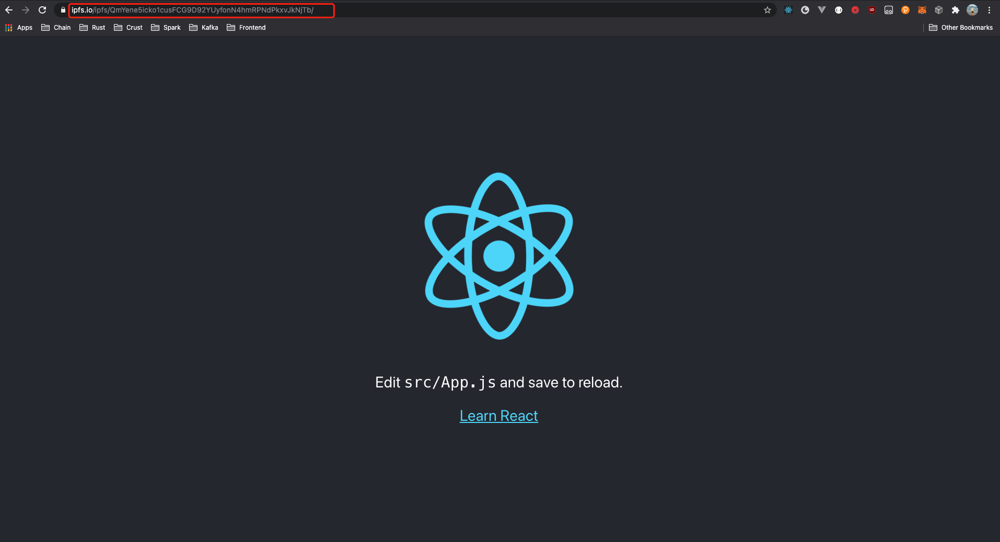

We will build and host a simple React website during this tutorial. **You might be tempted to skip it because you’re not interested in building or hosting website — but give it a chance.** The techniques you'll learn in the tutorial are fundamental to building with Crust Storage, and mastering it will give you a deep understanding of Crust storage functions.

## Try Crust Storage

### 1. Setup

> Make sure you have **Node.js** env, refer [this](https://nodejs.org/en/download/package-manager/) to install

- Install Crust Command Line

```shell
sudo npm i -g @crustio/crust-cli
```

- Create a React app

```shell
npx create-react-app hello-crust
```

- Build it

```shell
cd hello-crust/
PUBLIC_URL=./ npm run build
```

### 2. Pin and Publish

- Login with seeds

> *SEEDS* are 12 secret words of your Crust Account

```shell
crust-cli login [SEEDS]
```

- Pin `build/`

```shell
crust-cli pin build/
```

You'll get an IPFS cid in this step, like `QmYene5icko1cusFCG9D92YUyfonN4hmRPNdPkxvJkNjTb`.

- Publish `build/`

```shell
crust-cli publish QmYene5icko1cusFCG9D92YUyfonN4hmRPNdPkxvJkNjTb
```

Then your website is already been published into Crust Network now.

### 3. Query status

After you publish your website, you can run this command to monitor if your website is picked by any storage nodes

```shell
crust-cli status QmYene5icko1cusFCG9D92YUyfonN4hmRPNdPkxvJkNjTb
```

```shell
✅ QmYene5icko1cusFCG9D92YUyfonN4hmRPNdPkxvJkNjTb picked, replicas: 24
```

### 4. Access it

**Congrats**, you can access your website everywhere now with:

https://ipfs.io/ipfs/QmYene5icko1cusFCG9D92YUyfonN4hmRPNdPkxvJkNjTb



## Learn

In the quick demo just now, including the interaction with IPFS and the interaction with the Crust Chain.

- [Pin website](#2-pin-and-publish) access the IPFS SDK to pin your website locally, if you want to write code to access IPFS, please refer [this part](build-developer-guidance.md#21-upload-files-to-ipfs).
- [Publish website](#2-pin-and-publish) access `crust.js` and send a `place storage order` transaction, if you want to write code to access Crust Chain and send transactions, please refer [this part](build-developer-guidance.md#22-initialize-api-instance-and-on-chain-identity)

## Resources

- [crust-cli](https://github.com/crustio/crust-cli)
- [crust.js](https://github.com/crustio/crust.js)
- [polkadot-api](https://github.com/polkadot-js/api)
- [ipfs-http-client](https://github.com/ipfs/js-ipfs/tree/master/packages/ipfs-http-client#readme)
- [create-react-app](https://github.com/facebook/create-react-app)
