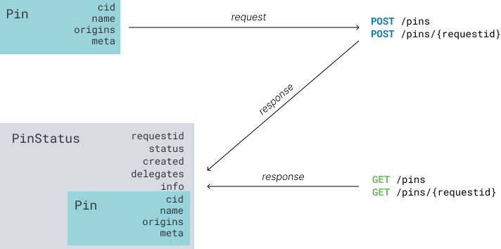
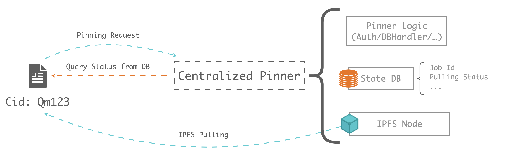
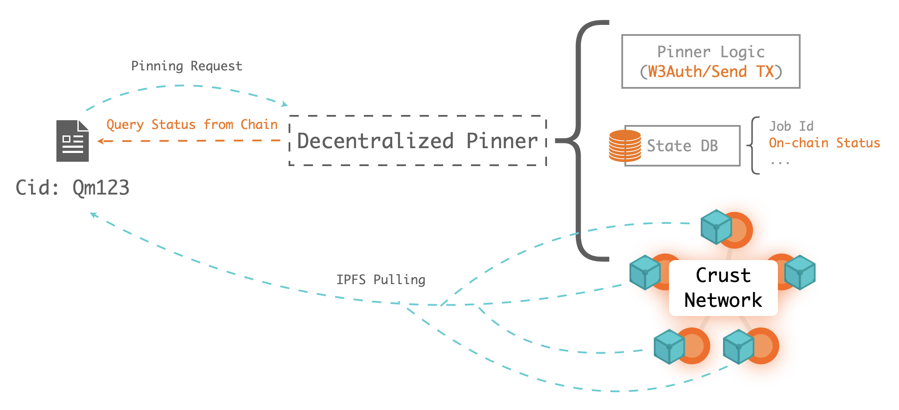

[IPFS remote pinning services](https://docs.ipfs.io/how-to/work-with-pinning-services/#use-an-existing-pinning-service) allow users pin their IPFS files to remote stable IPFS nodes to ensure file's reliability and accesibility.

Furthermore, remote pinning service might be useful if:

- Your local node isn't always online, but you need items to be consistently available
- You'd like to keep a persistent backup of your local node's files somewhere else
- You don't have all the disk space you need on your local node
- You run more than one IPFS node, and would like to use one of them as a "personal pinning service" as your preferred location for permanent storage

## Background

Once these remote pinning services adapt to [pinning serice API](https://ipfs.github.io/pinning-services-api-spec/#section/Schemas/Objects), they can be used by users with **standard IPFS pinning APIs**.



Currently, remote pinning service mostly storing user's IPFS file in the **centralized IPFS nodes**(called centralized IPFS pinning service), like [Pinata](https://pinata.cloud/documentation#PinningServicesAPI), [Infura](https://infura.io/docs/ipfs) and [Cloudflare](https://developers.cloudflare.com/distributed-web/ipfs-gateway/browsing-ipfs).

Generally, the centralized remote pinning service's lifecycle are designed as below:



This centralized pinning service divided into 3 parts:

- Pinner logic: handling the centralized authentication(**with email/phone**), upserting database, **handling some commercial logic(payment/billing)** and communicating with centralized IPFS nodes
- State database: handling IPFS pulling/pinning status and managing user's information
- IPFS node: managing IPFS nodes, maybe IPFS clusters

However, for the Web3 users, they are more innclined to use web3 identity and pay with blockchain tokens/smart contracts. In this article, we'll introduce a lightweight Web3-Auth pinning service based on [Crust Network](https://crust.network)

## Solution

The whole design shows below:



The main differences between centralized and decentralized pinning are:

- Pinner logic: W3Auth pinner authenticating with **Web3 identities(Ethereum/Substrate-based chains/solana/polygon/near/...)**, and only **recording on-chain status**(CID's replica info)
- State databse: W3Auth pinner only recording and managing **on-chain** status
- IPFS nodes: W3Auth pinner **DO NOT needs local IPFS, it is based on Crust Network**, which is a totally decentralized IPFS Network guaranteed your file by blockchain protocol, you can check [here](https://crust.subscan.io/storage) to learn more detail storage information about Crust Network.

## Usage

The IPFS W3Auth Pinning Service(aka. W3Auth PS) is compatible with standard IPFS remote pinning service. You can refer [IPFS Docs](https://docs.ipfs.io/how-to/work-with-pinning-services/#use-an-existing-pinning-service) to learn how to use remote pin.

As for the **Access Token** of W3Auth PS, you can easily get it with several web3 ways.

```shell
Authorization: Bearer <base64(ChainType-PubKey:SignedMsg)>
```

Let's take `ipfs cli` as an example

```shell
ipfs pin remote service add crustpinner http://localhost:3000/psa base64(ChainType-PubKey:SignedMsg)
```

### Get ChainType

`ChainType` is:

1. `sub` (or `substrate`)
2. `eth` (or `ethereum`)
3. `sol` (or `solana`)
4. `pol` (or `polygon`)
5. `nea` (or `near`)
6. `ava`(or `avalanche`)

### Get PubKey and SignedMsg

### 1. With Substrate

#### Get `PubKey`

`PubKey` is just the substrate address, like `5Chu5r5GA41xFgMXLQd6CDjz1ABGEGVGS276xjv93ApY6vD7`

All substrate-based chains are adapted:

- [Crust](https://apps.crust.network/?rpc=wss%3A%2F%2Frpc.crust.network#/explorer)
- [Polkadot](https://polkadot.js.org/apps/?rpc=wss%3A%2F%2Fpolkadot.elara.patract.io#/explorer)
- [Kusama](https://polkadot.js.org/apps/?rpc=wss%3A%2F%2Fkusama.api.onfinality.io%2Fpublic-ws#/explorer)
- ...

#### Get `SignedMsg`

Just sign the `PubKey` with your private key to get the `SignedMsg`

- With [Crust Apps](https://apps.crust.network/?rpc=wss%3A%2F%2Frpc.crust.network#/signing)
- With [Polkadot Apps](https://polkadot.js.org/apps/?rpc=wss%3A%2F%2Frpc.polkadot.io#/signing)
- With [Subkey](https://substrate.dev/docs/en/knowledgebase/integrate/subkey#signing-and-verifying-messages)
- With [Node SDK](https://docs.crust.network/util-crypto/examples/encrypt-decrypt)
- With [Code Sample](https://github.com/RoyTimes/crust-workshop/blob/master/src/substrate.ts)

### 2. With Ethereum

#### Get `PubKey`

`PubKey` is just the ethereum address(42-characters) start with `0x`

#### Get `SignedMsg`

Just sign the `PubKey` with your eth private key to get the `SignedMsg`

- With [MyEtherWallet](https://www.myetherwallet.com/wallet/sign)
- With [MyCrypto](https://app.mycrypto.com/sign-message)
- With [Code Sample](https://github.com/RoyTimes/crust-workshop/blob/master/src/eth.ts)

### 3. With Moonriver

Moonriver is fully compatiable with the Ethereum, you can just follow the same steps with the Ethereum.

#### Get `PubKey`

`PubKey` is just the moonriver(ethereum) address(42-characters) start with `0x`

#### Get `SignedMsg`

Just sign the `PubKey` with your moonriver private key to get the `SignedMsg`

- With [MyEtherWallet](https://www.myetherwallet.com/wallet/sign)
- With [MyCrypto](https://app.mycrypto.com/sign-message)
- With [Code Sample](https://github.com/RoyTimes/crust-workshop/blob/master/src/eth.ts)

### 4. With Solana

#### Get `PubKey`

`PubKey` is just the solana address

#### Get `SignedMsg`

You can sign the `PubKey` with your solana private key to get the `SignedMsg`

- With [Solana Signer Sandbox](https://bafybeiexn4chci4exl54hlispdhwste6mpdcvgnu5zei53r2yl24hq2kri.ipfs.dweb.link/) (deploy with IPFS(cid: `QmYXnTQwKkup7yNLXZz2VyBvBj9eJB1knG8V8dnmjNuNnu`), source code is [here](https://github.com/zikunfan/solana-signer), you can deploy yourself)
- With [Phantom](https://docs.phantom.app/integrating/signing-a-message)

### 5. With Polygon

#### Get PubKey

`PubKey` is just the polygon address(42-characters) start with `0x`. It's compatiable with the ethereum.

#### Get SignedMsg

Just sign the `PubKey` with your polygon private key to get the `SignedMsg`

- With [MyEtherWallet](https://www.myetherwallet.com/wallet/sign)
- With [MyCrypto](https://app.mycrypto.com/sign-message)
- With [Code Sample](https://github.com/RoyTimes/crust-workshop/blob/master/src/eth.ts)

### 6. With Near

You can sign the `PubKey` with one of your near private key associated with your account to get the `SignedMsg`

- With [Near Wallet Example](https://bafybeifl55z3nnwr7c73fsimgbcpjjhx7psubzzh6gyfs3ynbwpkbkws4m.ipfs.dweb.link/) (deploy with IPFS(cid: `QmZupCTkUs6fDCAjYPfDqDtx85GekztfDa9u6Y8dsWhsvA`), source code is [here](https://github.com/MyronFanQiu/wallet-example), you can deploy yourself)
- With [Near-API-JS Example](https://github.com/near/near-api-js/blob/master/examples/cookbook/utils/verify-signature.js)
- With [Code Sample](https://github.com/RoyTimes/crust-workshop/blob/master/src/near.ts)

### 7. With Avalanche

You can sign the `Address` **without** chainID prefix, such as `avax1se4e9lvhlfwhcqnzjr0vpswqcnhsy5atn5r0l3`, with your X- or P- chain private key associated with your account to get the `SignedMsg`.

- With [Avalanche Wallet](https://wallet.avax.network/wallet/advanced)
## Deploy

### 1. Start MySQL

W3Auth PS uses MySQL as its state database, you can just use [docker](https://hub.docker.com/_/mysql) to start and config the db service.

### 2. Init State DB

Please execute the `sql script` under `./sql` folder to create database and state tables.

### 3. Config

#### 3.1 Config pinning service

Please create an `.env` file baseon `.env-example`, each config item means:

```js
NODE_ENV // `production` or `dev`
MYSQL_HOST // optional, default is `localhost`
MYSQL_PORT // optional, default is `3306`
MYSQL_DB // optional, default is `pinning_service` created by ./sql/V1_CREATE_DATABASE.sql
MYSQL_USER // optional, default is `root`
MYSQL_PASSWORD // optional, default is `root`
MYSQL_POOL_MAX // optional, default is `10`
MYSQL_POOL_MIN // optional, default is `0`
MYSQL_POOL_IDLE // optional, default is `30,000`
MYSQL_POOL_ACQUIRE // optional, default is `30,000`
CRUST_SEED // required, the pinning pool private seeds
WS_ENDPOINT // optional, crust chain websocket address, default is `wss://rpc-crust-mainnet.decoo.io`
DEFAULT_FILE_SIZE // optional, ordering file size, default is 2GB
CRUST_TIPS // optional, ordering tips, default is 0.00005 CRUs
VALID_FILE_REPLICAS // optional, the successfully pinning replica count, default is 3
```

#### 3.2 Config supported chains

W3Auth PS allows nodes config supported chains with sql script, default supported chain is `substrate`, you can config different `chain_name` with corresponding `chain_type`(auth way):

`chain_type`

- `0`: Support all substrate-based chains authentication
- `1`: Support all eth-compatible chains authentication, like `ethereum`/`polygon`/`bsc`/...
- `2`: Support solana authentication

And you can run the following sql to add/delete supported chains:

- Add

```sql
INSERT INTO `pinning_service`.`chain` (`chain_name`, `chain_type`) VALUES ('eth', 1);
```

- Delete

```sql
DELETE FROM `pinning_service`.`chain` WHERE `chain_name`='eth';
```

### 4. Start pinning service

- Run with docker

    Just run with the compose file in this repo

    ```shell
    docker-compose up -d order-service
    ```

- Run with node native

    ```shell
    # 1. Clone repo
    git clone https://github.com/crustio/ipfs-w3auth-pinning-service.git
    # 2. Install and build
    yarn && yarn build
    # 3. Run
    yarn start
    ```

Then, you can just config the standard IPFS remote pinning service with `http://localhost:3000/psa`!

## Resources

- [IPFS W3Auth Pinning Service](https://github.com/crustio/ipfs-w3auth-pinning-service)
- [IPFS Pinning Service](https://docs.ipfs.io/how-to/work-with-pinning-services/#use-an-existing-pinning-service)
- [IPFS Pinnning Service API](https://ipfs.github.io/pinning-services-api-spec/#section/Schemas/Objects)
- [Sign message with Polkadot.js/api](https://docs.crust.network/util-crypto/examples/encrypt-decrypt)
- [Sign message with Subkey](https://substrate.dev/docs/en/knowledgebase/integrate/subkey)
- [Sign message with Ethereum](https://programtheblockchain.com/posts/2018/02/17/signing-and-verifying-messages-in-ethereum/)
- [Sign message with Phantom (Solana)](https://docs.phantom.app/integrating/signing-a-message)
- [Workshop code sample](https://github.com/RoyTimes/crust-workshop)
