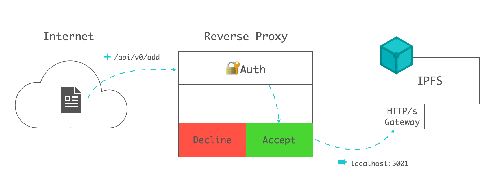
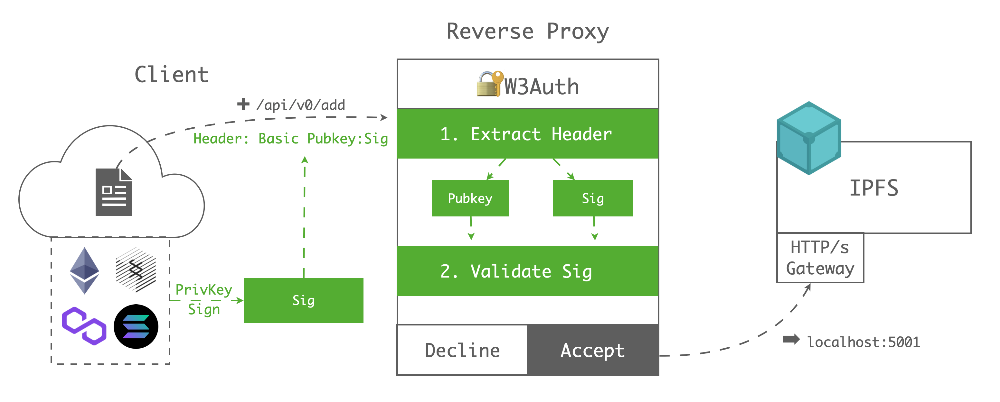

IPFS Public Gateways(aka. IPFS GW) provide an HTTP-based service that allows IPFS-ignorant browsers and tools to access IPFS content. It's like a bridge connecting Web2 and Web3 world.

## Background

IPFS GWs support read-only and writable API calls. However, the original GW configuration only support **public(open-to-all)** or **private(close-to-all)** way. If the GW providers want to limit the access only to the requests with authentication, they may need to config a reverse proxy, develop a IPFS plugin or set a cache-layer above IPFS.

Reverse proxy is the most popular way for providers handling authentication. [This tutorial configuring private gateway](https://docs.ipfs.io/concepts/ipfs-gateway/#private-gateways) includes a description of controling access with Nginx. Reverse proxy can also keep the original IPFS API calls which makes GW adaptable to all IPFS SDK/toolkits.



Infura provides a [Web2-authed](https://infura.io/docs/ipfs#section/Authentication/Overview) GW, which allows user use `PROJECT_ID` and `PROJECT_SECRET` after passed the centralized registration service(**with email/phone**).

However, for the Web3 users, they are more familiar with the web3 identities(**with wallet pubkey/privkey**). In this article, we will introduce a lightweight Web3-based authentication service based on IPFS gateway and reverse proxy.

## Solution

The whole process shows below:



### Client-side

Lets say Alice wants to upload her file to IPFS, she only needs to do the following steps:

- **Step1.** Sign her Pubkey(`0x123`) with her private key in any of Web3 wallet(Ethereum/Substrate-based chains/Filecoin/Solana ...), then she will get the Sig(`0x456`)
- **Step2.** Call original IPFS API(/api/v0/add) with basic auth header(`Basic 0x123:0x456`)

### Gateway-side

After the Web3 Authenticator received Alice's request:

- **Step1.** Parse the header, extract Pubkey(`0x123`) and Sig(`0x456`)
- **Step2.** Parse Sig with Pubkey, then get the Msg(`0x123`), determine whether the Msg and Pubkey are the same

## Deploy

> Please make sure you have IPFS Gateway running locally, you can refer to [this doc](https://docs.ipfs.io/concepts/ipfs-gateway/#overview) to config the gateway.

### 1. Run IPFS W3Auth

- Run with docker

```shell
docker run -e PORT=5050 -e IPFS_ENDPOINT=http://localhost:5001 --network=host crustio/ipfs-w3auth
```

- Run with node native

```shell
# 1. Clone repo
git clone https://github.com/crustio/ipfs-w3auth-gateway.git
# 2. Install and build
yarn && yarn build
# 3. Run
PORT=5050 IPFS_ENDPOINT=http://localhost:5001 yarn start
```

- **PORT**: W3Auth service listening port
- **IPFS_ENDPOINT**: IPFS local API endpoint

### 2. Config with reverse proxy

### 2.1 With caddy

- Auth both readable and writable API

```txt
https://ipfs.example.com {
    reverse_proxy 127.0.0.1:5050
}
```

- Auth only writable API

```txt
https://ipfs.example.com {
    reverse_proxy /api/* localhost:5050 {
        header_down Access-Control-Allow-Origin *
        header_down Access-Control-Allow-Methods "POST"
        header_down Access-Control-Allow-Headers *
    }

    reverse_proxy /ipfs/* localhost:8080
}
```

### 2.2 With nginx

- Auth both readable and writable API

```conf
server {
    listen       80;
    listen  [::]:80;
    server_name  ipfs.example.com;


    error_page   500 502 503 504  /50x.html;
    location = /50x.html {
        root   /usr/share/nginx/html;
    }


    location / {
        proxy_http_version 1.1;
        proxy_pass   http://localhost:5050/;
        proxy_set_header Host               $http_host;
        proxy_set_header X-Real-IP          $remote_addr;
        proxy_set_header X-Forwarded-For    $proxy_add_x_forwarded_for;
        add_header Cache-Control no-cache;
    }
}
```

- Auth only writable API

```conf
server {
    listen       80;
    listen  [::]:80;
    server_name  ipfs.example.com;
    error_page   500 502 503 504  /50x.html;
    location = /50x.html {
        root   /usr/share/nginx/html;
    }
    location /api {
        proxy_http_version 1.1;
        proxy_pass   http://localhost:5050/api;
        proxy_set_header Host               $http_host;
        proxy_set_header X-Real-IP          $remote_addr;
        proxy_set_header X-Forwarded-For    $proxy_add_x_forwarded_for;
        add_header Cache-Control no-cache;
    }

    location / {
        proxy_http_version 1.1;
        proxy_pass   http://localhost:8080;
        proxy_set_header Host               $http_host;
        proxy_set_header X-Real-IP          $remote_addr;
        proxy_set_header X-Forwarded-For    $proxy_add_x_forwarded_for;
        add_header Cache-Control no-cache;
    }
}
```

## Usage

The IPFS W3Auth Gateway is compatible with the official IPFS API, with the same HTTP endpoints, flags and arguments. The only additional step you must take when interacting with the IPFS W3Auth Gateway API is to configure the correct Basic Authentication header.

```curl
Authorization: Basic <base64(PubKey:SignedMsg)>
```

Let's take `cURL` as an example 😎

```shell
curl -X POST -F file=@myfile -u "ChainType-PubKey:SignedMsg" "https://localhost:5050/api/v0/add"
```

### Get ChainType

`ChainType` now can be:

1. `sub`(or `substrate`)
2. `eth`(or `ethereum`)
3. `sol`(or `solana`)

And you can get `PubKey` and `SignedMsg` by using the following web3-ways:

### Get Pubkey and SignedMsg

### 1. With Substrate

#### Get `PubKey`

`PubKey` is just the substrate address, like `5Chu5r5GA41xFgMXLQd6CDjz1ABGEGVGS276xjv93ApY6vD7`

All substrate-based chains are adapted:

- [Crust](https://apps.crust.network/?rpc=wss%3A%2F%2Frpc.crust.network#/explorer)
- [Polkadot](https://polkadot.js.org/apps/?rpc=wss%3A%2F%2Fpolkadot.elara.patract.io#/explorer)
- [Kusama](https://polkadot.js.org/apps/?rpc=wss%3A%2F%2Fkusama.api.onfinality.io%2Fpublic-ws#/explorer)
- ...

#### Get `SignedMsg`

Just sign the `PubKey` with your private key to get the `SignedMsg`

- With [Crust Apps](https://apps.crust.network/?rpc=wss%3A%2F%2Frpc.crust.network#/signing)
- With [Polkadot Apps](https://polkadot.js.org/apps/?rpc=wss%3A%2F%2Frpc.polkadot.io#/signing)
- With [Subkey](https://substrate.dev/docs/en/knowledgebase/integrate/subkey#signing-and-verifying-messages)
- With [Node SDK](https://apps.crust.network/docs/util-crypto/examples/encrypt-decrypt)

### 2. With Ethereum

#### Get `PubKey`

`PubKey` is just the ethereum address(42-characters) start with `0x`

#### Get `SignedMsg`

Just sign the `PubKey` with your eth private key to get the `SignedMsg`

- With [MyEtherWallet](https://www.myetherwallet.com/wallet/sign)
- With [MyCrypto](https://app.mycrypto.com/sign-message)

### 3. With Solana

#### Get `PubKey`

`PubKey` is just the solana address

#### Get `SignedMsg`

You can sign the `PubKey` with your solana private key to get the `SignedMsg`

- With [Solana Signer Sandbox](https://bafybeiexn4chci4exl54hlispdhwste6mpdcvgnu5zei53r2yl24hq2kri.ipfs.dweb.link/) (deploy with IPFS(cid: `QmYXnTQwKkup7yNLXZz2VyBvBj9eJB1knG8V8dnmjNuNnu`), source code is [here](https://github.com/zikunfan/solana-signer), you can deploy yourself)
- With [Phantom](https://docs.phantom.app/integrating/signing-a-message)

### 4. With Polygon

#### Get PubKey

`PubKey` is just the polygon address(42-characters) start with `0x`. It's compatiable with the ethereum.

#### Get SignedMsg

Just sign the `PubKey` with your polygon private key to get the `SignedMsg`

- With [MyEtherWallet](https://www.myetherwallet.com/wallet/sign)
- With [MyCrypto](https://app.mycrypto.com/sign-message)

### 5. With Near

> Comming Soon

## Resources

- [IPFS W3Auth Github Repo](https://github.com/crustio/ipfs-w3auth-gateway)
- [IPFS Gateway](https://docs.ipfs.io/concepts/ipfs-gateway/#ipfs-gateway)
- [Config IPFS Gateway](https://docs.ipfs.io/how-to/configure-node/#gateway)
- [Sign message with Polkadot.js/api](https://apps.crust.network/docs/util-crypto/examples/encrypt-decrypt)
- [Sign message with Subkey](https://substrate.dev/docs/en/knowledgebase/integrate/subkey)
- [Sign message with Ethereum](https://programtheblockchain.com/posts/2018/02/17/signing-and-verifying-messages-in-ethereum/)
- [Sign message with Phantom (Solana)](https://docs.phantom.app/integrating/signing-a-message)
