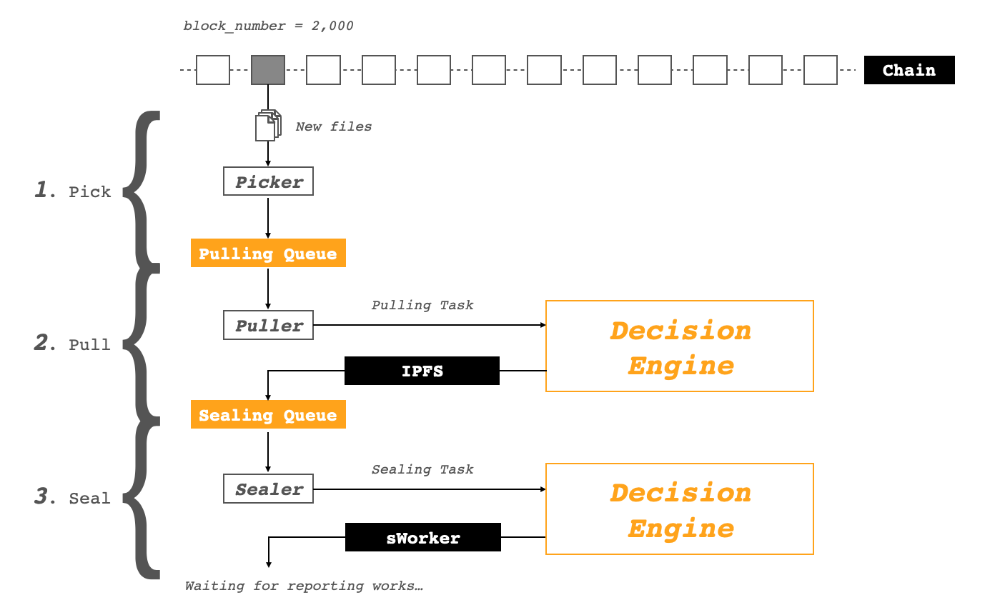

sManager (Storage Manager) is a file picking robot which continuous picking and handling files from Crust Network. Node operators can customize this module to implement their own file handling strategy. Basically, sManager is divideds into the following parts:

1. **Picker**: Listen new files from chain, add a pulling task into `Pulling Queue`;
2. **Puller**: Take task from `Pulling Queue`, pull the file from IPFS, when the file downloaded successfully, add a sealing task into `Sealing Queue`;
3. **Sealer**: Take task from `Sealing Queue`, seal the file by calling sWorker API;
4. **Decision Engine**: The detail picking-up mechanism can be customized by node-self;

## Usage

1. Clone repo

```shell
git clone https://github.com/crustio/crust-smanager.git
```

2. Installing

```shell
cd crust-smanager && yarn
```

3. Debug

```shell
yarn debug $CHAIN_ADDR $IPFS_ADDR $SWORKER_ADDR $NODEID $CHAIN_ACCOUNT
```

- `$CHAIN_ADDR`: Chain's websocket address, default is `ws://localhost:9944`
- `$IPFS_ADDR`: IPFS's API address, default is `http://localhost:5001`
- `$SWORKER_ADDR`: sWorker's API address, default is `http://localhost:12222`
- `$NODEID`: Node type, only has 2 types, member or isolation, default is `isolation`
- `$CHAIN_ACCOUNT`: Chain's account, used for group deduplicate and member judgement, Maxwell's format is `5HnF6QzzXqTyzoLieVjcE4aw71NxhNK8XAH5634yXmGzz16N`

4. Dockerize

```shell
./dockerize.sh
```

## Flows

The overall sManager working flow shows like the following diagram.



It divided into 3 processes. Generally, it picking file from chain, pulling file from IPFS and sealing file with sWorker.

### 1. Pick

Picking process contains:

1. Subscribe new finalized block from chain
2. Parse the block's information, get new files by parsing events and extrinsics
3. Get group information and judge if member node should pick files
4. Judge file's cid legality
5. Deleting expired files and closed files from chain
6. Clearing outdated tasks of pulling and sealing queue

### 2. Pull

Pulling process contains:

1. Loop all pulling tasks in pulling queue
2. For each task, puller will send it into `Decision Engine` to judge if we pick up it or not(see [details](#3-decision-engine) on how it decides about pulling)
3. Async pulling by calling IPFS' pin API, if successed, add it into sealing queue

### 3. Seal

Sealing process contains:

1. Loop all sealing tasks in sealing queue
2. For each task, sealer will send it into `Decision Engine` to judge if we seal it or not(see [details](#3-decision-engine) on how it decides about sealing)
3. Async sealing by calling sWorker's seal API, if successed, the whole pick-up ended, waiting for reporting works.

## Components

sManager's code divided into 4 parts:

1. Cron job: Scheduling executing the pulling and sealing process, the picking process is triggered by chain's new block;
2. Queues: the current sManager's queue system is in-memory, managing different tasks;
3. APIs: integrated with Chain, IPFS and sWorker;
4. Decision Engine: Customized picking-up mechanism;

### 1. Cron job

#### Description

sManager's entry is 3 crob jobs: picking job triggered by chain's new block; pulling job and sealing job triggered by a timing job. The source code can be check [here](https://github.com/crustio/crust-smanager/blob/main/src/decision/index.ts)

```ts
  const de = new DecisionEngine(
    chainAddr,
    ipfsAddr,
    sworkerAddr,
    nodeId,
    chainAccount,
    ipfsTimeout,
    sworkerTimeout
  );

  // TODO: Get cancellation signal and handle errors?
  de.subscribeNewFiles().catch(e =>
    logger.error(`💥  Caught pending queue error: ${e.toString()}`)
  );
  de.subscribePullings().catch(e =>
    logger.error(`💥  Caught pulling queue error: ${e.toString()}`)
  );
  de.subscribeSealings().catch(e =>
    logger.error(`💥  Caught sealing queue error: ${e.toString()}`)
  );
```

#### Customize

Node can customize by adjusting the cron job time of pulling & sealing job. Please refer the [node cron syntax](https://github.com/node-cron/node-cron#cron-syntax) to change the trigger time.

### 2. Queues

#### Description

Queue is a fundamental data structure used in sManager, currently, sManager use **in-memory queue**, which means *it will be clear when sManager restarted.* Queue's structure shows below, and the source code can be check [here](https://github.com/crustio/crust-smanager/blob/main/src/queue/index.ts)

```ts
export interface BT {
  // Block number
  bn: number;
}

export default class TaskQueue<T extends BT> {
  private _tasks: T[];
  private readonly maxLength: number; // queue length
  private readonly maxDuration: number; // task outdated time
  // ...
}
```

It shows the basic queue's characteristics:

- `Task`: `T`(task) should have `bn`(block number) member field
- `maxLength`: Queue should have max length
- `maxDuration`: Queue should clear the outdated task periodically

And there has 2 queues in sManager: `pullingQueue` and `sealingQueue` defined in `decision` module.

```ts
interface Task extends BT {
  // The ipfs cid value
  cid: string;
  // Object size
  size: number;
}

private pullingQueue: TaskQueue<Task>;
private sealingQueue: TaskQueue<Task>;
```

#### Customize

Node can customize by:

- Persistent queue by importing `Redis`, `MongoDB` or any other databases/message middlewares to save task, then it won't be disappeared when program restart
- Dynamic `maxLength` and `maxDuration` designed by your memory or CPU utilization

### 3. APIs

sManager communicated with 3 modules of Crust: Chain, IPFS and sWorker, node can add more api calls using in decision engine, please refer the completed API calls docs:

- Chain's API calls: please refer [crust.js](https://github.com/crustio/crust.js) and [polkadot-js/api](https://github.com/polkadot-js/api)
- [IPFS's API calls](https://github.com/ipfs-inactive/js-ipfs-http-client#api)
- [sWorker's API calls](https://github.com/crustio/crust-sworker/blob/master/docs/API.md)

#### 3.1 Chain

Current chain's API call shows below, source code can be check [here](https://github.com/crustio/crust-smanager/blob/main/src/chain/index.ts).

- `subscribeNewHeads`: Listen the best finalized block, used for listening the new files from block
- `isSyncing`: Judge if the chain still in syncing, used by `subscribeNewHeads`
- `header`: Get latest block header, used by `isSyncing`
- `getChainAccount`: Get chain account from `arg[4]($CHAIN_ACCOUNT)`, used for judging if the node is group owner
- `sworkIdentity`: Get sWorker identity, used for geting group owner's information
- `groupMembers`: Get the node's group member information, used for deduplicate files
- `parseNewFilesAndClosedFilesByBlock`: Parse `FileSuccess` event and `place_storage_order` to get new files(*new pulling task*); parse `CalculateSuccess` and `IllegalFileClosed` to get expired/illegal files(*deleted files*)
- `maybeGetFileUsedInfo`: Get `[FileInfo, UsedInfo]` by cid, used for judging if file's replicas is full
- `withApiReady`: Make sure `ApiPromise` can be used
- `parseFileInfo`: Transfer `place_storage_order` extrinsic data to `FileInfo`

#### 3.2 IPFS

Current IPFS's API call shows below, source code can be check [here](https://github.com/crustio/crust-smanager/blob/main/src/ipfs/index.ts).


- `pin`: `ipfs pin [cid]`
- `unpin`: `ipfs pin rm [cid]`
- `size`: `ipfs object stat [cid]`
- `exist`: `ipfs pin ls --type=recursive | grep [cid]`
- `free`: `ipfs repo stat`

#### 3.3 sWorker

Current sWorker's API call shows below, source code can be check [here](https://github.com/crustio/crust-smanager/blob/main/src/sworker/index.ts).

- `seal`: Seal a file existing in IPFS, **this call is a sync call**, please make sure execute 1 by 1
- `delete`: Delete a file already sealed by sWorker, as well as the original file in IPFS
- `free`: The rest disk capacity

### 4. Decision Engine

Decision Engine determines Node's different **picking-up mechanism**, current **default decisions** shows below, and the source code of decision engine can be check [here](https://github.com/crustio/crust-smanager/blob/main/src/decision/index.ts).

#### 4.1 Free space judging

sManager judged the current free space when trying to pulling file from IPFS and trying to sealing file with sWorker.

1. Before pulling file

```ts
  private async pickUpPulling(t: Task): Promise<boolean> {
    try {
      // 1. Get and judge file size is match
      // TODO: Ideally, we should compare the REAL file size(from ipfs) and
      // on-chain storage order size, but this is a COST operation which will cause timeout from ipfs,
      // so we choose to use on-chain size in the default strategy

      // Ideally code:
      // const size = await this.ipfsApi.size(t.cid);
      // logger.info(`  ↪ 📂  Got ipfs file size ${t.cid}, size is: ${size}`);
      // if (size !== t.size) {
      //   logger.warn(`  ↪ ⚠️  Size not match: ${size} != ${t.size}`);
      //   // CUSTOMER STRATEGY, can pick or not
      // }
      const size = t.size;

      // 2. Get and judge repo can take it, make sure the free can take double file
      const free = await this.freeSpace();
      // If free < t.size * 2.2, 0.2 for the extra sealed size
      if (free.lte(t.size * 2.2)) {
        logger.warn(`  ↪ ⚠️  Free space not enough ${free} < ${size}*2.2`);
        return false;
      }

      // 3. Judge if it should pull from chain-side
      return await this.shouldPull(t.cid);
    } catch (err) {
      logger.error(`  ↪ 💥  Access ipfs or sWorker error, detail with ${err}`);
      return false;
    }
  }
```

2. Before sealing file

```ts
  private async pickUpSealing(t: Task): Promise<boolean> {
    const free = await this.freeSpace();

    // If free < file size
    if (free.lt(t.size)) {
      logger.warn(`  ↪ ⚠️  Free space not enough ${free} < ${t.size}`);
      return false;
    }

    return true;
  }
```

#### 4.2 File replica judging

sManager will get file's replica info **before pulling file**. When the replica is full(currently is 200, defined by `MaxFileReplicas`), the node will refuse to pulling this file.

```ts
  /**
   * Judge if replica on chain is full or file on chain is exist
   * @param cid ipfs cid value
   * @returns wether file not exist or replica is full
   * @throws crustApi error
   */
  private async isReplicaFullOrFileNotExist(cid: string): Promise<boolean> {
    const usedInfo: UsedInfo | null = await this.crustApi.maybeGetFileUsedInfo(
      cid
    );

    logger.info(`  ↪ ⛓  Got file info from chain ${JSON.stringify(usedInfo)}`);

    if (usedInfo && _.size(usedInfo.groups) > consts.MaxFileReplicas) {
      logger.warn(
        `  ↪ ⚠️  File replica already full with ${usedInfo.groups.length}`
      );

      return true;
    } else if (!usedInfo) {
      logger.warn(`  ↪ ⚠️  File ${cid} not exist`);
      return true;
    }

    return false;
  }
```

#### 4.3 Group deduplicate

Because there is only 1 replica within the same group, so sManager provides the deduplicate mechanism, which simply uses the `mod` by `cid(toNum)` and `group length`.

```ts
  /**
   * Judge if is member can pick the file
   * @param cid File hash
   * @returns Whether is my turn to pickup file
   */
  private async isMyTurn(cid: string): Promise<boolean> {
    // Member but without groupOwner is freaking strange, but anyway pass with true
    if (
      this.nodeId === consts.MEMBER &&
      this.groupOwner &&
      this.members.length > 0
    ) {
      // 1. Get group length
      const len = this.members.length;
      // 2. Get my index
      const myIdx = this.members.indexOf(this.crustApi.getChainAccount());
      // 3. Judge if should pick storage order
      if (myIdx !== -1) {
        const cidNum = lettersToNum(cid);
        logger.info(
          `  ↪  🙋  Group length: ${len}, member index: ${myIdx}, file cid: ${cid}(${cidNum})`
        );
        return cidNum % len === myIdx;
      }
    }

    return true;
  }
```

There are some clues for nodes to customize its Decision Engines:

1. Ranking pulling queue with file's price, picking from high to low;
2. Pick to wrong size file(ordered file size < real file size), close it to get the whole reward

More customized decisions are welcomed to be contributed to sManager, and you of course can develop your own sManager.

## Resources

- `crust-smanager`: https://github.com/crustio/crust-smanager
- `crust.js`: https://github.com/crustio/crust.js
- `crust`: https://github.com/crustio/crust
- `crust-sworker`: https://github.com/crustio/crust-sworker
- `js-ipfs`: https://github.com/ipfs/js-ipfs
