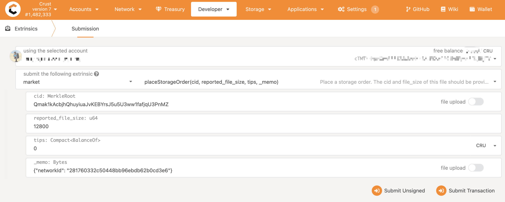

sManager (Storage Manager) is a file picking bot which continuously picking and handling files from Crust Network. Node operators can customize this module to implement their own file handling strategy. 

## Main Flow

sManager consists of a bunch of recurring jobs exchanging data via local database and application context. The main workflow is illustrated as below: 


- `Chain Event Indexer` subscribes chain event, and indexes latest file records to local database's `File Records Queue`

- `Chain Database Indexer` parses file records from Crust Network on-chain database, and indexes historical file records to local database's `File Records Queue`

- `Pull Scheduler` periodically picks file records from `File Records Queue` based on its picking strategy, pulls the file from IPFS network by *pinning* it to local IPFS node, and then seals the file by calling sWorker's seal API.


## Usage

1. Clone repo

```shell
git clone https://github.com/crustio/crust-smanager.git
```

2. Installing

It's recommended to use `volta` as the node version manager. Please follow the [volta docs](https://docs.volta.sh/guide/getting-started) to install it.

```shell
cd crust-smanager && npm i
```

3. Debug

```shell
npm run dev
```

4. Run in Prod
```shell
npm run build
npm start
```

It's recommended to run sManager using Docker with the `restart=always` restart policy.

A daemon guard should be configured if you want to run sManager natively without docker. Tools like `pm2` and `nodemon` could be used.

## Configuration

sManager could be configured with a json format file, whose name is specified with environment variable `SMANAGER_CONFIG`. If not set, default file name `smanager-config.json` will be used.

You could check [smanager-config.example.json](https://github.com/crustio/crust-smanager/blob/mainnet/data/smanager-config.example.json) as a sample config file:

```json
{
  "chain": {
    "account": "crustaccount",
    "endPoint": "ws://localhost:19944"
  },
  "sworker": {
    "endPoint": "http://localhost:12222"
  },
  "ipfs": {
    "endPoint": "http://localhost:5001"
  },
  "node": {
    "role": "member"
  },
  "telemetry": {
    "endPoint": "https://sm-submit.crust.network"
  },
  "dataDir": "data",
  "scheduler": {
    "minSrdRatio": 30,
    "strategy": {
      "dbFilesWeight": 10,
      "newFilesWeight": 90
    }
  }
}
```

Those config items will be loaded in the sManager configuration setup process. The meaning of each item is as follows:

- `chain.account`: your member account

- `chain.endPoint`: your chain endpoint

- `sworker.endPoint`: your sWorker endpoint

- `ipfs.endPoint`: your IPFS endpoint

- `dataDir`: the directory of the database of sManager

- `scheduler.minSrdRatio`: a minimum ratio of SRD that one node can start to accept storage orders.

    > For example, if the ratio is 30, your node will start to accept storage order once the ratio of SRD capacity is higher than 30%

- `scheduler.strategy.dbFilesWeight`: how much bandwidth of this node will be used to fetch and store the history storage orders (Storage orders in the past four months).

- `scheduler.strategy.newFilesWeight`: how much bandwidth of this node will be used to fetch and store the newest storage orders.


## Components

sManager is designed to have several tasks running independently. Tasks are either scheduled by the block event or by configured intervals. Each task plays as an actor which consumes/produces some information and communicate with other tasks through the local database or application context.

sManager follows the **Fails Early** principle which means it will shutdown on any unexpected error. To support this principle, tasks are designed to be recoverable after application restarts.

### Local Database

The local database stores below information:

1. **File Records**: The files metadata (tips, size, replicas count, expire time, etc) on Crust Network.

2. **File and Owner Relationship**: sManager also maintains the relationship between a file and an on-chain account. This information will help making better pulling decision.

3. **Chain Metadata**: E.g. the block and time on chain.

4. **Pin Records**: The pin history of files.

5. **Cleanup Records**: The files needs to removed from local file system, normally this is triggered when a file expires on Crust Network.

Checkout [Db Schema](https://github.com/crustio/crust-smanager/blob/mainnet/db-schema.md) for the schema details.

### Indexers

Indexers extract information into the local database from various data sources. Currently sManager has implemented below indexers:

1. **Chain Database Indexer**: Index file records from the Crust Network on-chain database.

2. **Chain Event Indexer**: Index file records by listening latest chain event.

3. **Chain Time Indexer**: A simple indexer which pushes the latest block height and it's timestamp to the config table.


### Simple Tasks

Simple tasks are specialized tasks which runs periodically. Currently sManager has implemented below tasks:

1. **Group Info Updater**: Update sworker identity information from sworker api.

2. **Ipfs Gc**: Schedule ipfs gc periodically.

3. **Telemetry Reporting**: Report smanager statistics information to the telemetry server.

4. **Pull Scheduler**: Schedule file pulling based on configured strategy.

5. **Seal Status Updater**: Update sealing status periodically.

6. **File Retry Task**: Retry pulling if possible.

7. **File Cleanup Task**: Cleanup deleted files from local file system.

## Customize for Private DSM

### Motivation

Essentially, Crust [DSM](DSM.md) is a public decentralized storage market. Storage orders are broadcast across the whole Crust Network, and any Node could possibly pick any order, pull the file to local IPFS node, and seal it.

In some cases, however, [Storage Merchants](storage-merchant.md) may prefer to build a virtual `private DSM` based on Crust Network, and provide storage service for their customers only. This is a reasonable requirement, and could be satisfied by a few customization to sManager and the IPFS node sManager connects to.

### Howto

#### Basic Flow

Basically, the solution is built on top of [IPFS Private Network](https://docs.ipfs.io/concepts/privacy-and-encryption/#creating-a-private-network), with additional customization to sManager, and some protocol agreements between Storage Merchants and their customers.

- `IPFS`: Firstly, Storage Merchants create an `IPFS Private Network`, and configure there sManager to connect to these private IPFS nodes.
- `sManager`: Storage Merchants customize their sManager to only pick up specific storage orders:
  - Generate a unique `private network Id`, configure it in the sManager, and share it to their customers
  - Customers place storage orders with this `private network Id` in the `_memo` field

> Please do note that, customer should upload file to one of the IPFS node in the `IPFS Private Network` before placing the order. Otherwise, file will be stored by other public storage merchants, but not the target storage merchants. 


#### IPFS Private Network

`IPFS Private Network` could be setup by simply generating a shared secret key and saving it to `$IPFS_PATH`.

1. Generate a pre-shared-key using [ipfs-swarm-key-gen](https://github.com/Kubuxu/go-ipfs-swarm-key-gen)

```shell
go get github.com/Kubuxu/go-ipfs-swarm-key-gen/ipfs-swarm-key-gen
ipfs-swarm-key-gen > ~/.ipfs/swarm.key
```

2. Join a private network

To join a given private network, get the key file from someone in the network and save it to ~/.ipfs/swarm.key (If you are using a custom $IPFS_PATH, put it in there instead).

For more information, please refer to [IPFS Docs](https://github.com/ipfs/go-ipfs/blob/release-v0.9.0/docs/experimental-features.md#private-networks).


#### sManager Customization

1. Add a `networkId` field to the config file.
2. Disable `Chain Database Indexer`. This indexing job is no longer necessary, and besides, order `_memo` is not persisted into chain database.
3. Update `Chain Event Indexer` to only pick orders with the configured `networkId` in the `_memo` field.

#### Order Memo

When placing storage orders targeted at a `private DSM`, customer could place `network Id` in the `_memo` field, as illustrated below:



### sManager Customization Sample

As a reference, you could check [decooio/crust-smanager](https://github.com/decooio/crust-smanager) for how to customize sManager to build a `private DSM` on top of Crust Network.

## Resources

- `crust-smanager`: https://github.com/crustio/crust-smanager
- `crust.js`: https://github.com/crustio/crust.js
- `crust`: https://github.com/crustio/crust
- `crust-sworker`: https://github.com/crustio/crust-sworker
- `js-ipfs`: https://github.com/ipfs/js-ipfs
