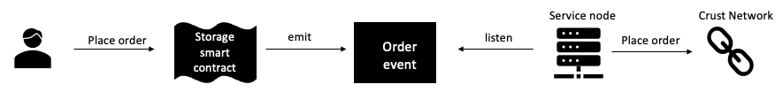

## Introduction

Decentralized storage(dStorage) is the fundamental of Web3 ecosystem. As a supplement to the costly on-chain storage, dStorage can scale horizontally as distributed network and store unlimited data theoretically.

[Ethereum's Web3 stack](https://ethereum.org/en/developers/docs/storage/) lists some important considerations about dStorage:

- Persistence mechanism and incentive structure
- Data retention enforcement
- Decentrality
- Consensus

Based on these thoughts, dStorage projects are usually a **standalone** **blockchain** with consensus supporting data retention ability, incentive mechanism, and data persistence. The chart below shows an analysis of several mainstream Storage projects and their strategies for data retention and data persistence.

[ ](https://www.notion.so/68b99ae146214e73b3ef3a8cfcb6727a)

As the fundamental of Web3 ecosystem, dStorage is designed to serve the entire web3 ecosystem, including DApp hosting, NFT metadata storage, GameFi and social media data storage, even hosting the Metaverse. So we want to use **a single web3 identity for** DApps and personal data storage rather than multiple accounts. ***It's very similar to SSO(Single Sign-On) in Web2 world.***

There are many smart contract platforms such as Ethereum, Polkadot, Near, Polygon, Solana... Every platform has its own DApp ecosystem. Web3 users use different identities to call smart contracts on each blockchain. And providing dStorage to users on different blockchains becomes a basic requirement for dStorage projects.

## Solution

Crust Network provides storage smart contract integrations for various smart contract platforms.

It is a combination of:

- Storage Smart Contract: users can place order on various platforms
- Merchant node: service node which runs monitoring and order processes provided by Crust Network



#### 1. Storage Smart Contract

Storage Smart Contract is deployed by Crust Network on various blockchain platforms. Currently, the Storage Smart Contract has been deployed on following platforms:

- [Ethereum](https://github.com/crustio/eth-storage-contract/blob/main/contracts/StorageOrder.sol)
- [Arbitrum one](https://github.com/crustio/eth-storage-contract/blob/main/contracts/StorageOrderCompatible.sol)
- [Polygon](https://github.com/crustio/eth-storage-contract/blob/main/contracts/StorageOrderCompatible.sol)
- [Astar](https://github.com/crustio/eth-storage-contract/blob/main/contracts/StorageOrderAstar.sol)
- [Aptos](https://github.com/crustio/aptos-storage-contract)
- [Elrond](https://github.com/crustio/elrond-storage-contract)

##### Storage Smart Contract main functions

***Funtions for contract owner***

1. add_order_node: Add merchant service node
1. remove_order_node: Remove merchant service node
1. set_order_price: Set order price which includes order base price and byte price
1. set_size_limit: Set file size limit
1. set_service_rate: Set merchant service fee rate

***Functions for users***

1. get_price: Get file price by size, **file_price = base_price + byte_price * size / 1024^2, price = file_price * (service_price_rate + 100) / 100**
1. place_order: Place order with cid
1. place_order_with_node: Place order with indicated node

JS Code sample(Ethereum compatible):
```
// Place order in ethereum compatible platform, you can get the storageOrder contract instance by ethers.js or web3.js as you like
// For more information please refer to allow "https://docs.ethers.io/v5/" and "https://web3js.readthedocs.io/en/v1.7.3/"
const fileCid = "QmfH5zLmBtptUxRSGWazaumGwSsCW3n6P164eRXpbFatmJ";
const fileSize = 5246268;

// Firstly get price in ETH with file size
const StorageOrderABI = [
  "function placeOrder(string cid, uint size) external payable",
  "function placeOrderWithNode(string cid, uint size, address nodeAddress) public payable",
  "event Order(address customer, address merchant, string cid, uint size, uint price)",
]
// Take Ethereum for example
const StorageOrderAddress = "0x6e9469673257e21b3e75bb9292c9ab009bc481d4";
const provider = new ethers.providers.JsonRpcProvider();
const signer = provider.getSigner()
const storageOrder = new ethers.Contract(StorageOrderAddress, StorageOrderABI, provider);
const storageOrderSigner = storageOrder.connect(signer);
const price = await storageOrderSigner.getPrice(fileSize);

// Secondly placeOrder with cid, size and price 
await storageOrderSigner.placeOrder(fileCid, fileSize, {value: price})
// You can also place order with an indicated node
// const order_node = "0xc582Bc0317dbb0908203541971a358c44b1F3766";
// await storageOrderSigner.placeOrderWithNode(fileCid, fileSize, order_node, {value: price})
```

For Aptos sample, please refer to [this doc](https://github.com/crustio/aptos-storage-contract)

For Elrond sample, please refer to [this doc](https://github.com/crustio/elrond-storage-contract)

#### 2. Merchant node

Everyone can start a [storage contract node](https://github.com/crustio/storage-contract-node) to provide a place order service as a merchant node.

Merchant node helps customers place storage orders on Crust Network and obtains a service fee in return decided by service price rate(**service_fee = file_price * service_price_rate / 100**).

## Cases now

Storage Smart Contract has already been used by several platforms including:

- [Smart Contract] [Ethereum](https://etherscan.io/address/0x6e9469673257e21b3e75bb9292c9ab009bc481d4)
- [Smart Contract] [Arbitrum one](https://arbiscan.io/address/0x6E9469673257E21B3E75bb9292c9aB009bc481D4)
- [Smart Contract] [Polygon](https://polygonscan.com/address/0xE1E8ff8e51DA7066CB1009a4c1dE68AE2d095655)
- [Smart Contract] [Astar](https://blockscout.com/shiden/address/0x10f15729aEFB5165a90be683DC598070F91367F0)
- [Smart Contract] [Aptos](https://explorer.aptoslabs.com/account/0x59c6f5359735a27beba04252ae5fee4fc9c6ec0b7e22dab9f5ed7173283c54d0)
- [Smart Contract] [Elrond](https://explorer.elrond.com/accounts/erd1qqqqqqqqqqqqqpgq9z44nz6t6nheyflvfh94syzky84gk0d8j3vss49tnh)
