This document is aimed at claiming the mainnet CRU18. The user signs it with an ETH account, and maps the CRU18 information in advance on the Maxwell preview network.After the mainnet goes online, the Maxwell address of your claimed CRU18 will be converted to the mainnet address.

## Attention

1. **On Maxwell,CRU18 cannot be staked to obtain income**,the stake function of CRU18 will only take effect after the mainnet is launched
2. After the mainnet goes online, the **Maxwell address you claimed for CRU18 will be converted to the mainnet address**, ⚠️Be sure to keep your Maxwell address's mnemonic seed"/"backup file"&password⚠️ 
3. CRU18 **Claim can only be done once**, please **be sure to choose your Maxwell address (main network address) and keep your private key information**, all information is recorded by the Maxwell chain and cannot be updated or changed

## Preparation for claiming

In order to prevent unknown errors in the claim CRU18 process, we highly recommend using the following tools to help you in the entire claim process:

> Don't worry about being unfamiliar with the following tools, we will teach you how to use them step by step in the following steps.

1. [MyEtherWallet](https://www.myetherwallet.com/interface/dashboard)
2. [Crust Apps](https://apps.crust.network/)

## Steps

### I．Confirm that your wallet has CRU18 tokens and has private key signature authority

Make sure you are listed on CRU18's holder list:[Etherscan CRU18 Holders List](https://etherscan.io/token/0x655ad6cc3cf6bdccab3fa286cb328f3bce9a3e38#balances)

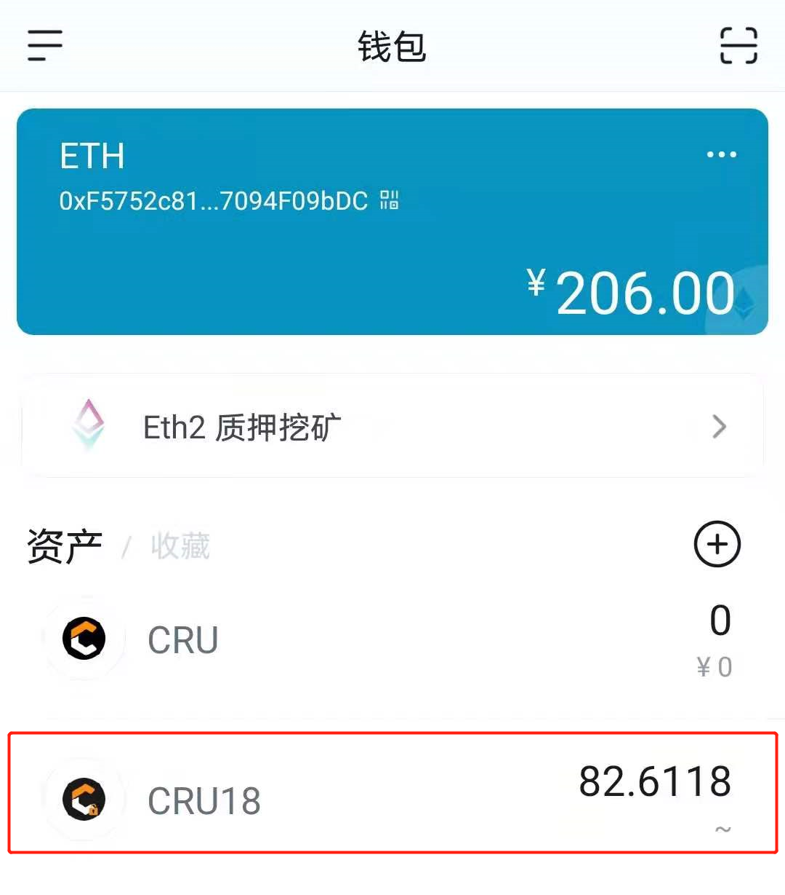

### II．Signature verification and bridge tokens

Go to the Claims page of [Crust Apps](https://apps.crust.network/#/claims)

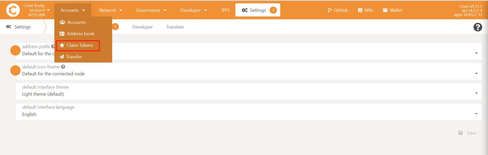

1. Select the Claim CRU18 module
2. Select the account of Maxwell Preview Network that you want to claim（**⚠️Remember to backup "mnemonic seed"/"backup file"&password⚠️**）
3. Click "Continue"

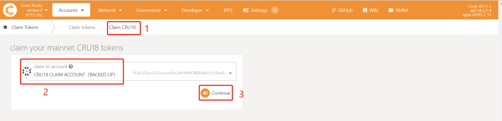

### III. Log in to MyEtherWallet and Connect to your wallet

1. Open[MyEtherWallet](https://www.myetherwallet.com/access-my-wallet):
    - Click 'MEW wallet'
    - Connect the wallet which with ERC20 CRU18(The following process will use 'ImToken' and 'MetaMask' as example)

**⚠️ Pay Attention, please ensure that the connected wallet address has CRU18(We need to sign the message with the private key of this address)**

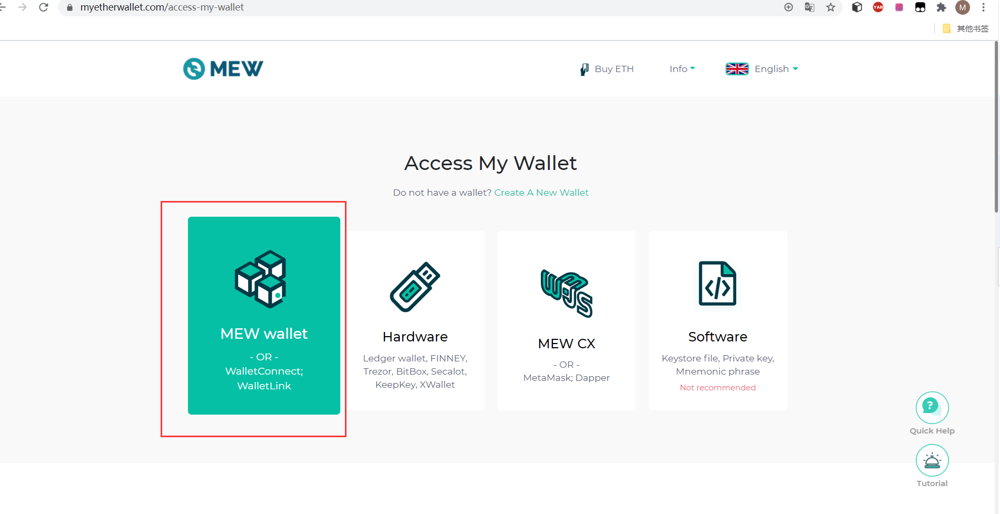

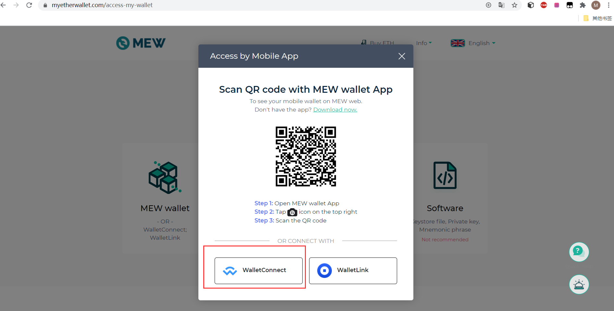

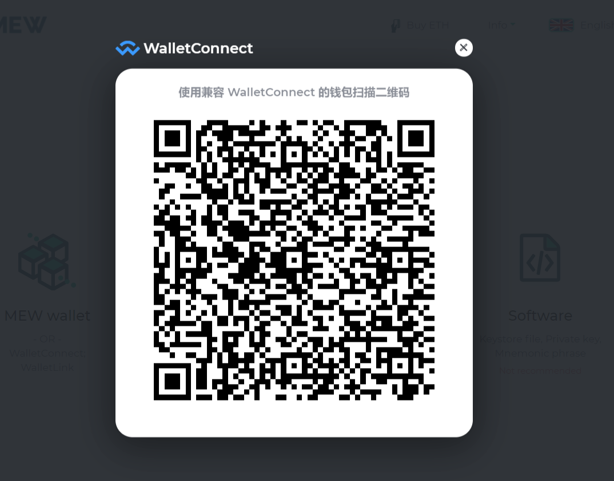

2. On the ImToken mobile client, click the *scan icon* in the upper right corner, scan the QR code displayed by MyEtherWallet and authorize

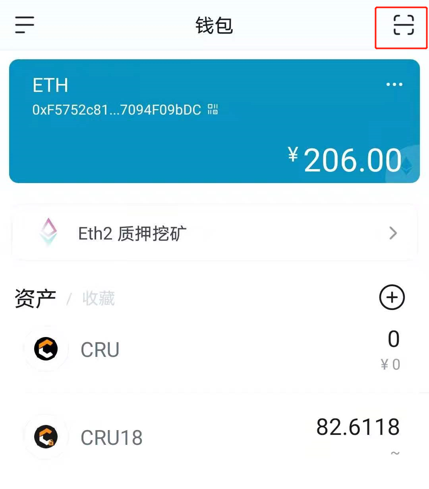

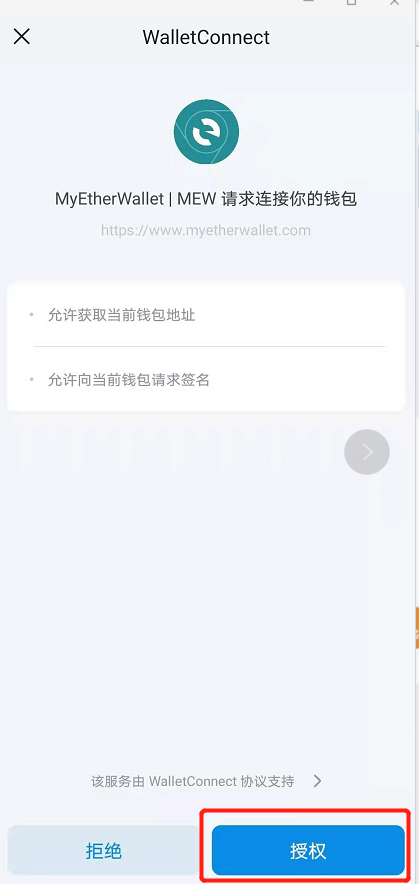

If you use MetaMask, please click MEW CX after you access your Wallet

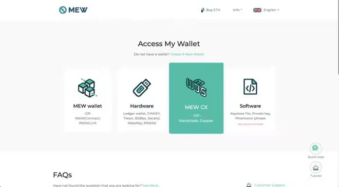

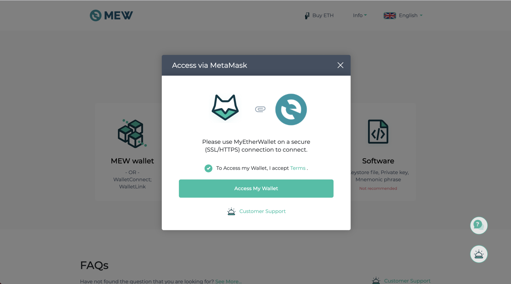

3. After the authorization is successful, you will see the following screen on the MyEtherWallet page, which means your wallet is successfully connected

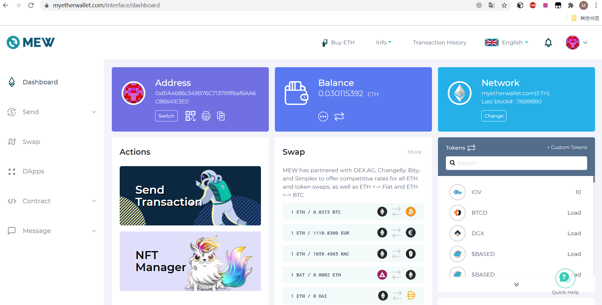

### IV. Get the Ethereum Signature

1. In Crust Apps Claim-Claim CRU18 page，**Click the gray box to copy the text**

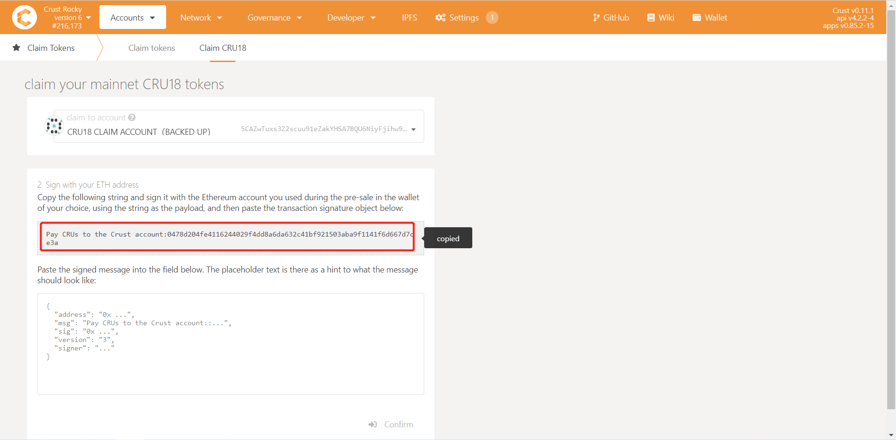

2. In MyEtherWallet page, click **Message** on the left side as shown, select **Sign Message**, and paste the text in the gray box into the text box, click **Sign**

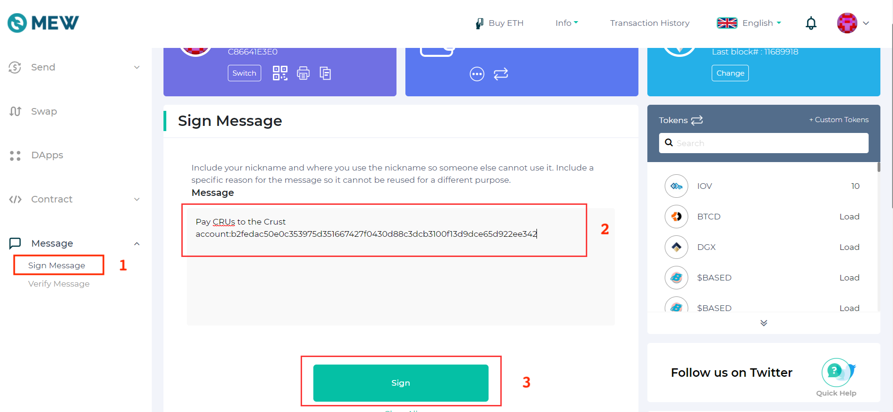

3. There will be a pop-up in the ImToken side, Click "Confirm", **⚠️ Please be attention here, At this step, the communication between MyEtherWallet and ImToken may be interrupted and no authorization information will pop up. Please execute** [Step III](#iii-log-in-to-myetherwallet-and-connect-to-your-wallet) again.

If you use MetaMask, you just need to make your sign through Metamask pop-up window.

4. Go back to MyEtherWallet, click **Confirm Signing**

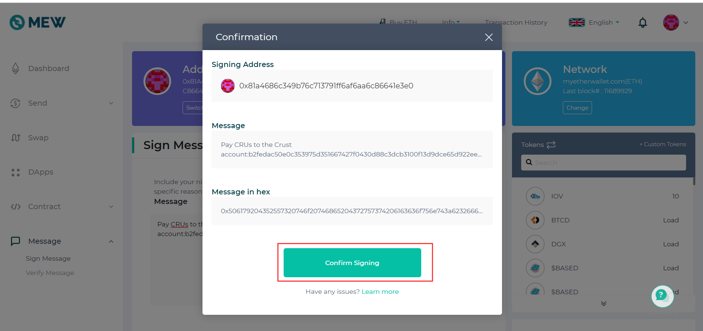

5. When MyEtherWallet shows **Signed Message**, click 'Copy'

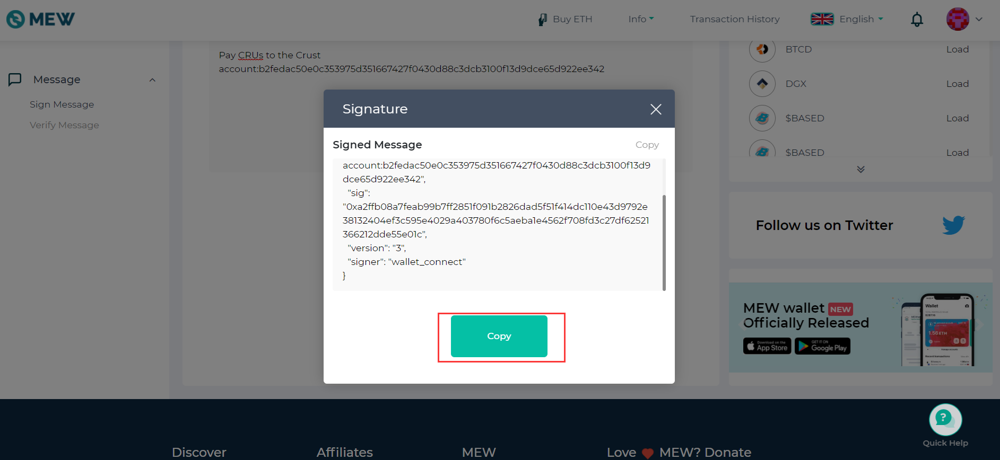

### V. Claim CRU18

Go back to **Crust Apps Claims** page, with the **Signed Message** copied in [Step IV](#iv-get-the-ethereum-signature):

1. Paste the signature into the area shown in the image below, and click "Confirm claim". The green area shown as the image below will appear if the claim is recorded on chain.

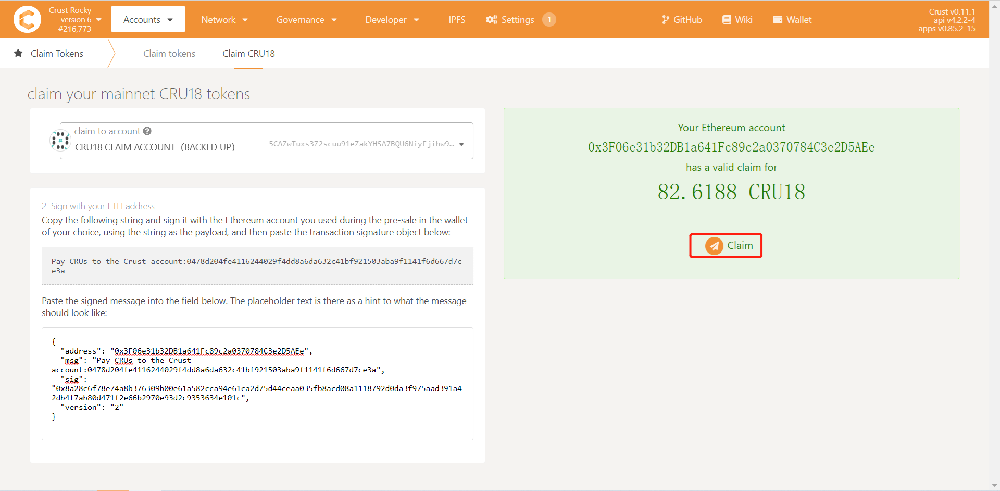

2. Click to claim

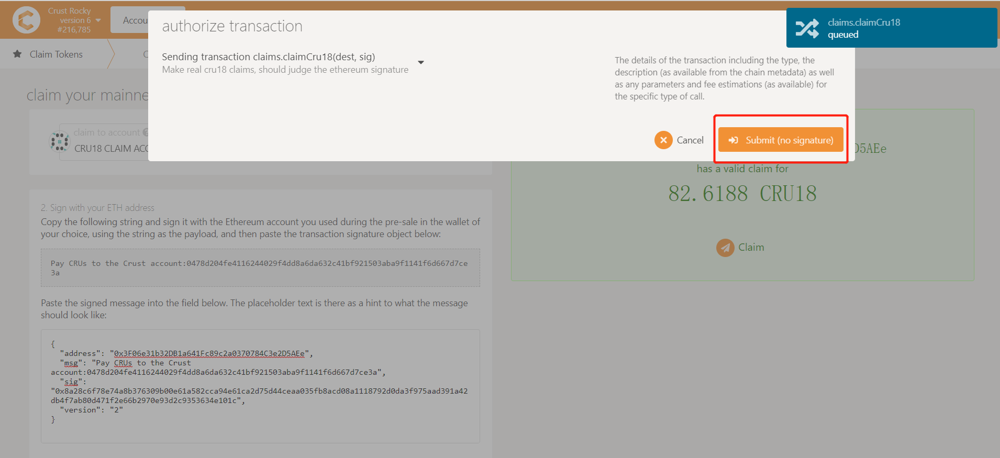

3. Claim Successfully

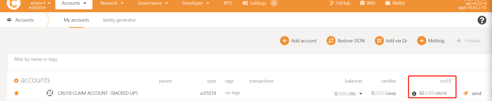

## Reference 

The code involved in claim process has been **open source**:

1. [Crust CRU18 Bridge](https://github.com/decloudf/crust-bridge/tree/main/mainnet-bridge)
2. [Crust Claims](https://github.com/crustio/crust/tree/maxwell/cstrml/claims)
