[CSM Token](https://ipfs.decoo.io/ipfs/QmYVRP7puUhGvQPuThHK2mtQgj2nUAoJYkBgXYxwiaC8Dq) is Crust Shadow's original token.The total initial amount of CSM is 200 million,it will be allocated to community.you can map the ERC20 CSM to the Crust Maxwell network in advance to participate Maxwell's storage market related activities.Follow this tutorial step by step to claim Maxwell CSM. 

## Preparation

In order to prevent unknown errors in the claim process, we highly recommend using the following tools to help you in the entire claim process:

> Don't worry about being unfamiliar with the following tools, we will teach you how to use them step by step in the following steps.

1. [MyEtherWallet](https://www.myetherwallet.com/interface/dashboard)
2. [ImToken](https://token.im/) or [MetaMask](https://metamask.io/)
3. [Crust Apps](https://apps.crust.network/)

## Steps

### 0. ⚠️⚠️⚠️  All exchange accounts are not applicable

Using an exchange account to sent a transfer (withdrawal) transaction will be invalidated and cause asset loss. You are responsible for the consequences!

### I. Send CSM Claim Transaction

First of all, you need to **transfer CSM** to ***Crust Maxwell Claim Address*** on the Ethereum side. Transfering can be done on any wallet side, but you **must pay attention to following points** before transfering CSM:

> 1. ⚠️ Please make sure you transfer CSM to the Claim Address, not ETH or CRU.
> 2. ⚠️ Make sure you have the authority to make signature with the private key of the account (all accounts created by exchanges are not applicable, please use the wallet with private key stored to perform following steps)
> 3. ⚠️ Confirm the CSM ERC20: [CSM](https://etherscan.io/token/0x2620638eda99f9e7e902ea24a285456ee9438861)
> 4. ⚠️ Crust Maxwell Claim Address: [0x17a9037cdfb24ffcc13697d03c3bcd4dff34732b](https://etherscan.io/address/0x17a9037cdfb24ffcc13697d03c3bcd4dff34732b)

Go to the Claim CSM page of [Crust Apps](https://apps.crust.network/#/claims/maxwellCsmClaims)

Initiate a CSM transaction to Crust Maxwell Claim Address

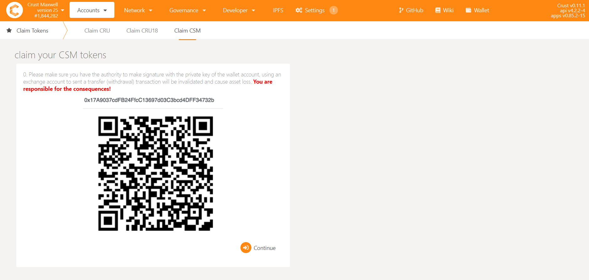

Please confirm your transaction is successful and make sure it has **at least 6 confirmations**, **copy the hash value of this successful transaction** and click "Continue".

### II. Verify transactions and bridge tokens

1. Select the account of Maxwell Preview Network that you want to claim
2. Input the Tx Hash you copied from  [Step I](#i-send-csm-claim-transaction)
3. Click "Continue", this step will wait for a while, backend bridge service will check the legicimacy of your claim transaction. **The network may busy for a while, and you will receive a failure hint, if that, you can wait and try it later.**

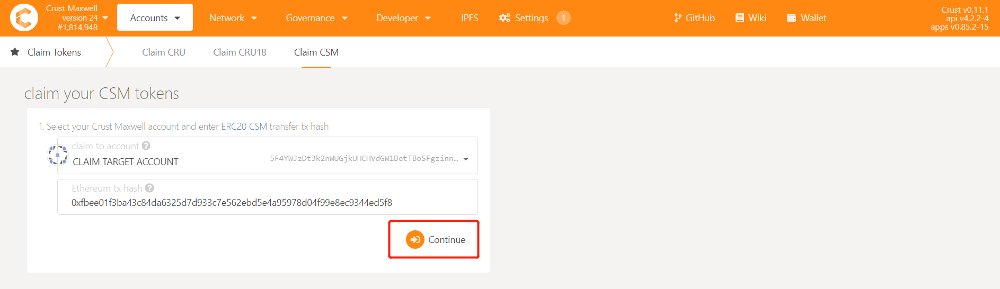

### III. Log in to MyEtherWallet and Connect to your wallet

1. Open [MyEtherWallet](https://www.myetherwallet.com/access-my-wallet):
    - Click 'MEW wallet'
    - Connect the wallet which you **transfer ERC20 CSM**(The following process will use 'ImToken' and 'MetaMask' as example)

**⚠️ Pay Attention, please ensure that the connected wallet address is same as the address where the transaction was successfully sent in [Step I](#i-send-csm-claim-transaction)**(We need to sign the message with the private key of this address)

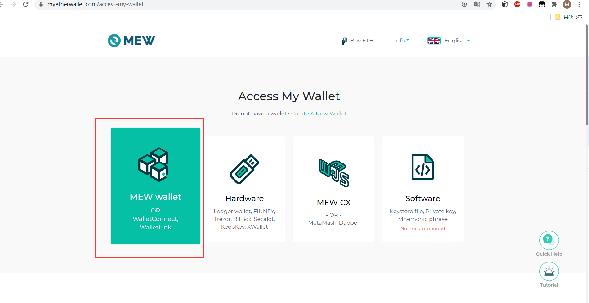

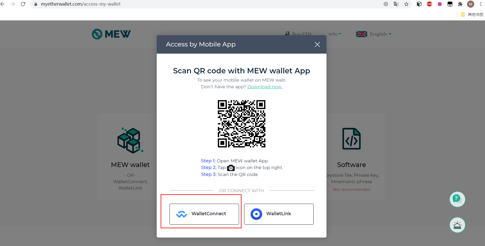

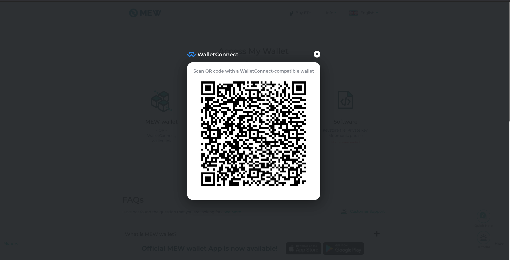

2. On the ImToken mobile client, click the *scan icon* in the upper right corner, scan the QR code displayed by MyEtherWallet and authorize

If you use MetaMask, please click `MEW CX` after you access your Wallet

3. After the authorization is successful, you will see the following screen on the MyEtherWallet page, which means your wallet is successfully connected

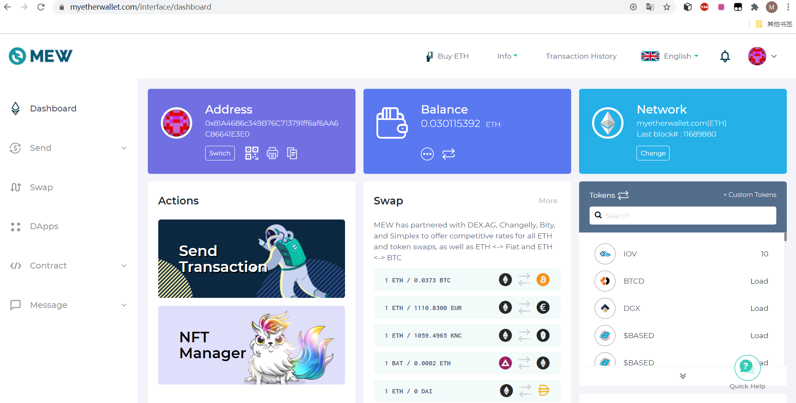

### IV. Get the Ethereum Signature

Make sure you completed [Step II](#ii-verify-transactions-and-bridge-tokens), then continue with following steps

1. In Crust Apps Claim page，**Click the gray box to copy the text**

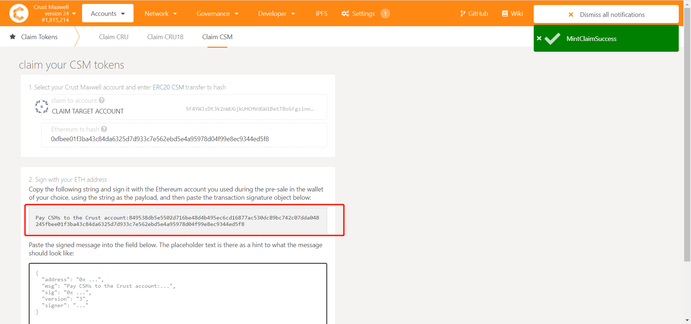

2. In MyEtherWallet page, click **Message** on the left side as shown, select **Sign Message**, and paste the text in the gray box into the text box, click **Sign**

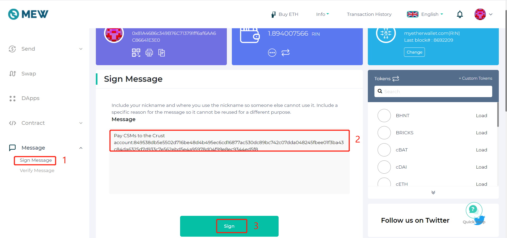

3. There will be a pop-up in the ImToken side, Click "Confirm", **⚠️ Please be attention here, At this step, the communication between MyEtherWallet and ImToken may be interrupted and no authorization information will pop up. Please execute** [Step III](#iii-log-in-to-myetherwallet-and-connect-to-your-wallet) again.

If you use MetaMask, you just need to make your sign through Metamask pop-up window.

4. Go back to MyEtherWallet, click **Confirm Signing**

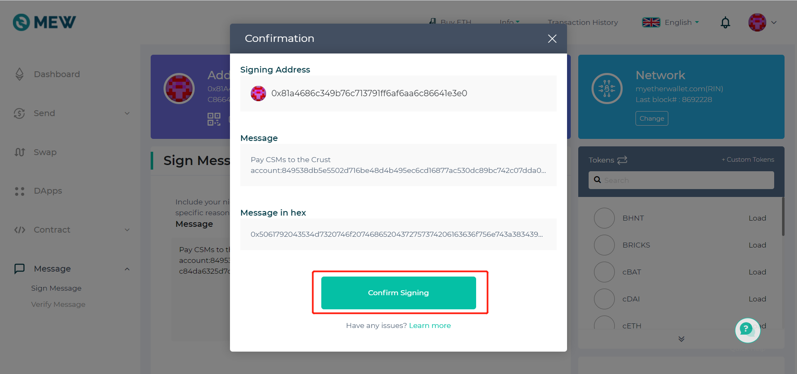

5. When MyEtherWallet shows **Signed Message**, click 'Copy'

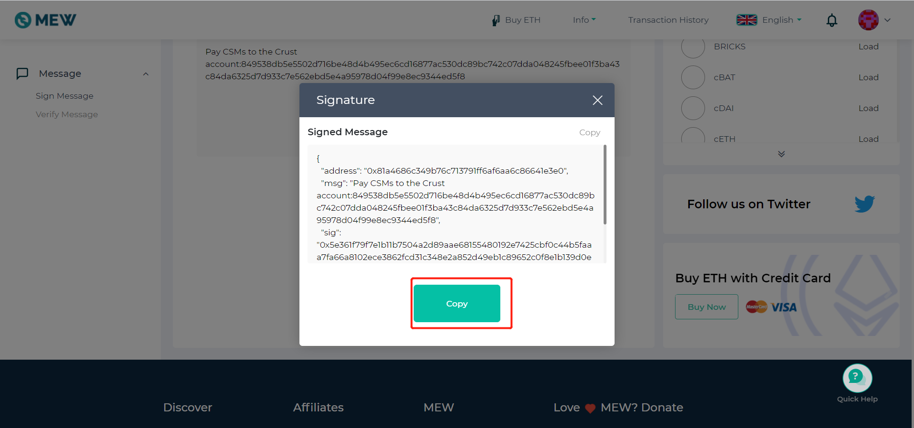

### V. Claim CSM

Go back to **Crust Apps Claims** page, with the **Signed Message** copied in [Step IV](#iv-get-the-ethereum-signature):

1. Paste the signature into the area shown in the image below, and click "Confirm claim". The green area shown as the image below will appear if the claim is recorded on chain.

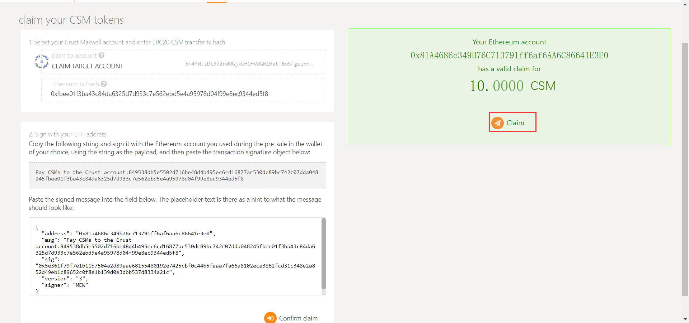

2. Click to claim

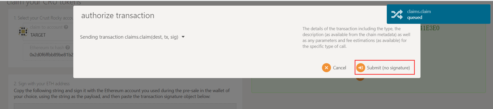

3. Claim Successfully

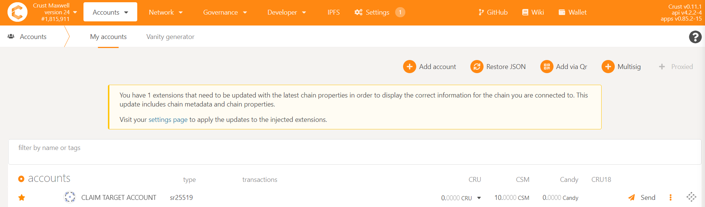

## References

The code involved in claim CSM process has been **open source**:

1. [Crust Bridge](https://github.com/decloudf/crust-bridge/tree/main/maxwell-claim)
2. [Crust Claims](https://github.com/crustio/crust/tree/master/cstrml/claims)
