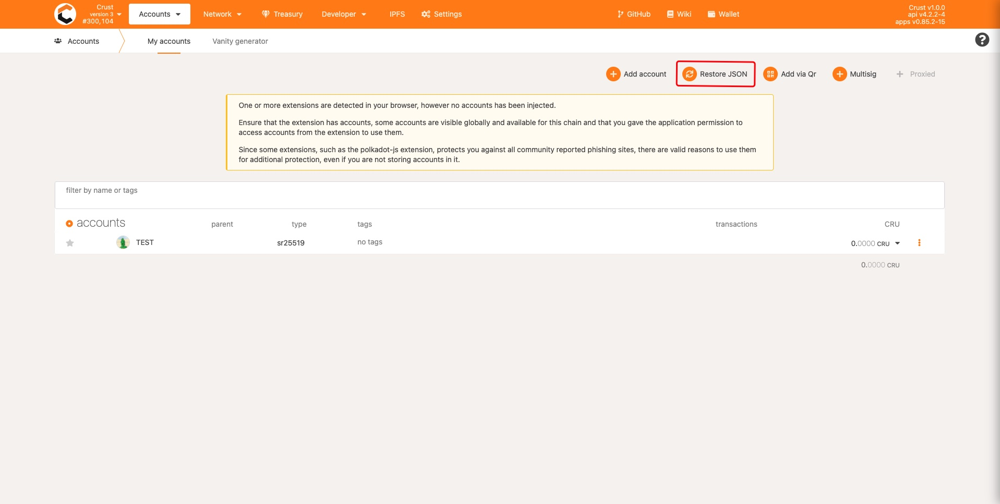

LockedCRU(including CRU18/CRU24/CRU24D6) is ERC20 token **for the participants of pre-selling and profit ark**, those participants can refer to this tutorial to claim your lockedCRU  in Crust Mainnet.

## Precautions

This tutorial currently only suits the users already [claimed lockedCRU in Maxwell](https://wiki-maxwell.crust.network/docs/en/claimCRU18) before mainnet launched. **At present, maxwell's lockedCRU claim has ended, for those users who haven't claimed lockedCRU, please wait for the mainnet's democracy to open**.

## 1. Extension Wallets

If you are using the browser extension wallet(MathWallet/Polkadot Extension/Crust Wallet/...) to manage your account, you can just go to [Crust Mainnet Apps' Account Page](https://apps.crust.network/?rpc=wss%3A%2F%2Frpc.crust.network#/accounts) to check about your lockedCRU asset (you can switch between different networks by clicking the Crust icon in the upper left corner of Crust APPs)

1. Check Extension Wallet


2. Check lockedCRU on Crust Apps


## 2. Crust Apps

If you are using Crust Apps to manage your account, then, the only thing you need to do is export the backup json file in the original network, and restore backup in Crust MainNet

### 2.1 Export backup file

First, export the backup json file in [Crust Apps's Account Page](https://apps.crust.network/?rpc=wss%3A%2F%2Fapi-maxwell.crust.network#/accounts) on Maxwell (you can switch between different networks by clicking the Crust icon in the upper left corner of Crust APPs)


### 2.2 Restore account in Crust Apps

Go to [Crust Mainnet Apps' Account Page](https://apps.crust.network/?rpc=wss%3A%2F%2Frpc.crust.network#/accounts), import your backup json (you can switch between different networks by clicking the Crust icon in the upper left corner of Crust APPs)




Then you can check out your lockedCRU asset


## 3. Others

If you are using other wallet or apps to manage your account

### 3.1 Export backup file

First, you need to export the backup json file, which looks like below

```json
{
    "encoded":"mOJSAMXCU+b/S80Uos2/olJJQ4RBA9+IoOr26VCIYXcAgAAAAQAAAAgAAACEef8KOVeeWD0DqPShntOtcHGTXAH4acTdJ7zjc9cLeXgIH1wsksMXh6CdvnARjxvKwXL98LjK2NLBDwSA8iqFAF8rspqMJ0kEKx4ExRPB0nQU94XU27UL8/eV08HVdBYhKU2664XOL/d+Zyyx2JNREj7kIKpPs2staSxD2zwkTNLGWasKwXjl7vAtxevZUNj01VZL5GWtg2TprMs0",
    "encoding":{
        "content":["pkcs8","sr25519"],
        "type":["scrypt","xsalsa20-poly1305"],
        "version":"3"
    },
    "address":"cTLmniiPcB6VgGCaswyL8smqex1VkjckxZ262snDzbZdYVAKC",
    "meta":{
        "genesisHash":"0x8b404e7ed8789d813982b9cb4c8b664c05b3fbf433309f603af014ec9ce56a8c",
        "isHardware":false,
        "name":"Test",
        "tags":[],
        "whenCreated":1627617500095
    }
}
```

### 3.2 Restore account in Crust Apps

Go to [Crust Mainnet Apps' Account Page](https://apps.crust.network/?rpc=wss%3A%2F%2Frpc.crust.network#/accounts), import your backup json


Then you can check out your lockedCRU asset


