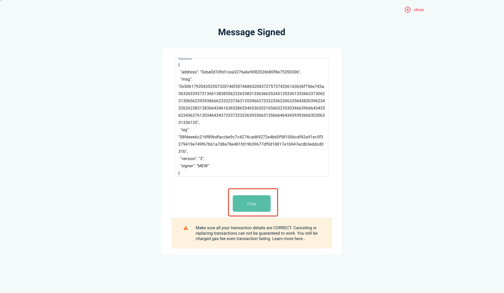

If you want to **map ERC20 CRU to Crust Network**, you can follow this tutorial step by step to claim CRU

## Preparation

In order to prevent unknown errors in the claim process, we highly recommend using the following tools to help you in the entire claim process:

> Don't worry about being unfamiliar with the following tools, we will teach you how to use them step by step in the following steps.

1. [MyEtherWallet](https://www.myetherwallet.com/wallet/access)
2. [ImToken](https://token.im/) or [MetaMask](https://metamask.io/)
3. [Crust Apps](https://apps.crust.network/)

## Steps

### ❗️ All exchange accounts are invalid

**DO NOT** do the following steps with the exchange account,  that will make the claim invalid and cause asset loss

### I. Burn ERC20 CRU

First of all, PLEASE **MAKE SURE you have read** the following precautions before you burn ERC20 CRU, once you burnt your CRU, nobody can get your asset back:

> 1. ⚠️ Please make sure your burn is ERC20 CRU, not ETH or other ERC20 tokens
> 2. ⚠️ Please make sure you **have the authority to make signature** of the ethereum account (you own this account's private key, and again all accounts created by exchanges are NOT APPLICABLE)
> 3. ⚠️ Please make sure that your each burn transaction is **less than 50,000 CRU**
> 4. ⚠️ ERC20 CRU: [CRUST](https://etherscan.io/token/0x32a7C02e79c4ea1008dD6564b35F131428673c41)
> 5. ⚠️ Burn Address: [0x0000000000000000000000000000000000000001](https://etherscan.io/address/0x0000000000000000000000000000000000000001)

Then, you can burn your ERC20 CRU now 😄

1. Go to the claim page in [Crust Apps](https://apps.crust.network/#/claims), transfer your ERC20 CRU to the Burn Address ([0x0000000000000000000000000000000000000001](https://etherscan.io/address/0x0000000000000000000000000000000000000001)) **in the ethereum network**, you can send this transaction with any kind of ethereum wallets (AGAIN, make sure you own the private key)

2. Please confirm your transaction is:
   - Successful
   - Has **at least 6 confirmations**
   - **Copy the transaction hash value**

### II. Verify transaction

Go to the claim page in [Crust Apps](https://apps.crust.network/#/claims)

1. Select the account of Crust mainnet that you want to claim,If you haven't created an account yet, you can refer to this [create account tutorial](https://wiki.crust.network/docs/en/crustAccount#create-accout)
2. Paste the transaction hash value you copied in [Step I](#i-burn-erc20-cru)
3. Make sure your transaction's **amount <= claim limit**
4. Click "Continue", this step will wait for a while, the claim service will check the legicimacy of your transaction.

If a red error appears in the upper right corner of the page, it means you have failed in this step, it may caused by the following reasons:

1. Your transaction's confirmations is not enough (**at least 6 confirmations**)
2. Your transaction amount exceeding the claim limit, if so, please wait it to recover
3. Claim service may busy for a while, if that, you can wait and try it later

### III. Log in to MyEtherWallet and Connect to your wallet

> Since MyEtherWallet supports lots of wallets, the following process will use 'ImToken' and 'MetaMask' as example, other wallets are super familiar with these 2

**⚠️ Please make sure that the connecting wallet address is same as the address where the transaction was successfully sent in [Step I](#i-burn-erc20-cru)** (We need to sign the message with the private key of this address)

**If you're using ImToken mobile wallet**

1. Open [MyEtherWallet](https://www.myetherwallet.com/wallet/access):
    - Click 'Mobile Apps'
    - Connect the wallet address which you **burnt the ERC20 CRU**

2. On the ImToken mobile client, click the *scan icon* in the upper right corner, scan the QR code displayed by MyEtherWallet and authorize

**If you use MetaMask, please click `Browser Extension`**

After the authorization is successful, you will see the following screen on the MyEtherWallet page, which means your wallet is successfully connected

### IV. Get the Ethereum Signature

Please make sure you completed [Step II](#ii-verify-transaction), then continue with following steps

1. In Crust Apps Claim page，**Click the gray box to copy the text**

2. In MyEtherWallet page, click **Message** on the left side as shown, select **Sign Message**, and paste the text in the gray box into the text box, click **Sign**

3. Then:
    - If you're using ImToken, there will be a pop-up in the ImToken side, Click "Confirm", **⚠️ Please be attention here, At this step, the communication between MyEtherWallet and ImToken may be interrupted and no authorization information will pop up. Please do the** [Step III](#iii-log-in-to-myetherwallet-and-connect-to-your-wallet) again.

    

    - If you're using MetaMask, you just need to make your sign through Metamask pop-up window.

    

4. **Copy the signature**

### V. Claim CRUs

Go back to **Crust Apps Claims** page, with the **Signed Message** copied in [Step IV](#iv-get-the-ethereum-signature):

1. Paste the signature into the area shown in the image below, and click "Confirm claim". The green area shown as the image below will appear if the claim is recorded on chain.

2. Click to claim

3. Claim successfully

## References

The code involved in claim process has been **open source**:

1. [MainNet Claim](https://github.com/decloudf/crust-bridge/tree/main/mainnet-claim)
2. [Crust Claims](https://github.com/crustio/crust/tree/mainnet-staging/cstrml/claims)
