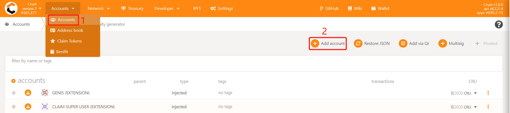

## Use CRU18 Guarantee

CRU18 is locked and cannot be transferred, but the amount in the locked can be used as a guarantor to obtain income

### Import the CRU18 account to [Mainnet_Apps](https://apps.crust.network/?rpc=wss%3A%2F%2Frpc.crust.network#/accounts)

#### Option 1. Import mnemonic
Click "Add account",replace "mnemonic seed" with the mnemonic of CRU18 account, click "Next" to create

#### Option 2. Import backup file
Click "Restore JSON", import the backup file and enter the password, click "Restore"

### Create Controller account
Create a controller account for operating assets. There needs to be a certain number of CRUs in the account to pay transaction fees for various transactions

### Depost
Depost a certain amount of CRU to the CRU18 account and the controller account to pay transaction fees for various transactions

### New bond

Use CRU18 as the stash account to establish a binding relationship between the controller and stash. The bond value can be used to guarantee the value.

For specific operations, please refer to [New Bond Guide](new-bond.md)

### Guarantee

Choose a suitable validator or candidate to guarantee. For specific operations, please refer to [Guarantor's Guide](guarantor-guidance.md)

