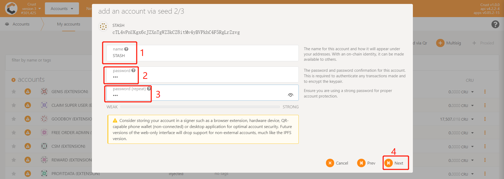

## What is the Crust account?

The Crust account is the carrier of the user’s assets in Crust Network. Users need to keep the Crust Network **mnemonic seeds** and backup files safe, in case of the user’s permanent loss of assets resulting from their loss of accounts. The methods of creating an account include [using Apps to create an account](#option-iusing-apps-to-create-an-account) and [using Crust Wallet to create an account](#option-iiusing-crust-wallet-to-create-an-account).

The types of assets stored in the Crust account can be referred to [crust tokens](crust-tokens.md).

## Option I.Using Apps to create an account

### Create an account

Go to [Crust Apps](https://apps.crust.network), Click "Accounts" in the navigation bar at the top of the window, and click "Add account", as shown below.

The **mnemonic seeds** value for this account. Ensure that you keep the **mnemonic seeds** in a safe place and check "I have saved my mnemonic seed safely"

Enter your account name and password, and click "Next"

### Account backup
Click "Save", the account will be backed up on your device by default. Please take care of your backup file.The format is as follows "cT1K1QvCcR4xxxxxxVcS8AVxxxxLuSxNBiEt.json"

## Option II.Using Crust Wallet to create an account

### Install Crust Wallet

[Tutorial to install wallet](crustWallet.md),After the installation is complete, you can pin it for easy use.

### Create an account

Click the plug-in Crust Wallet, enter the wallet password, and click "Create".

**Be sure to back up the mnemonic phrase**, enter the account nickname and wallet password, and click "Next".

Confirm again that you have backed up the mnemonic. If there is no backup, you can click "Go Back" to return to the previous step for backup. If you have already backed up, you can click "Next" to enter the next step.

### Account backup

Click Settings, enter the "Account Management" interface, click "Export Account" to export the backup file.

**Please take care of your backup file**.The format is as follows "cT1K1QvCcR4xxxxxxVcS8AVxxxxLuSxNBiEt.json"

### Sync account to Apps

Click to open Crust Apps,And allow Crust Apps access to Crust Wallet.

## III.Others

> The following wallet extensions support Edge, Google, Firrefox, Brave or other browsers

[polkadot.js](https://polkadot.js.org/extension/)
[Math Wallet](https://mathwallet.org/en-us/#extension)

