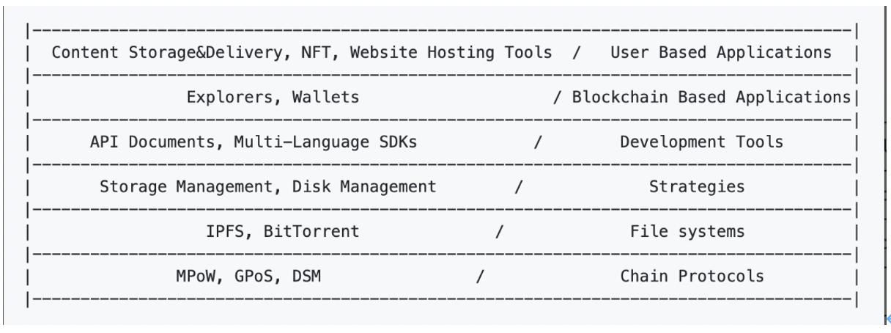

Crust Grants Program, launched by the Decentralized Cloud Foundation (DCF), rewards projects that add value to the Web 3.0 decentralized cloud storage ecosystem. Grants divides decentralized cloud storage into technology stacks at six layers, including chain protocol layer, file systems protocol layer, node strategies layer, development tools and infrastructure layer, blockchain-based applications layer and user-based applications layer, incentivizing projects in the decentralized cloud storage ecosystem at full strength.

## 1. Joining Crust Grants gives you access to

For projects whose Crust Grants application has been accepted:

1. Funding support up to 30,000 USDT;

2. Deep participation in the Crust technology community and the opportunity to be invited to events of Crust ecology to enhance the profile and recognition of your project;

3. Deep participation in Web3 ecosystem and support from Polkadot and IPFS ecosystem;

4. Team members getting certified as Crust Ambassador;

5. Project teams being connected with ecology funds.

## 2. Application direction

Crust Grants protocol stacks

### 2.1 Chain Protocol Layer (L0)

Crust protocol layer incentivizes and maintains a decentralized storage network. Using IPFS as the underlying storage, it gives blockchain incentives through MPoW and GPoS protocols and provides a decentralized supply-and-demand aggregation system through DSM protocol to provide stable token incentives for storage nodes.

Grants will give incentives for all L0 protocol stack optimizations. Here are two paths:

In the MPoW protocol, the current version of off-chain storage worker sWorker is based on Intel SGX. Future efforts can be made to provide different versions of sWorker on other TEE architectures (including Arm and TrustedZone), or to provide versions covering a wide range of languages. The Crust team is also currently building a version of sWorker based on the Apache Teaclave SDK (See[https://github.com/crustio/crust-sworker-teaclave](https://github.com/crustio/crust-sworker-teaclave?fileGuid=8g6KfhSut6oyB6R1))

The on-chain Crust protocol stack is actually not bound by any consensus algorithm. Transplanting Crust protocol stack to Ethernet ecosystem as a smart contract chain or to any contract public chain (Near, Tron, etc.) is also an option.

### 2.2 File systems protocol layer

Crust protocol currently uses IPFS as the underlying storage, and any improvement to the IPFS protocol or projects contributing to the IPFS ecosystem are covered by Grants incentives. The file system protocol layer, of course, is not limited to the IPFS ecosystem, and compatibility or active adaptation of different decentralized storage protocols is also within the scope of this layer. Here we list 3 possible paths:

1. Changing the Bitswap mechanism to optimize the credit mechanism for data exchange, thus improving the efficiency of IPFS Retrival (See implementation in the Bitswap codebase:[https://github.com/ipfs/go-bitswap](https://github.com/ipfs/go-bitswap?fileGuid=8g6KfhSut6oyB6R1));

2. Providing encrypted version of IPFS. Here is the go-ipfs-encryptor codebase that Crust team is currently implementing:[https://github.com/crustio/go-ipfs-encryptor](https://github.com/crustio/go-ipfs-encryptor?fileGuid=8g6KfhSut6oyB6R1);

3. Becoming more compatible with different decentralized storage protocols, such as adapting to DAT Project (See the codebase:[https://github.com/datproject/dat).](https://github.com/datproject/dat).?fileGuid=8g6KfhSut6oyB6R1)

### 2.3 Node strategies layer

Any improvement made by nodes to hardware or software is bound to enhance the storage performance of the entire Crust network. Giving account to this, Grants incentives cover any project that improves the running efficiency and stability of nodes. 4 paths are provided here.

1. Working on the optimal strategy about hard disk organization, including Raid mechanism optimization, hard disk management plan, etc.;

2. Optimizing and adapting Crust Node (See the codebase:[https://github.com/crustio/crust-node](https://github.com/crustio/crust-node?fileGuid=8g6KfhSut6oyB6R1));

3. Optimizing and adapting sManager in the DSM (See the codebase:[https://github.com/crustio/crust-smanager](https://github.com/crustio/crust-smanager?fileGuid=8g6KfhSut6oyB6R1));

4. Providing management and monitoring programs for LAN Owner&Member, for example,  customizing strategies based on Prometheus and collecting full data of Owner and Member nodes for alarm and monitoring (See the codebase:[https://github.com/prometheus/prometheus).](https://github.com/prometheus/prometheus).?fileGuid=8g6KfhSut6oyB6R1)

### 2.4 Development Tools and Infrastructure Layer

Applications for cloud storage cannot be separated from the continuing improvement of all sorts of development tools or scaffolds. Therefore, any project that provides development ecology tools is within the scope of Grants incentives. Here are a few tools or services in the development ecology.

1. Chain Node Service: Providing Infura- and Ethereum-like chain node services, with which developers can connect to Crust Network without locally starting the chain or synchronizing data (See Infura link:[https://infura.io/](https://infura.io/?fileGuid=8g6KfhSut6oyB6R1));

2. IPFS Public Gateway: Providing IPFS cache services (write service), which enable developers to store data in Crust Network through IPFS cache nodes without starting IPFS (See IPFS Public Gateway link:[https://ipfs.github.io/public-](https://ipfs.github.io/public-?fileGuid=8g6KfhSut6oyB6R1)gateway-checker/);

3. Multi-language API SDKs: Currently Crust Network supports SDK of the JS version. SDKs supporting multiple languages can bring convenience to developers with varied language preferences when working on Crust ecology (See Crust SDK link:[https://wiki.crust.network/docs/en/](https://wiki.crust.network/docs/en/?fileGuid=8g6KfhSut6oyB6R1)buildCrustKits);

4. API documentation: Documentation is also an important factor impacting developers’ participation in the building of ecology. Fully-fledged documentation can certainly attract more developers into participation;

5. Command-line tools: Providing command lines enables the access to Crust network resource services, such as crust-cli:[https://github.com/crustio/crust-cli](https://github.com/crustio/crust-cli?fileGuid=8g6KfhSut6oyB6R1)

## 2.5 Blockchain-based Applications Layer

Projects that help visualize on-chain information or bring on-chain features into good play are also within the scope of Grants incentives. Here are some successful examples.

1. Crust Blockchain Browser: Displaying block information of Crust Network (Address:[https://crust.subscan.io](https://crust.subscan.io?fileGuid=8g6KfhSut6oyB6R1));

2. Crust Storage Explorer: Displaying the storage information of Crust Network (Address:[https://splorer.crust.network](https://splorer.crust.network?fileGuid=8g6KfhSut6oyB6R1));

3. Crust Plugin Wallet: With well-equipped features of Crust assets and IPFS Companion ( See the codebase:[https://github.com/crustio/crust-extension](https://github.com/crustio/crust-extension?fileGuid=8g6KfhSut6oyB6R1)).

## 2.6 User-based Applications Layer

Projects that develop applications with the help of the Crust Network are also within the scope of Grants incentives, which include but are not limited to the following scenarios:

1. DApp and web deployment；

2. NFT data storage

3. Content storage and distribution

Current applications that have successfully leveraged Crust Network include:

1. Uniswap Interface (See the implementation code:[https://github.com/Uniswap/uniswap-interface/pull/1342](https://github.com/Uniswap/uniswap-interface/pull/1342?fileGuid=8g6KfhSut6oyB6R1));

2. Polkadot Apps (See the implementation code:[https://github.com/polkadot-js/apps/pull/4933](https://github.com/polkadot-js/apps/pull/4933?fileGuid=8g6KfhSut6oyB6R1));

3. Crust Apps (See the implementation code:[https://github.com/crustio/crust-apps/blob/master/.github/workflows/release.yml#L72-L77)](https://github.com/crustio/crust-apps/blob/master/.github/workflows/release.yml#L72-L77)?fileGuid=8g6KfhSut6oyB6R1).

## 3. Decelopment Environment
Developers can refer to the [Crust Rocky Testnet Guidance](https://wiki.crust.network/docs/en/buildRockyGuidance) for development and testing.

## 4. Application Process

Each stage of the application is described in detail in the[Application Entrance](https://github.com/crustio/Crust-Grants-Program?fileGuid=8g6KfhSut6oyB6R1). The overall process for Crust Grants application is as follows.

1. Application: Applicants complete the[Application Template](https://github.com/crustio/Crust-Grants-Program/blob/main/applications/application_template.md?fileGuid=8g6KfhSut6oyB6R1)and submit a Pull Request;

2. Application Review: In this step, DCF members may raise questions concerning the application in the form of PR Comments and will schedule an online meeting with the applicant team for full discussions, with the entire process repeating for 1-3 rounds;

3. Development: Pull Requests that pass the review will be integrated into the main branch and the applicants will enter the development phase.

## 4. Delivery Process

The submitted application should contain the milestones of the development phase. After each milestone is completed, it can be delivered in[Github](https://github.com/crustio/Crust-Grant-Milestone-Delivery?fileGuid=8g6KfhSut6oyB6R1). The delivery process is as follows.

1. Submission: Each time an applicant completes a Milestone he can submit a[Milestone Table](https://github.com/crustio/Crust-Grant-Milestone-Delivery/blob/main/deliveries/milestone-delivery-template.md?fileGuid=8g6KfhSut6oyB6R1)and corresponding[invoice](https://forms.gle/A7NQDDcCJYfcbSCe8?fileGuid=8g6KfhSut6oyB6R1);

2. Review: The DCF Committee will review each metric by referring to the milestone description, either by email or through an online meeting;

3. Delivery: For milestones that pass the review, the DCF Committee will make the payment. If the development team chooses to receive CRUs, a corresponding rate will be settled by email (Once the first milestone passes the review, it will be recorded in the[Crust Stack](https://github.com/crustio/Crust-Grants-Program/blob/main/crust_stack.md?fileGuid=8g6KfhSut6oyB6R1))

4. Payment
