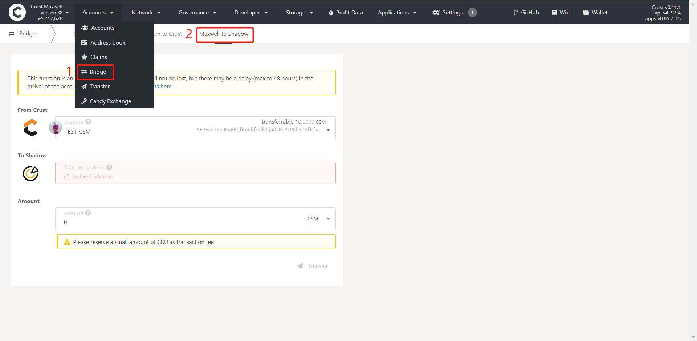
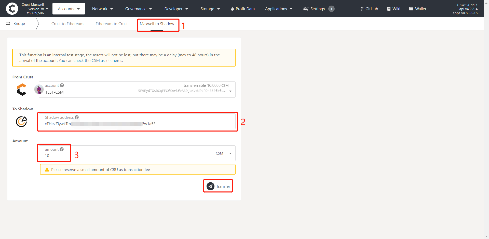
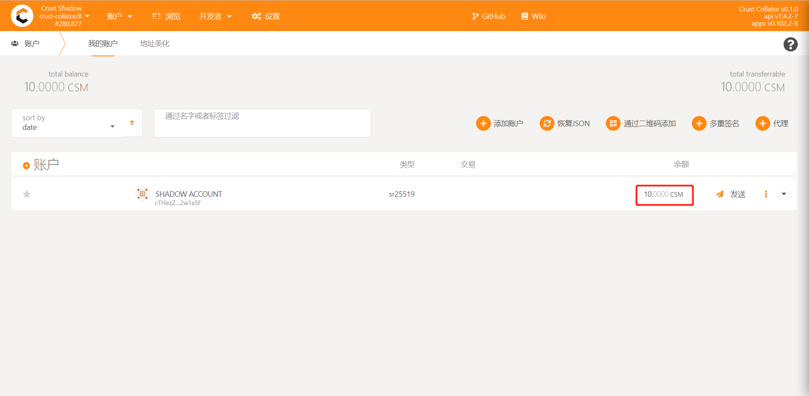

Shadow Bridge provides a cross-chain CSM transferring service from Crust Maxwell to Crust Shadow.

## Preparation

Prepare a Crust Shadow account for accepting CSM token. You can get it on [Crust Shadow web wallet](https://shadow-apps.crust.network/?rpc=wss%3A%2F%2Frpc2-shadow.crust.network#/accounts)

## Crust Maxwell to Crust Shadow

***Step 1.*** Go to [Crust Maxwell Apps](https://apps.crust.network/?rpc=wss%3A%2F%2Fapi-maxwell.crust.network#/explorer), Choose `Accounts ➡️ Bridge ➡️ Maxwell to Shadow`

***Step 2.*** Enter the Crust Shadow receiving account(*start with `cT`*) in frame 2; enter the amount that you want to transfer in frame 3; click “Transfer” after you confirm there is no mistake above, then sign and complete the transaction.

> **NOTE** The sending account on Maxwell-side needs some CRUs as blockchain transaction fee.

***Step 3.*** Wait a few minutes, you'll receive the CSM token on Crust Shadow-side. You can check it on [Crust Shadow web wallet](https://shadow-apps.crust.network/?rpc=wss%3A%2F%2Frpc2-shadow.crust.network#/accounts)

