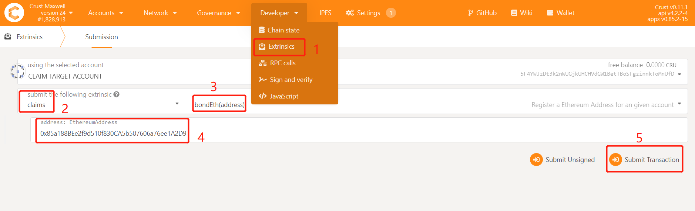
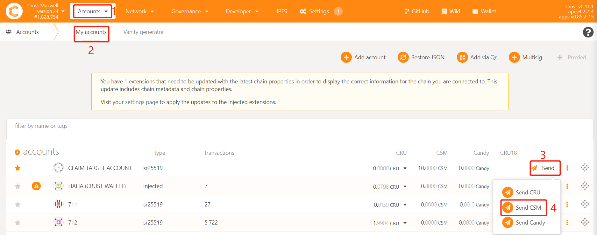
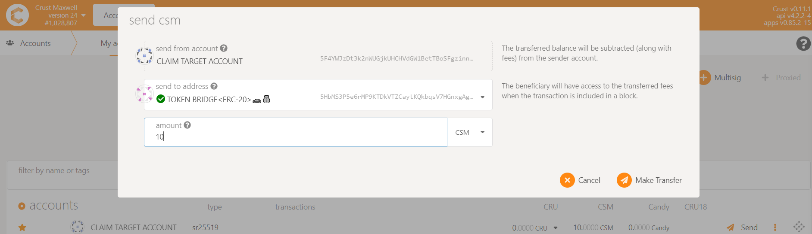

If you want to **map Crust Maxwell CSM back to ERC20 CSM**, you can follow this tutorial step by step to claim back ERC20 CSM.

## Attention

1. Claim back **will not arrive in real time**, claim back cycle is: **7 days**
2. **A certain amount of CSM will be deducted as  the Ethereum gas fee**, the claim back fee is: **1000 CSM**

> **The sum of multiple transfers in the same claim back cycle needs to be greater than claim back fee**, if your claim back amount is less than the fee, it will be judged as invalid and will not be executed

2. After the end of each claim back cycle, **the total claim back tokens will be burned** on the Crust Maxwell Preview network to ensure data consistency between the claim pool and the claim back pool

## Steps

### I. Bond Ethereum Address

First of all, **⚠️you need to bind your Ethereum address. Please note that for claim back transactions that are not bonded with an Ethereum address, you may lose the claim back CSM⚠️**, so be sure to bind the Ethereum address you need to claim back.

1. Through [Crust Apps's Extrinsics Page](https://apps.crust.network/?rpc=wss%3A%2F%2Fapi.crust.network%2F#/extrinsics), select `claims` and `bondEth`, and fillin the Ethereum Address which you wanna claim back.

2. When sending extrinsic successfully, please double confirm the bonding information by query from [Crust Apps's Chain State Page](https://apps.crust.network/?rpc=wss%3A%2F%2Fapi.crust.network%2F#/chainstate), if shows `none`, please repeated step 1.

### II. Send Claim Back Transaction

Next, you need to initiate a CSM transfer transaction to the ***Crust Maxwell Certified Claim Back Address*** on Crust Maxwell Preview Network online. This operation needs to be performed on [Crust Apps's Account Page](https://apps.crust.network/?rpc=wss%3A%2F%2Fapi.crust.network%2F#/accounts). Please be sure to read before initiating the transfer:

1. ***Crust Maxwell Certified Claim Back Address***: [5HbMS3P5e6rMP9KTDkVTZCaytKQkbqsV7HGnxgAgvv5d64tx](https://crust.subscan.io/account/5HbMS3P5e6rMP9KTDkVTZCaytKQkbqsV7HGnxgAgvv5d64tx) (Certified with name: Token Bridge<ERC-20>🚗💰)
2. ⚠️ Note that within a claim back cycle (7 days), you need to **ensure that the total claim back amount is greater than 1000 CSM**
3. The account that initiated the transfer back transaction has performed [Step I](#i-bond-ethereum-address) to bond the Ethereum address

### III. Follow-up

After performing Step I and II:

1. All claim back transactions will be cleared within a claim back cycle
2. The claim back sender's address is same as claim address: [0x17a9037cdfb24ffcc13697d03c3bcd4dff34732b](https://etherscan.io/address/0x17a9037cdfb24ffcc13697d03c3bcd4dff34732b), you can find all the transactions and operations in this address

## Reference

The code involved in claim back process has been **open source**:

1. [Crust Bridge](https://github.com/decloudf/crust-bridge/tree/main/maxwell-claim-back)

