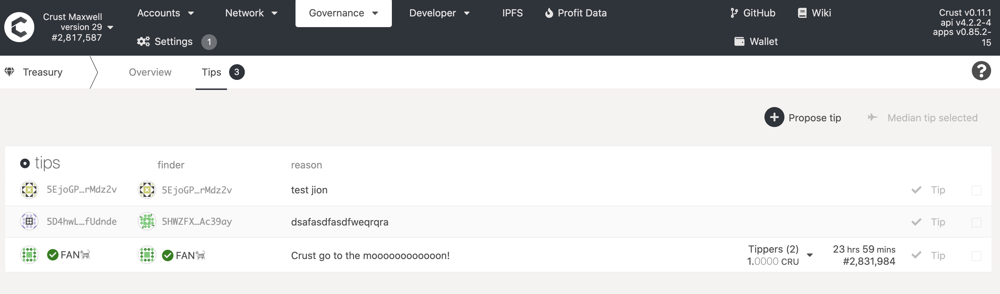
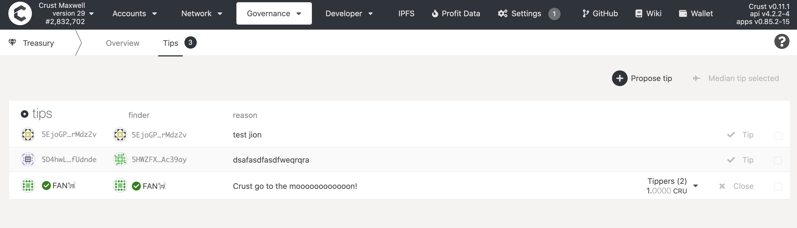
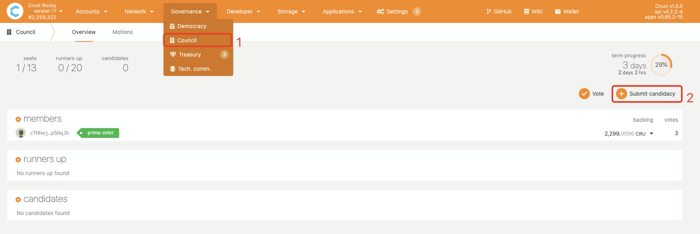
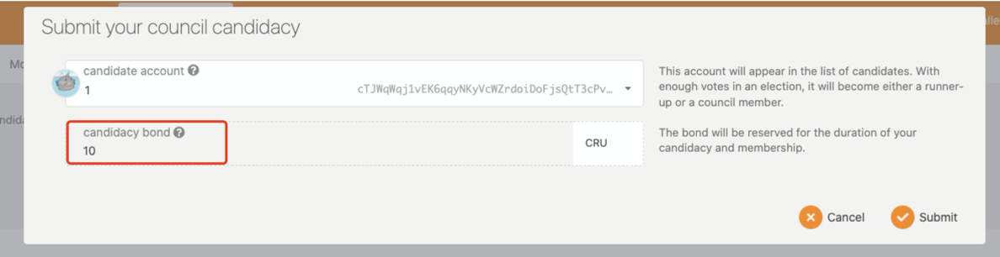
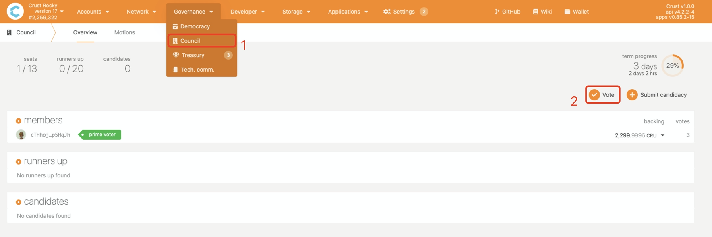
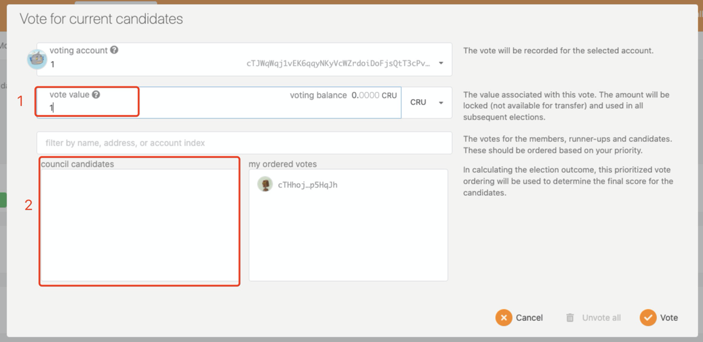

The Democracy module is an important part of Crust Network, reflecting the advantages of Crust on-chain governance and degree of decentralization. The whole picture of Democracy module contains the following parts:

1. [**Proposals&Referenda**](#1-proposalsreferenda): General democracy module that everyone can submit a proposal and vote for the proposal to make Crust Network better.
2. [**Treasury&Tips**](#2-treasurytips): The Treasury is a pot of funds collected through transaction fees, slashing, staking inefficiencies, etc. The funds held in the Treasury can be spent by making a spending proposal that, if approved by the Council, will enter a waiting period before distribution. 
3. [**Bounty**](#3-bounty): Bounties Spending proposals aim to delegate the curation activity of spending proposals to experts called Curators: They can be defined as addresses with the agency over a portion of the Treasury with the goal of fixing a bug or vulnerability, developing a strategy, or monitoring a set of tasks related to a specific topic: all for the benefit of the Crust ecosystem.
4. [**Council**](#4-council): The council is an on-chain entity comprising a number of actors, each represented as an on-chain account. Along with controlling the treasury, the council is called upon primarily for three tasks of governance: proposing sensible referenda, canceling uncontroversially dangerous or malicious referenda, and electing the technical committee.
5. [**Technical Committee**](#5-technical-committee): The Technical Committee can, along with the Council, produce emergency referenda, which are fast-tracked for voting and implementation. These emergency referenda are intended for use only under urgent circumstances.

## 1 Proposals&Referenda
This part mainly focuses on the main processes, specific practices, rules, and parameters of the Democracy module for ease of reading.

### 1.1 Main processes
1. Create a preimage to decide on the code for execution with a request for voting;
2. Create and submit a proposal;
3. Review proposals from others or wait for the proposal to be reviewed;
4. At the end of each Launch cycle, the proposal with the highest number of review votes will be selected into the voting stage, and the proposals that pass the voting stage will move on to the execution stage.
5. A timer will be set for the execution of the approved proposals according to the chain parameters.

### 1.2 Practices
1. Create a preimage

As shown above, go to the Democracy page and then click on "Submit preimage".

You can select any transaction that can be executed by Sudo permission, such as taking.SetValidatorCount, in the transaction submission page. Creating a preimage requires a small number of CRUs, whose amount depends on the selected transaction.

After the transaction is submitted, you can go to the event page and check the hash value of the newly created preimage and copy that value as does on the above page.

2. Create and submit a proposal
  The hash value of the previously generated preimage can be submitted by clicking on the "Submit a proposal" button.

  

3. Review proposals from others or wait for the proposal to be reviewed 
  Once a proposal has been created, you can see all the proposals currently in progress in the proposal list. Any token holder can select the proposal he or she is interested into review. Reviewing the proposal requires a sum of CRUs, which cannot be used for other purposes such as staking. At the end of each proposal cycle, the proposal with the highest number of review votes will proceed to the voting stage.
  

4. Voting stage
  The proposal that enters the voting stage will be as shown on the page below. Again, any token-holding user can choose to support the proposal or reject it. Whether the proposal will be approved or rejected can be viewed on this current page as well.
  
  There is much freedom for users to express their will in supporting or rejecting the proposal. Users can choose to lock more CRUs or decide on a longer locking time to express a stronger inclination of approval or rejection. By choosing a higher locking multiplier, users can make the locking more effective. It is noteworthy that locked-in CRUs in this stage can be used for staking. Specifications on the voting formula and lock-up time will be explained in detail in the subsequent parameter description.
  

5. Execution stage
  At the end of the voting period for each proposal, the proposal that has passed the vote will enter the execution stage. Depending on the type of proposal, execution is divided into immediate execution and deferred execution. The proposal described earlier in this document will be executed in a deferred manner by default. Detailed execution time can be found on the following page.

  

### 1.3 Rules, parameters and notices

1. The created preimage needs to be a transaction that can be executed by Root permission, such as taking.SetValidatorCount or market.setPunishment. Otherwise,  the execution will eventually fail even if it enters the stage.
2. Both the proposal submission and the proposal review will require a certain number of CRUs to be staked. The amount set on the preview web is **10 CRUs**. The locked-in CRUs will be automatically unlocked once the proposal enters the voting stage. However, it should be noted that the locked CRUs cannot be unlocked for proposals up for review at the same time, and only the proposal that ultimately makes it into the voting stage will see CRUs unlocked. On the preview web, **every 7 days** the proposal with the highest number of review votes will be selected into the voting stage.

3. Proposals in the voting stage have **7 days** to be decided on approval or rejection. The number of locked-in CRUs will be converted to valid votes in relation to the length of locking time. For example, by default CRUs will only be locked in until the end of the voting period, with the number of valid votes equal to one-tenth of the locked-in CRU amount. Further, the number of valid votes is equal to twice the locked amount with twice the locking time (8 days * 2). The voting on ordinary proposals is calculated using a majority approval mechanism, which is related to the total voting amount, the number of valid approval votes, the number of valid rejection votes, and the total amount of network circulation: ``The number of valid rejection votes / sqrt (total voting amount) < the number of valid approval votes / sqrt(total amount of network circulation)``.

4. The deferred time duration is **8 days** on the preview web.

### 1.4 Proxy voting mechanism
Coming soon
### 1.5 External proposals
Coming soon

## 2 Treasury & Tips
 
### 2.1 Treasury
The treasury collects handling fees consumed in network operation and penalty amounts from the GPoS consensus mechanism. The existence of the treasury provides financial support for the long-term development of the Crust network.
 
Any token holder can make a proposal for the use of treasury funds, and each proposal for the use of treasury funds requires the lock up of 5% of the proposed amount as collateral. Council members can vote to pass or reject each proposal. It is worth noting that if a malicious proposal is rejected, the proponent’s locked collateral will be punished.
 
In order to maintain the stability of the network economic system, another major function of the treasury is deflation, and a fixed proportion of the treasury will be destroyed in each treasury spending cycle.
 
### 2.2 Tips
One of the ways to use treasury funds is through the tipping mechanism. By submitting a tip application and passing the approval of council members, a tip fund can be given to a specific account. This specifically includes the following functions:
 
1. Anyone can initiate a tip application, there are two situations:
- a. If the sponsor is a member of the council, the council member can directly fill in the tip amount without locking funds, and the sponsor will not be rewarded after the tip is passed. 
- b. If the initiator is not a member of the council, the initiator can only fill in the tip reason. The tip amount will be automatically calculated based on the data of the tip reason, and the initiator needs to lock the equivalent tip funds until the tip is approved or canceled. When the tip is approved, the sponsor will unlock the locked funds and get a part of the tip amount (currently 20%).
It is worth noting that although the tip amount can be filled in the tip application, **the actual tip amount is not determined by the initiator**. Each council member can choose the amount of tip to be given, **the final tip amount is the midpoint of all tips**.
 
2. Members of the council can approve tips, and by default, can propose intermediate tips, or they can give a specific distribution schedule for tips through transactions.
 
3. After the tip application is approved by more than half of the council members, the members of the council can close the application and trigger the tip issuance step after a certain period of time.
 
4. The initiator can also cancel a tip application that has already been initiated.
 
5. Members of the council can punish specific invalid tips. (Supported in subsequent versions)
 
The overall process is:
 
1. The initiator submits a tip application and selects the tip beneficiary, fills in the reason for the tip application, and the corresponding tip amount will be locked. If the initiator is a member of the council, they can fill in the tip amount additionally, and their own funds will not be locked. After submitting a tip application, no other operations are required, and users can wait for the tip to pass. In addition, the tip application can also be revoked.

 
2. Council members can approve each tip application and choose the amount of tip to be given. Council members can also approve tip applications in batches and choose to give intermediate tips.

 
3. After more than half of the council members have given approval for a tip application, the tip application will enter the countdown stage. After the countdown, council members can close the tip application to trigger the tip issuance process.

 
4. The tip amount is the median number given by all council members. If the sponsor is not a council member, 20% of the tip amount will be given to the sponsor as a reward, and the remaining tip amount will be given to the tip beneficiary.
 
At this point, the application, approval, and distribution process of tips is complete.
 
## 3 Bounty
Coming soon
 
## 4 Council

Members of council can express their opinions on the use of the treasury amount, the acceleration of the democratic module, and several on-chain transactions with important influence. This chapter mainly introduces how to become a member of council, vote for a member you support, and approve council-related proposals.
### 4.1 Submit Candidacy
The steps to apply to become a member of council are relatively simple, just click on it as shown in the figure below. It should be noted that applying to become a candidacy requires a certain amount of CRU to be locked as a guarantee, and if you are not successfully elected or have been elected but lose your seat, you **will lose this part of the locked CRU**, please choose carefully to become a candidacy.

### 4.2 Vote for Candidacy
Becoming a member of council requires the support of the masses, each of whom can vote for any number of applicants. To vote for others, you first need to lock a certain amount of CRU as a guarantee, and the CRU in this part needs to be **transferable CRU**. At the same time, you can fill in the amount of CRU supported. The CRU in this part can be **CRU under pledge** or any CRU under other locked conditions such as CRU18.

### 4.3 Motions
Coming Soon
 
## 5 Technical Committee
Coming Soon

