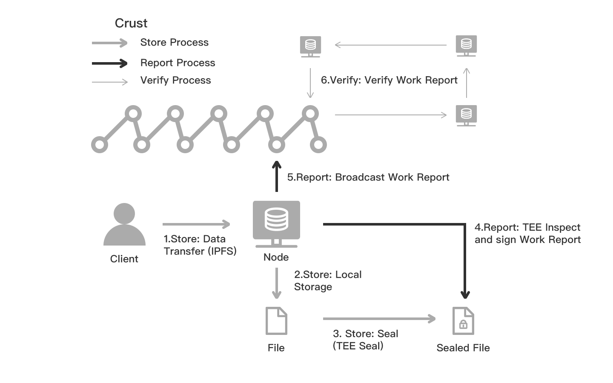

## What is Crust

Crust provides a decentralized storage network of Web3 ecosystem. It supports multiple storage layer protocols such as IPFS, and exposes storage interfaces to application layer. Crust's technical stack is also capable of supporting a decentralized computing layer. It is designed to build a decentralized cloud ecosystem that values data privacy and ownership.

## How to Use Crust

In general, you can follow 3 simple steps to upload, store and distribute files:

1. Add your file to IPFS network.
2. Place corresponding storage order on Crust Chain.
3. After the storage order status turns to be successful, the file can be then accessed via standard IPFS interface and gateway from anywhere.

<!--
Please refer to the [code sample](build-developer-guidance.md) that explains how to execute above 3 steps via program. You can also visit [Crust Apps](storageUserGuide.md) to execute those steps via UI.
-->

## Best Scenarios of Crust

Crust can be used in a wide range of scenarios, including:

1. Serverless DApp/website hosting

   Developers are able to deploy their own Dapps/websites based on Crust/IPFS Network. With this, developers are able to only focus on building Dapps/websites, no need for server management. Moreover, Crust Network incentivizes multiple nodes to store Dapp/website files and provide storage services, thus ensuring the high availability of Dapps/websites. [Crust Apps] is an example, it is hosted on Crust Network.

2. General off-chain data storage

   Some blockchain-based decentralized applications, such as NFT and decentralized social platforms, involve a large amount of user data, far beyond the on-chain storage capacity. Based on Crust/IPFS Network, developers can provide general off-chain data storage services for these applications.

3. Accelerated content delivery

   Developers are able to build P2P content delivery network (CDN) services with Crust/IPFS Network. Crust Network incentivizes the nodes to spontaneously distribute CDN data and play the role of CDN edge nodes to accelerate the data transmission for CDN users.

4. Secured cloud storage
   Developers are able to build Cloud storage applications with Crust/IPFS Network. Without maintaining storage clusters, developers only need to integrate the SDK of Crust/IPFS into applications to provide users with stable storage services.

A series of `Crust Grants` will be introduced to accelerate the application development and network adoption.

## Join and Use Crust Now

You can refer to following links to join the Crust Network.

- Node Provider - Refer to the [Node Guidance](node-overview.md) to run setup and run Crust Nodes.  
- Token Holder - Refer to the [Guarantor Guidance](guarantor-guidance.md) to perform staking operations.
- Storage User - Storage user guidance is coming soon.
- Developers - Refer to the [Build](build-getting-started.md) pages for more information.

## How Crust Works

Crust works in 3 layers as follows.

1. MPoW (Meaningful Proof of Work) - The low-trust/zero-trust storage proof layer to inspect and prove storage work of miners.
2. GPoS (Guaranteed Proof of Stake) - The PoS-derived consensus layer that requires nodes to provide storage proof to get staking quota.
3. DSM (Decentralized Storage Market) - It enables users to place storage orders on the chain, to get their data stored and distributed on Crust Network.

### MPoW

MPoW is a low-trust storage proof layer. The overall function of MPoW is to periodically generate trustable storage work reports and upload to the chain. A storage work report includes incremental information of data storage work on a particular node.

Technical-wise, Current MPoW's low-trust storage proof mechanism is implemented based on TEE (Trusted Execution Environment) technology. There are 3 major processes: store process, report process and verify process.

Based on the Trusted Execution Environment(TEE) technology, nodes in Crust network can perform non-interactive storage proof. As shown in the figure below, TEE will periodically check the storage status of nodes and generate a workload report that can be verified by all nodes.

Zero-knowledge algorithm is an alternative technical approach to implement the 3 major processes of MPoW. It will be considered in future development.

### GPoS

GPoS is a PoS-derived consensus protocol. Like NPoS, a user can vote to specific nodes (and we define the voting behavior as a guarantee process). The key difference is that each node has its own staking quota, decided by its proven storage resource and work. Therefore, GPoS encourages nodes to provide more storage resources to take more work, and improve the security and robustness of the network.

GPoS leverages the storage work reports generated by the MPoW storage proof layer to calculate the storage resource related parameters.

GPoS also encourages users to stake their tokens to high quality nodes via guarantee operation to obtain staking income.

GPoS related concepts and processes are described in the following diagram.

### DSM

DSM (Decentralized Storage Market) allows storage users to place storage orders on the chain, and the files (IPFS CID list) specified in the storage order will be stored by Crust nodes. DSM also takes care of incentivizing storage nodes to provide retrieving service.

DSM contains 3 major mechanisms:

1. Pricing Mechanism. Storage order fee is calculated by the network according to file size, storage period and overall storage requirement and supply.  
    
2. Storage Order Mechanism. Storage Order works in a pooled way. Once a user places a storage order:
   a) Certain amount of order fee will be added to the specific file payment pool, and the rest will be put to the overall network staking pool.
   b) Any node that submits corresponding storage proof will be added to the payout queue of the file payment pool, until the payout queue reaches its limitation. Nodes in the queue will be able to claim the income later.
   c) Any node that submits corresponding storage proof will get a staking quota increasement (by several times depending on the file copy amount all over the network). 
    
3. Retrieval Mechanism. As a data storage system, besides the storage market, DSM also takes the responsibility of incentivizing the nodes to provide retrieval service. Therefore, DSM includes another layer of incentives to encourage nodes to support data retrieval:
   a) DSM enhances the IPFS credit system, which is a local node ranking system without consensus, as part of the BitSwap strategy. In a Crust-backed BitSwap process, a node is able to query the on-chain storage proof info to get what blocks are stored on which nodes; therefore, if it failed to retrieve blocks from target node, the local ranking for target node will be lowered down.
   b) According to the credit system, nodes providing better retrieval service will get higher ranking and have a better chance of getting more files quickly, thus getting more storage payments and staking income. On the other hand, nodes that provide lower quality of retrieval service will unlikely to benefit from the system.
