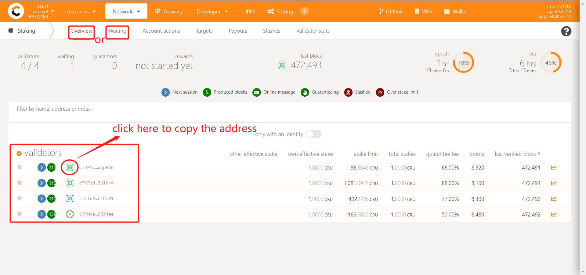
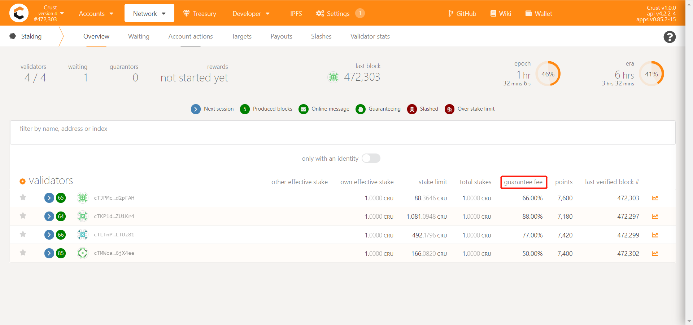
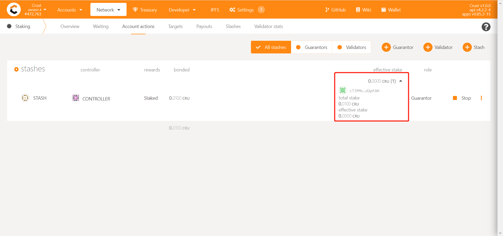
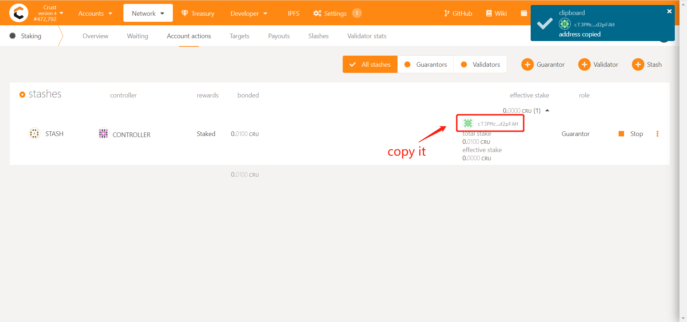
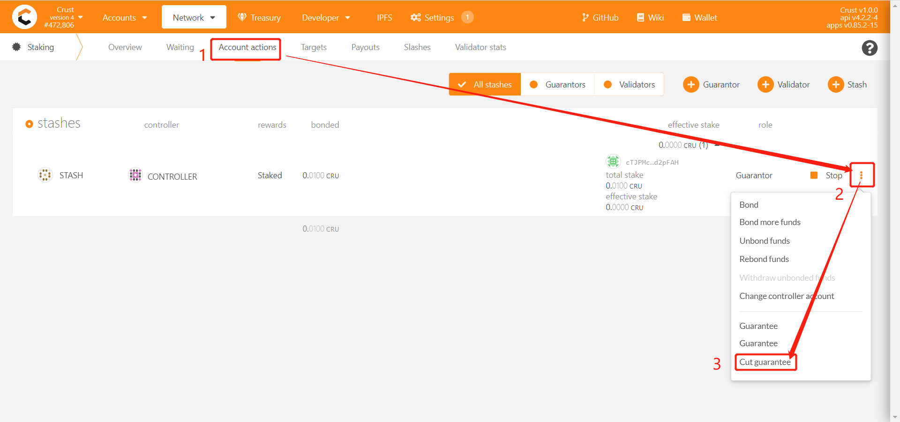
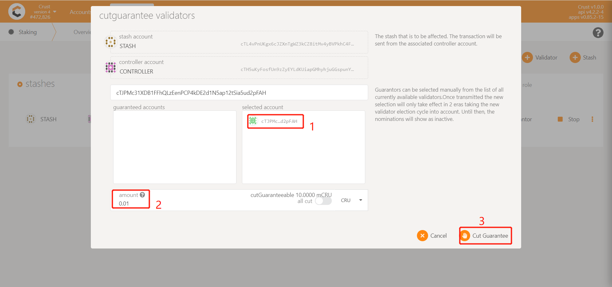

For the introduction of the role of the guarantor, please refer to [guarantor](guarantor.md). This article mainly introduces how the guarantor can participate in GPoS and get rewards.

## Bond Accounts
Makesure you have finished [account setup steps](new-bond.md), and bonded your stash and controller account.

## Explorer Validators
* Click “Staking” in the top and click “Overview” or "Waiting"
* Choose a validator and click it's icon in the validator list to copy the validator's Account ID.

> If a validator obtains 1000 CRU staking reward in one era, and if his own self-staking is 90% of the total staking amount of him (the other 10% is the guarantor's staking). If the guarantee fee set by the validator is 95%, the final guarantor will receive a total of 1000 * 10% * 95% = 95 CRUs, and the validator will get 905 CRUs.

## Guarantee
### Step 1, go to guarantee page

* Go to“Staking” —— “Account actions”
* Confirm your stash and controller account, follow the process shown below, click "Guarantee"

### Step 2, input guarantee information

* Paste the copied address in the node list in the blank
* Select the specific node in the candidate accounts
* Enter the amount you want to guarantee
* Click "Guarantee"

### Step 3, wait for the guarantee to take effect

* Go to "Staking" —— "Account actions"
* Find the validator you guaranteed, follow the steps shown in below picture
* There are two values under the account you just guaranteed, the value below is "effective stake", it will take effect after waiting for an era

  

## Effective Stake

For example:

There is a validator who obtained a Stake Limit of 100 CRUs by providing storage, this Validator also have 100 CRUs bonded, then all the 100 CRUs will be all effective staked to the validator.

At this time, if a guarantor guarantees the same validator, the guarantee amount is 400 CRUs. After waiting for an ERA, the effective stake contributed by the guarantor and validator are 80 and 20 CRUs respectively. That is, each part's effective stake are calculated from their contributions according to the proportion of the guaranteed CRU.

## Cut guarantee

If you want to reduce the guarantee of a validator, follow these steps.

### Step1
Staking- Account action- click the validator’s icon to copy it’s address

### Step2
Click the button- cut guarantee

### Step3
Paste the validator’s address and pick it in the candidate accounts and input the amount you want to cut.

