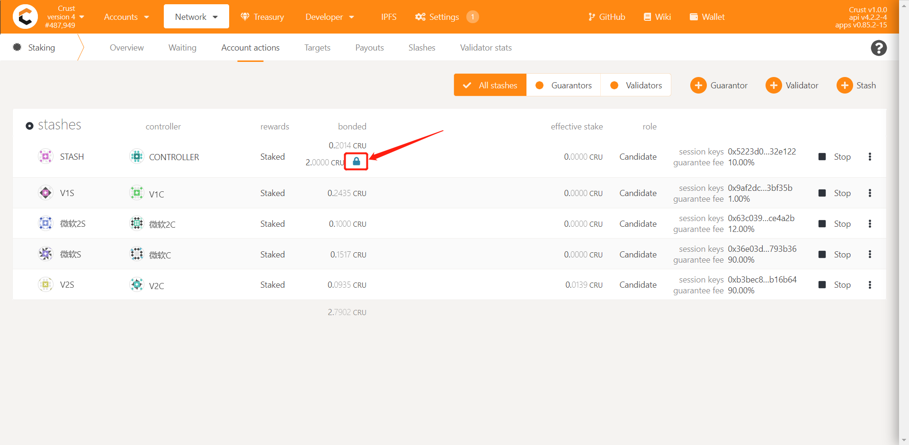

## Overview

The "Guarantee" is an important mechanism in the Crust Consensus [GPoS](GPoS.md), which enables nodes to obtain effective staking not only from their own staked tokens, but also from the guarantor's guarantee.

A guarantor is an account that provides a guarantee for one or multiple validators in Crust Network. Any account with CRU tokens can potentially become a guarantor while in turn obtaining guarantee incomes. Additionally, the guarantor can maintain the security of the network by choosing validators with quality performance.

## Guarantors’ Rewards and Slash

### 1. Rewards

#### 1. Calculate rewards

The guarantor obtains rewards from staking, which is influenced by the following factors:

- Stake Limit: The Stake Limit determines the upper limit of the effective stake of CRUs by the validator, which is directly related to the amount of storage provided by the validator. In Crust Network, a 1TB SRD([check the meaning of SRD from glossary](glossary.md)) file corresponds to an upper limit of 1CRU, and a meaningful file corresponds to 1-10 times the upper limit of SRD, with specific ‘times’ related to the number of duplicates of meaningful files. For details, please refer to [DSM Guidance](DSM.md).
- Effective Stake: The Effective Stake is **the amount of staking that actually generates incomes**, which is related to the stake limit of the validator that is guaranteed. An example is provided as follows:
- Guarantee Fee: The proportion of reward obtained by the guarantor, which is set by the validator. **A higher guarantee fee does not mean higher guarantee income**. The guarantee income of any guarantor needs to consider the effective stake and his own staking amount.

> For example, if the validator obtains 900 CRU staking rewards and 100 CRU authoring reward (block generation reward) in one era, and if his self-staking accounts for 90% of his total staking(The remaining 10% is contributed by guarantors). If the guarantee fee is 95%, then the guarantors finally obtain (900 + 100) * 10% * 95% = 95 CRUs income, and the remaining 905 CRUs belong to the validator.

> If a validator’s stake limit is 1000 CRU, the self-staking is 900 CRU, and the guarantor staked 300 CRU. In this way, the total stake is 1200, and the total effective pledge is 1000. The effective stake of the validator is 1000 * (900/1200) = 750, and the effective stake of the guarantor is 1000 * (300/1200) = 250.

How are the rewards specifically distributed? The GPoS income obtained by the guarantor is calculated as following:

```shell
guarantor_rewards = total_staking_income * guarantor_effective_staking_amount / total_effective_staking_amount * guarantee_fee
```

```shell
validator_total_staking_amount = validator_self_staking_amount + guarantee_amount
```

```shell
guarantor_effective_guarantee_amount = MIN (stake_limit, validator_total_staking_amount) * (guarantee_amount / validator_total_staking_amount)
```

Here is an example:

If node A staked 1000 CRUs itself, for which you guaranteed 200 CRUs. The stake limit is 1000 CRUs, with the percentage of guarantee fee set at 95%, and the staking incomes generated per round are 600 CRUs. Supposing the effective staking amount of the network is 2000, we can work out the income of each Era:

1. Effective staking amount = minimum value (1000, 1200) * (200 / 1200) = 1000 * (200 / 1200) = 166.66 CRU
2. Staking income = 600 * (166.66 / 2000) * 95% = 47.498 CRU

#### 1.2 Withdraw rewards

The **guarantee rewards cannot be directly received and transferred**, but will be changed to the [Binding](new-bond.md) state(this part of bonding funds will not be guaranteed to anyone by default). To make use of these rewards, you can:

1. follow the steps of [increase the guarantee amount](guarantor-guidance.md) to get more rewards.
2. follow the following process to withdraw your rewards to make them transferable.

    a. you need to do the [unbond](https://wiki.crust.network/docs/en/validatorGuidance#32-decrease-the-amount-of-self-staked-token) for the amount that you want to withdraw.
    
    b. After 28 days, you can withdraw your reward by click the "withdraw" icon as the following picture highlighted.



### 2. Slash

The guarantor and the validator guaranteed by him have the same slash ratio. For details of the slash, please refer to slash specifications in [Validator](validator.md).

## How to Guarantee

Please refer to [Guarantee Guidance](guarantor-guidance.md) for details.
