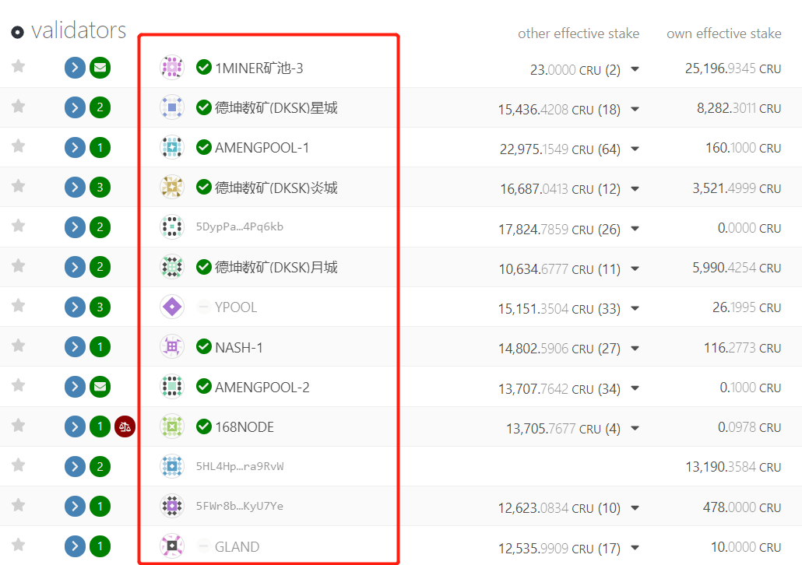
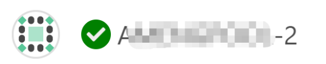
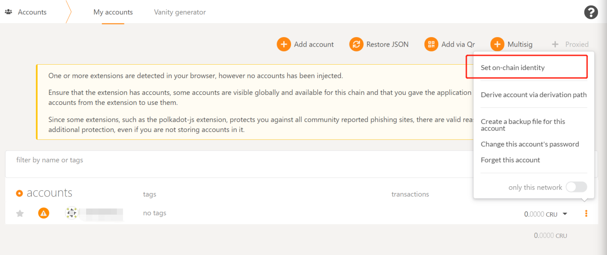
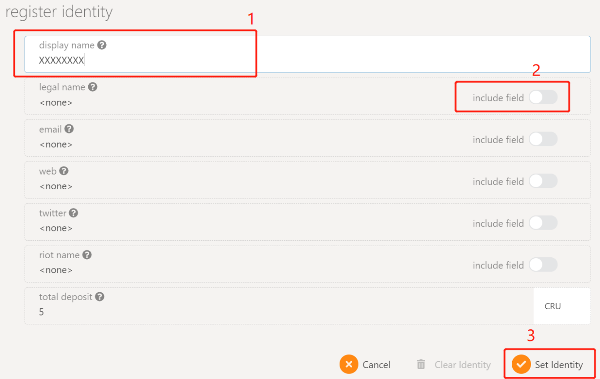
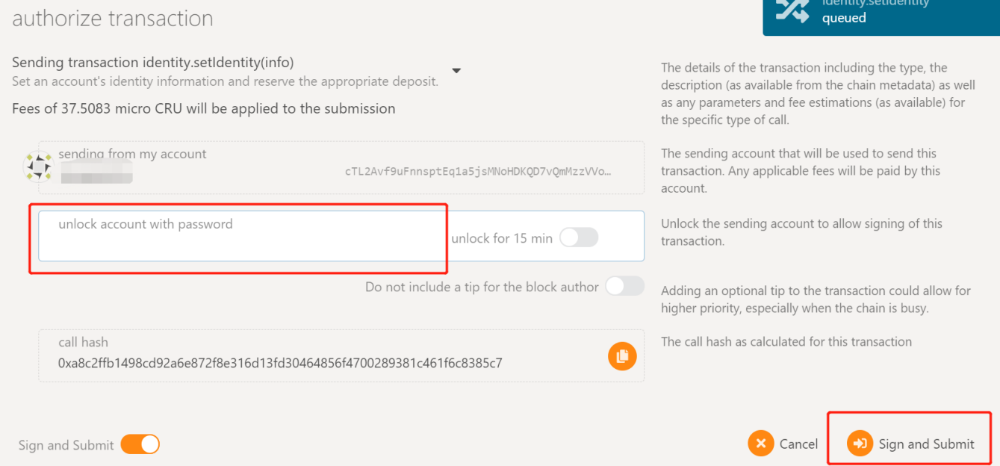
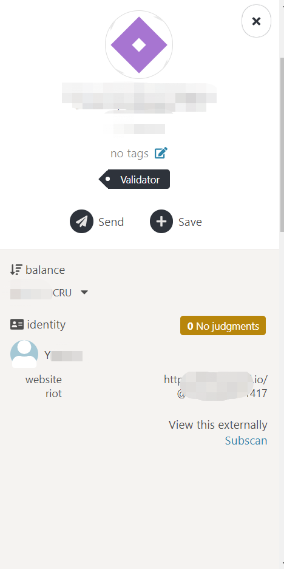
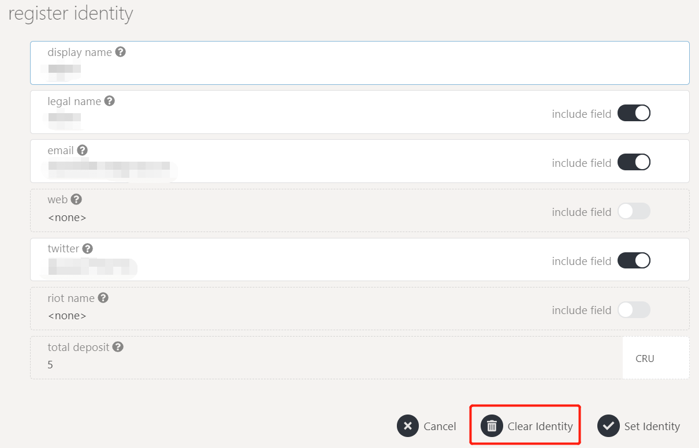
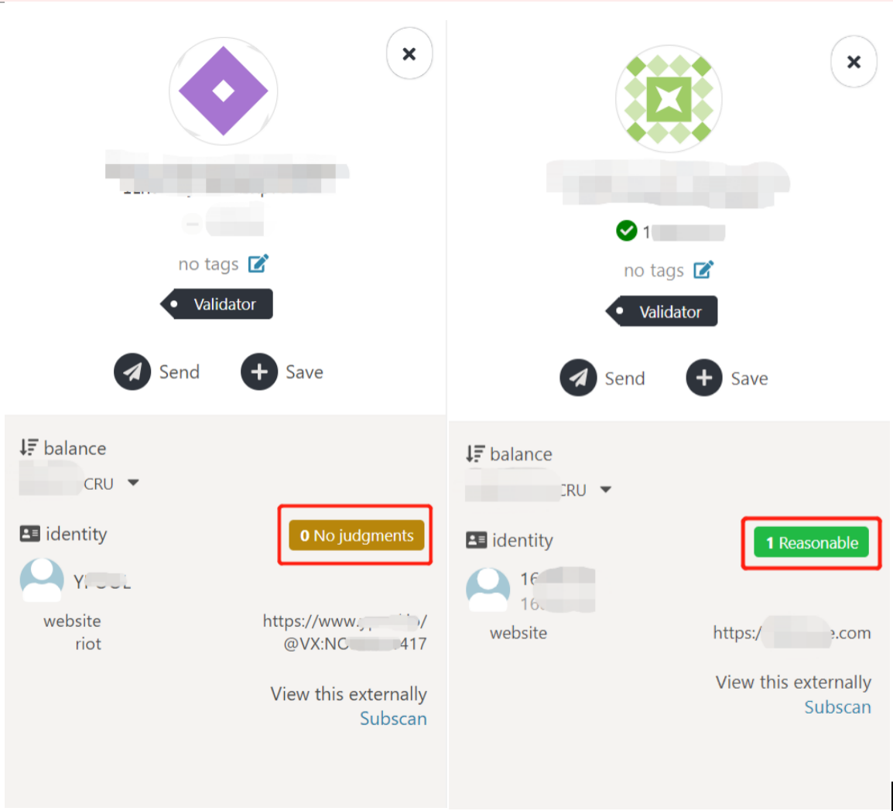

Crust Network allows users to disclose relevant information of their on-chain identities, and users can submit to the Crust community for verification. By completing the on-chain identity setting and verification, users can have the following benefits:

* For general users, it is convenient for others to remember and search, and establish connections through disclosure information of identity;
* For the validator/candidate nodes, besides the benefits mentioned above, it can also help the nodes build a brand, increase credibility to guarantors, and build long-term and stable guarantee relationships.

Different on-chain identity statuses will be displayed differently in the Crust Network. Take the picture below as an example:

For accounts that have not set their on-chain identities, only their address information will be displayed on the network:

For accounts that have completed the on-chain identity setting, but have not submitted or passed community verification, the Display Name of the account will be displayed on the network:

For accounts that have completed the on-chain identity setting, submitted and passed the community verification, a green tick symbol will be displayed in front of the Display Name:

The setting of the on-chain identity requires 5 CRU as a deposit. When users initiate "Clear identity" , the deposit will be refunded.

## Instructions of Setting On-Chain Identity

1. Crust Apps → Accounts → My accounts，choose “Set on-chain identity”

2. In the pop-up dialog box, fill in the information you are willing to disclose

Only “Display Name” is required, the remaining items are selected and can be filled in through the “include field” switch according to the display needs. When complete, click “Set Identity”

3. Enter the account and password in the pop-up dialog box, and click "Sign and Submit" to complete the on-chain signature operation. Wallet users can sign in using Crust wallet.

After the setting of on-chain identity is completed, other users can see their display name in the network. After clicking the display name, all the information disclosed by the account will be displayed on the pop-up page:

4. If users no longer want to disclose relevant information, they can clear the identity information through "Clear Identity".

## Verification of On-Chain Identity

Users who have completed the setting of on-chain identity can apply for verification to the Crust community. After the community reviews their disclosed information and confirms integrity and authenticity, the verification will be granted, and the green tick symbol will be displayed in front of the account. The verification status on the information page will also change from "No judgments" to "Reasonable".

The requirements of information disclosure for validator/candidate nodes and general users to  complete verification are different. The detailed requirements and application channels will be explained in the verification activities of the Crust community.
