## 1. Overview


### 1.1 Node Responsibility

The Isolation node is a full-featured node of Crust Network, which undertakes core functions such as block generation, storage, and file transfer, equivalent to that the Owner and Member nodes are on the same machine. Therefore, support for SGX is necessary. The Isolation node account is connected to chain through the session key and the report of storage information works with configuring backup files. 

### 1.2 Hardware Spec

For an isolation node, you need to run both chain module and storage module on your device, so your device needs to support SGX. Additionally, since the block generation process and the storage proving process both have high demands for network stability, we strongly recommend that the block generation node use a fixed public network IP, otherwise it will be punished due to any unstable block generation. For detailed configuration requirements and recommendations, please refer to the official [hardware spec](node-Hard-wareSpec.md#isolation-node-spec).

## 2. Ready to Deploy

### 2.1 Create your Accounts

Please refer to [here](new-bond.md) to create your Stash and Controller group and [here](crust-account.md) to create a Member account. These 3 accounts need to meet the following requirements:

Notices:

* Ensure Member account has 2~5 CRUs as a transaction fee (cannot be locked) for sending work reports. It is recommended you check the remaining status of reserves from time to time;
* Be sure to reserve a small number of CRUs not locked in the Controller&Stash for sending transactions (about 1 CRU)
* Make sure those accounts are unique
* If you want to use the account on the Maxwell network, you need to import the backup file to the main network [APPs](https://apps.crustcode.com/) and re-export the new version of the backup file

### 2.2 Create Group

Enter Crust APPS, select 'Benefit', click on 'Create group',select the Owner Stash account, click on 'Create', enter the password of the stash account and click on 'Sign and Submit' to send the transaction and create Group.

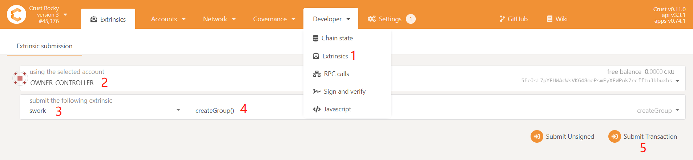
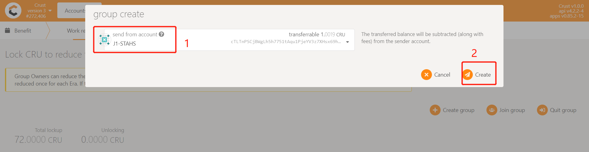


### 2.3 Setup BIOS

The SGX (Software Guard Extensions) module of the machine is closed by default. In the BIOS settings of your machine, you can set SGX to 'enable' and turn off Secure Boot (some types of motherboard do not support this setting). If your SGX only supports software enabled, please refer to this link [https://github.com/intel/sgx-software-enable](https://github.com/intel/sgx-software-enable).


### 2.4 Download Crust Node Package

a. Download

```plain
wget https://github.com/crustio/crust-node/archive/v1.0.0.tar.gz
```
b. Unzip
```plain
tar -xvf v1.0.0.tar.gz
```
c. Go to package directory
```plain
cd crust-node-1.0.0
```
### 2.5 Install Crust Service

Notices:

* The program will be installed under /opt/crust, please make sure this path is mounted with more than 500G of SSD space;
* If you have run a previous Crust testnet program on this device, you need to close the previous Crust Node and clear the data before this installation. For details, please refer to section 6.2;

* The installation process will involve the download of dependencies and docker images, which is time-consuming. Meantime, it may fail due to network problems. If it happens, please repeat the process until the installation is all complete.

Installation:

```plain
sudo ./install.sh
```

## 3. Node Configuration

### 3.1 Edit Config File

Execute the following command to edit the node configuration file:
```plain
sudo crust config set
```
### 3.2 Change Node Name

Follow the prompts to enter the name of your node, and press Enter to end:

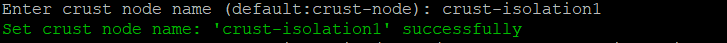

### 3.3 Choose Mode

Follow the prompts to enter a node mode, and press Enter to end:

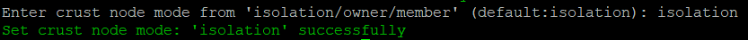

### 3.4 Config Controller Account

Enter the backup of the controller account as prompted and press Enter to end:

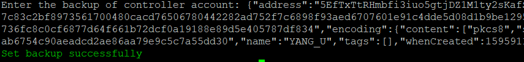
Enter the password for the controller backup file as prompted and press Enter to end:

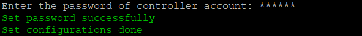

### 3.5 Config Hard Disks

> Disk organization solution is not unitary. If there is a better solution, you can optimize it yourself.

With Crust as a decentralized storage network, the configuration of your hard disks becomes quite important. The node storage capacity will be reported to the Crust Network as reserved space, and this will determine the stake limit of this node.

**Hard disk mounting requirements:**

* Chain data and related DB data will be stored in /opt/crust/data directory. It is recommend you mount your SSD to this directory.

* The order files and SRD (Sealed Random Data, the placeholder files) will be written in the /opt/crust/disks/1 ~ /opt/crust/disks/128 directory, depending on how you mount the hard disk. Each physical machine can be configured with up to 500TB of reserved space

* Please pay attention to the read and write permissions of the directory after mounting

Suggestions for mounting HDDs:

**HDDs organization solution is not unitary. If there is a better solution, you can optimize it yourself.**

* Single HDD: mount it directly to /opt/crust/disks/1
* Multiple HDDs (multi-directories): Mount the hard disks to the /opt/crust/disks/1 ~ /opt/crust/disks/128 directories respectively. For example, if there are three hard disks /dev/sdb, /dev/sdc and /dev/sdd, you can mount them to /opt/crust/disks/1, /opt/crust/disks/2, /opt/crust/disks/3 directories respectively. The efficiency of this method is relatively high, and the method is relatively simple, but the fault tolerance of the hard disk will be reduced
* Multiple HDDs (single directory): For hard disks with poor stability, using RAID/LVM/mergerfs and other means to combine the hard disks and mount them to the /opt/crust/disks/1 directory is an option. This method can increase the fault tolerance of the hard disk, but it will also bring about a drop in efficiency
* Multiple HDDs (mixed): Combine single directory and multiple directories to mount HDDs

```plain
sudo crust tools space-info
```

## 4. Start Node

### 4.1 Preparation

To start with, you need to ensure that the following ports are not occupied: 30888 19944 19933 (occupied by crust chain), 56666 (occupied by crust API), 12222 (occupied by crust sWorker), and 5001 4001 37773 (occupied by IPFS)

Then open the P2P port:

```plain
sudo ufw allow 30888
```

### 4.2 Start


```plain
sudo crust start
```
### 4.3 Check Running Status

```plain
sudo crust status
```

If the following five services are running, it means that Crust node started successfully.

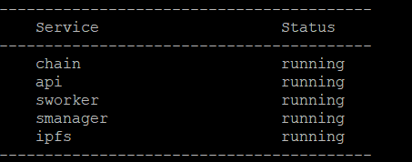

### 4.4 Set Node Storage Capacity and Run SRD

Please wait about 2 minutes and execute the following commands.

1  Assuming that the HDDs have 1000G of space, set it as follows, sWorker will reserve some space and automatically determine the size of the SRD:

```plain
sudo crust tools change-srd 1000
```

2 These commands may fail to execute. This is because sworker has not been fully started. Please wait a few minutes and try again. If it still does not work, please execute the subordinate monitoring commands to troubleshoot the error:

```plain
sudo crust logs sworker
```

### 4.5 Monitor

Run following command to monitor your node, and press 'ctrl-c' to stop monitoring：

```plain
sudo crust logs sworker
```

The monitoring log is as follows:
* (1) Indicating that the block is being synchronized. The process takes a long time;

* (2) Having successfully registered your on-chain identity;
* (3) Storage capacity statistics calculation in progress, which takes place gradually;
* (4) Indicating that the storage status has been reported successfully. The process takes a long time, about half an hour.

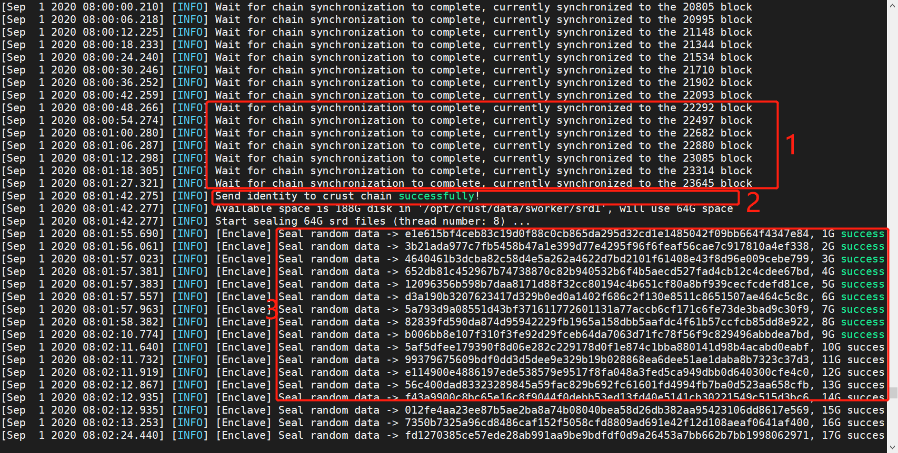

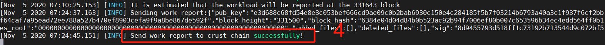

## 5 Joining Group

### 5.1 Add allowlist

Member accounts need to be added to the whitelist of the group before they can be added to the group. Enter [Crust APPS](https://apps.crust.network), select 'Account', select the 'Benefit' module, find the group created before, and click 'Add allowed accounts', as follows:

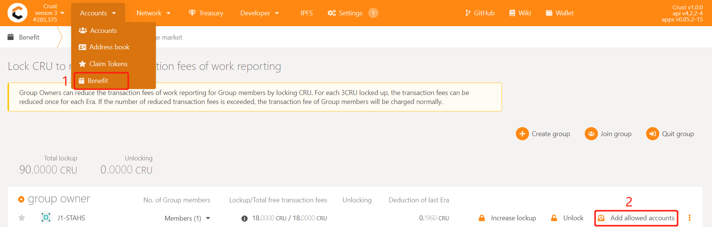

Select the Member account that needs to be added to the group, click 'Submit' and send the transaction, and add the account to the whitelist of the Group
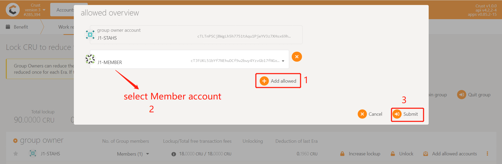

### 5.2 Join group

After the first work report,select 'Benefit', click on 'Join group',select the Member account and the Stash account, click 'Join group', enter the password of the Member account, and finally click 'Sign and Submit' to send the transaction

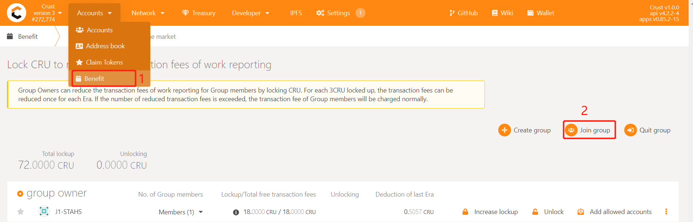
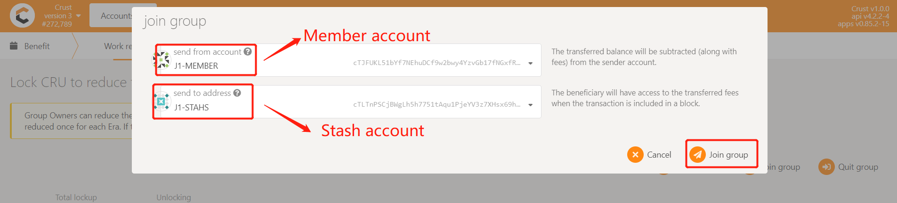

### 5.3 Lockup CRU to reduce the fee of the work report

**The work report in mainnet requires handling fees.** Under normal circumstances, each Member will perform 24 workload reporting transactions per day, which brings a lot of handling fees. For this reason, the Crust network provides a Benefit module that exempts workload reporting fees. Group owners can reduce or waive member handling fees by locking CRUs. **Each Member** needs to lock 18CRU for fee reduction. However, considering the unstable reporting of workload, it is recommended to lock 24CRU~30CRU to ensure that the fee is completely free.

Enter [Crust APPS](https://apps.crust.network), select 'Account', select the 'Benefit' module, find the group created before, and click 'Increase lookup', as follows:

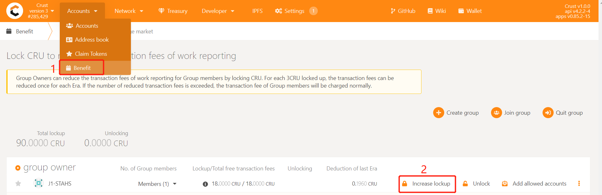

Enter the number of CRUs that need to be added, and sign the transaction, as follows:

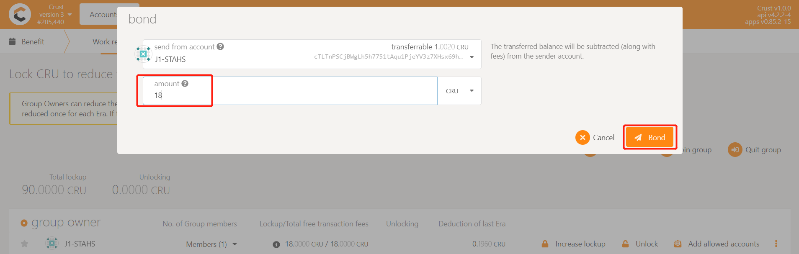

## 6. Blockchain Validate

### 6.1 Get session key

Please wait for the chain to synchronize to the latest block height, and execute the following command:

```plain
sudo crust tools rotate-keys
```
Copy the session key as shown below:

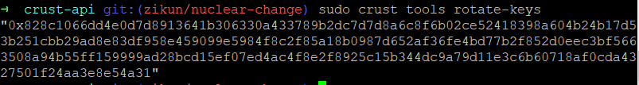

### 6.2  Set session key

Enter [CRUST APPs](https://apps.crust.network/), click on "Staking" button under "Network" in the navigation bar, and go to "Accounting action". Click on the setting button on the right of your stashes(a 3-dots button) and click on "Change session key".

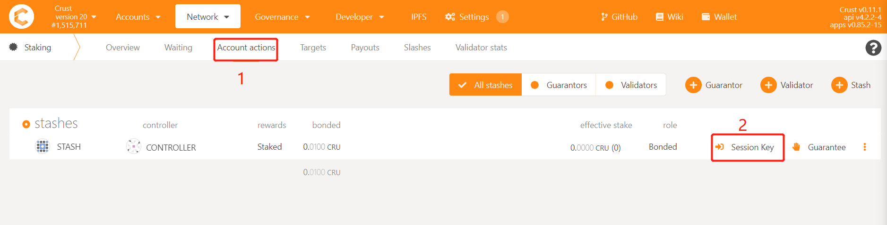

Fill in the sessionkey you have copied, and click on “Set session key”.

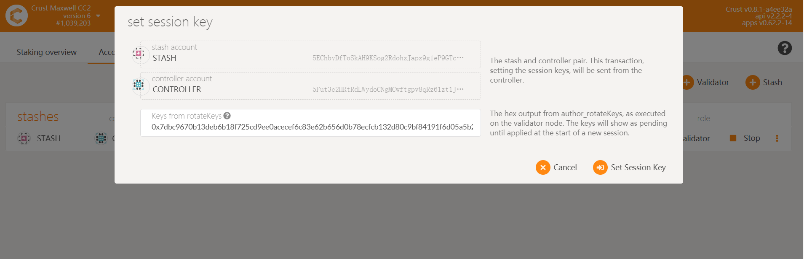


### 6.3 Be a Validator/Candidate

Follow the steps below:

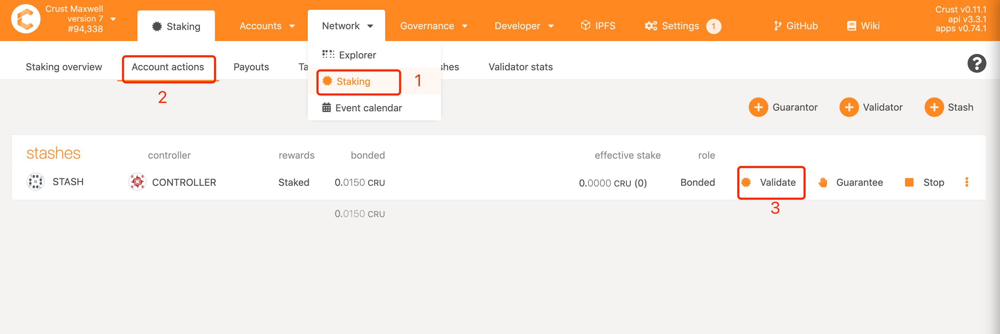

After one era, you can find your account listed in the "Staking" or "Waiting" list, which means you have completed all the steps.

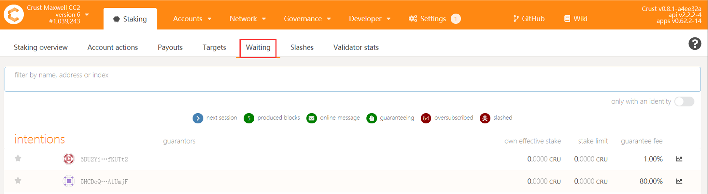


## 7. Restart and Uninstall

### 7.1 Restart

If the device or Crust node related programs need to be somehow restarted, please refer to the following steps. 

**Please note**: This section only concerns restarting steps of Crust nodes, not including the basic software and hardware environment settings and inspection related information, such as hard disk mounting, IPFS configurations, etc. Please ensure that the hardware and software configuration is correct, and perform the following steps:


```plain
sudo crust reload
```

### 7.2 Uninstall and Data Cleanup

If you have run a previous version of Crust test chain, or if you want to redeploy your current node, you need to clear data from three sources:

* Delete basic Crust files under /opt/crust/data and /opt/crust/disks
* Clean node data under /opt/crust/crust-node by executing:
    ```plain
    sudo /opt/crust/crust-node/scripts/uninstall.sh
    ```

