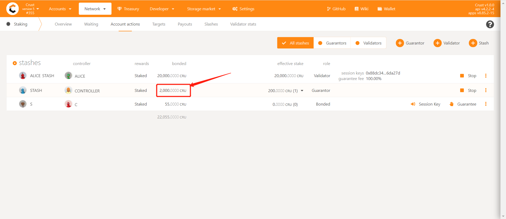
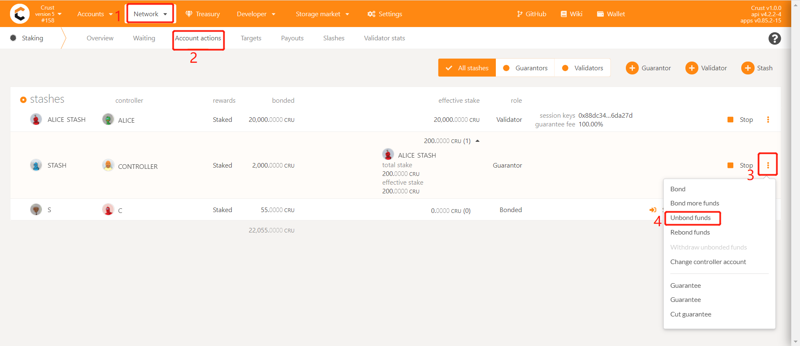
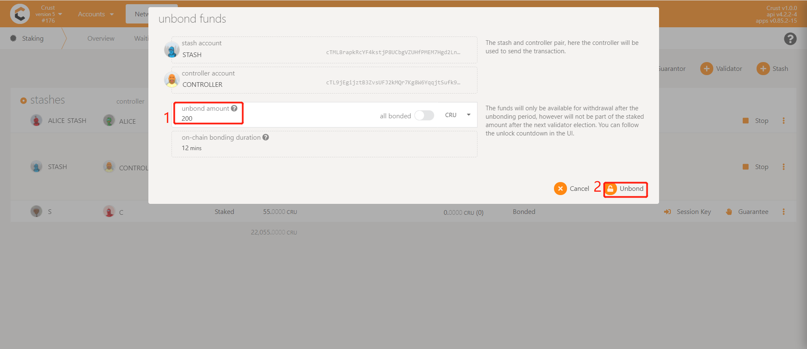
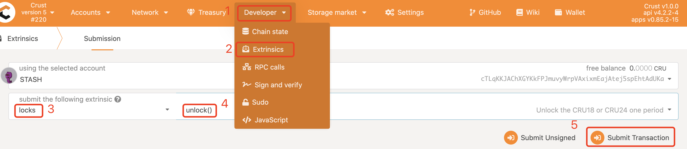
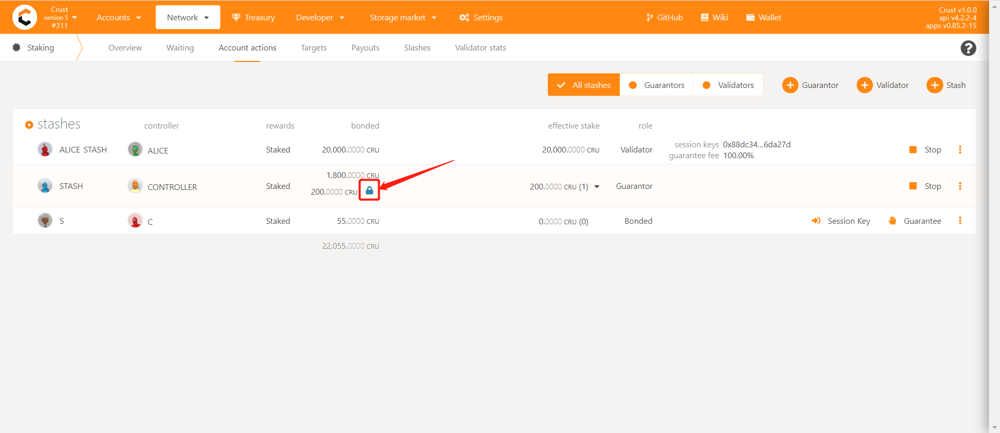

LockedCRU(including CRU18/CRU24/CRU24D6) is the token **for the participants of pre-selling and profit ark**, those participants can refer to this tutorial to unlock your token, the unlocking steps in this tutorial take CRU18 as an example.

## Attention

This tutorial is only for users who have already claimed a locked CRU. For users who have not claimed it on the mainnet, please refer to [this tutorial](claims-locked-cru.md) to claim it first.

The unlocking cycle of the locked CRU18 is `43200` blocks (about 30 days), and it is unlocked 1/18 each time. The default state is bound, and the entire unlocking process needs to be operated manually.

## Steps

## 1. View Locked CRU18

Users can go to [Staking Page](https://apps.crust.network/?rpc=wss%3A%2F%2Frpc.crust.network#/staking/actions) to view all their CRU18 assets (except `1 CRU` used for operating tx fees) is in bonding, as shown in the following figure:

**For example:**

If Alice owns `1800 CRU18` assets, she will see on this page that she has `1799 CRU18` assets in bonding

### 2. Unlock CRU18

Unlock needs 3 sub-steps:

#### 1. Unbond

Unbonding CRU18 needs to be done **28 days in advance**. That is, if you want to withdraw the corresponding CRU18 asset on October 31, you need to unbond it on October 2. You can do the unbond operation as shown below:

You can enter any value for the unbonding amount, but expired assets greater than the monthly unbonding amount will continue to be in bond and will not allow to be withdrawn

**For example:**

If Alice owns `1800 CRU18` assets, she will unlock 100 CRU every month. If Alice unbond 900 CRU, 100 CRU can be successfully unbond after 30 days and 800 CRU will continue to be bond.

#### 2. Unlock

After each unlocking period expires, users can unlock CRUs that have released liquidity as shown in the following figure:

#### 3. Withdraw

After the unbonding period (**28 days**), users can click on the withdraw operation as shown below:

### 3. Unlock Scheduler
| **Unlock Round** | **Unlock at (block number)** |
| :--------------- | :--------------------------- |
| 1 | 1209777 |
| 2 | 1641777 |
| 3 | 2073777 |
| 4 | 2505777 |
| 5 | 2937777 |
| 6 | 3369777 |
| 7 | 3801777 |
| 8 | 4233777 |
| 9 | 4665777 |
| 10 | 5097777 |
| 11 | 5529777 |
| 12 | 5961777 |
| 13 | 6393777 |
| 14 | 6825777 |
| 15 | 7257777 |
| 16 | 7689777 |
| 17 | 8121777 |
| 18 | 8553777 |

## Reference

1. [LockedCRU Claim](claims-locked-cru.md)
