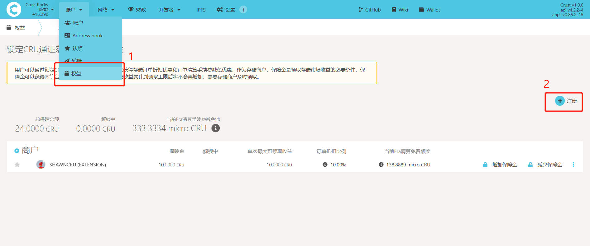

用户可以通过锁定CRU通证作为存储市场保障金来获得存储订单折扣优惠和订单清算手续费减免优惠。

作为[存储商户](merchantGuidance.md)，保障金是领取存储订单奖励的必要条件，保障金可以获得同等金额的奖励领取上限，待领取的存储订单奖励累计到上限后将不会再增加，需要存储商户及时领取。

## 存储订单折扣

用户可以在存储市场权益模块中通过锁定CRU通证作为保障金来获得最大10%的存储订单折扣优惠，折扣比例的计算公式为：

* 折扣比例=min（10%，用户保障金/存储市场总保障金）

>注意：折扣优惠不对小费生效

## 订单清算手续费减免

用户可以在存储市场权益模块中通过锁定CRU通证作为保障金来获得订单清算手续费减免优惠，Crust网络将会在每个Era的区块奖励中预留0.2%作为清算手续费减免池，用户通过锁定保障金可以在减免池中得到一定的配额。用户在发起清算时产生的手续费，将优先从减免池配额中扣除。用户的减免配额计算公式为：

* 用户减免配额 = （用户保障金/存储市场总保障金）* 减免池CRU总额

>注意：清算手续费减免池每个Era将被重置，未消耗的减免池额度将不会被累计.

## 存储市场权益模块操作说明

### 1. 注册成为商户

Group Owner需要先注册成为存储商户，才能获得存储市场收益进入Crust Apps ->账户 ->权益 ->存储市场，点击“注册”：

在对话框中输入初始的保障金数量，点击“绑定”，完成签名并提交。

此时，页面将会显示商户所获得的存储市场权益：

### 2. 增加保障金

当存储商户希望获得更多的权益时，可以通过操作增加保障金，进入Crust Apps ->账户 ->权益 ->存储市场，点击“增加保障金”。

在对话框中输入希望增加保障金的数量，点击“绑定”

注意：订单折扣比例最高为10%，达到最大比例后，增加保障金也不能获得更高的订单折扣比例。

### 3. 减少保障金

进入Crust Apps ->账户 ->权益 ->存储市场，点击“减少保障金”。

在对话框中输入希望解绑的数量，点击“解除绑定”

解除绑定的CRU需要28天后才能提取。

