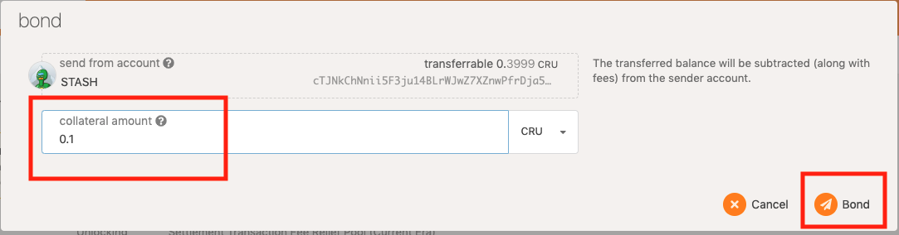
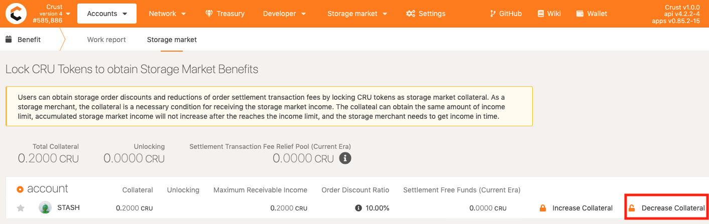

Users can receive storage order discounts and reductions for order settlement fees by locking in CRU tokens as storage market collateral.

For [storage merchants](merchantGuidance.md) to receive storage order rewards, the collateral is a necessity, with which merchants can get rewards equal to the collateral. This being said, the collateral represents the upper limit of the merchants’ to-be-collected storage order rewards, which will not increase any more when the limit is hit and merchants will need to collect them timely.

## **Benefit 1: Storage order discounts**

Users can get a maximum 10% discount on storage orders by [locking in CRU tokens as collateral](#1-add-collateral) in the Storage Market Benefits module. The discount rate can be calculated as: 

* Discount rate = min (10%, the user’s collateral / total storage market collateral).

  As shown in the example below,  a collateral of 0.1 CRU is locked in the Stash account (the total collateral of the whole network is 0.11, and the user's collateral takes up a big part of the collateral locked in the network). According to the above formula, the storage order discount rate obtained by the user is 10%, which can be known from [Crust Apps](https://apps.crust.network) -> "Account" -> "Benefits" -> "Storage Market".

  

>Note: The discount offer is not applicable for tips.

## **Benefit 2: Reductions for order settlement fees**

Users can get reductions for order settlement fees by [locking in CRU tokens as collateral](#1-add-collateral) in the Storage Market Benefits module. The Crust Network will reserve 0.2% of each Era’s block rewards which will be used for the reduction pool of settlement fees, and users can get a certain reduction limit in the reduction pool by locking in collateral. The order settlement fees will first be deducted from the reduction pool. Users’ order settlement fee reduction limit can be calculated as:

* A user's reduction limit for order settlement fees = (the user's collateral / total storage market collateral) * total CRUs of the reduction pool

  As shown in the example below,  a collateral of 0.1 CRU is locked in the Stash account (the total collateral of the whole network is 0.11, and the user's collateral takes up a big part of the collateral locked in the network). Since the balance of the "reduction pool of settlement fees" is 0, the current user's reduction limit for order settlement fees is 0.

  

>Note: The reduction pool for settlement fees will be reset each Era and unspent pool limits will not be accumulated.

## Benefit 3: Storage merchants receive storage order rewards

After the [order settlement](orderSettlement.md), order rewards belonging to storage merchants will not go directly to the merchants' balance, but are in a to-be-collected state. **There is a upper limit to the total amount of rewards to be collected, and this limit is equal to the total amount of [locked collateral](#1-add-collateral).**

As shown in the example below: If a merchant locks in a collateral of 0.1 CRU, his storage order rewards will keep growing as he continues to provide storage market services. New order rewards will be discarded until his total to-be-collected rewards reach 0.1 CRU.

To avoid storage order rewards being discarded, merchants will have two options:

       1. take the rewards, when the to-be-collected rewards will be cleared and can be re-accumulated;
       2. [lock in more collateral](#1-add-collateral), which can increase the receivable value of the to-be-collected rewards.

## **Instructions on Storage Market Benefits**

### 1. **Add collateral**

Go to [Crust Apps](https://apps.crust.network) -> Accounts -> Benefits -> Storage Market. Select the Group Owner's Stash account, click on the "Add collateral" button and fill in the amount of to-be-added collateral in the dialog box.

After the collateral is successfully added, it will show that the user's "maximum receivable income" has also increased.

### 2. **Cut collateral**

Similarly, storage merchants can reduce the amount of the locked collateral by clicking on the "Cut collateral" button and fill in the amount of collateral to be reduced in the pop-up box.

>Note: The collected rewards will go to the account balance, but will first be locked for 28 days before any transfer can be made.
