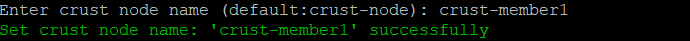
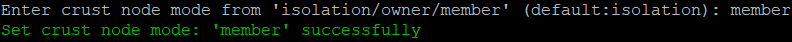
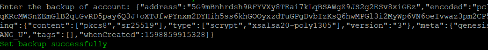
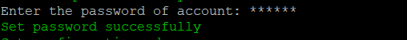

## 1. Overview


### 1.1 Node Responsibility

The Member node acts as the storage provider in Group. There can be multiple Member nodes in a Group, and their effective storage can be clustered on Owner to participate in block generation competition. Since Member nodes store files and perform trusted quantification, support for SGX is necessary. The Member node is connected to its account through configuring backup files.

### 1.2 Hardware Spec

The Member node runs chain modules (not participating in block generation), storage modules, IPFS, etc. It needs to be equipped with an SGX environment. Meantime, it stores user files, involving frequent network transmission, so the network bandwidth should also be in high standards. Refer to specific hardware recommendations here.

## 2. Ready to Deploy

### 2.1 Create your Accounts

Refer to [this link](crust-account.md) to create a Member account (a single account). The Member node account needs to meet the following three requirements:

* Reserve 5 CRUs as a transaction fee (cannot be locked) for sending work reports. It is recommended you check the remaining status of reserves from time to time;
* Cannot be the account of Owner;
* The account should be unique, meaning that it cannot be those same as other Member accounts, that is, one chain account only for one machine.

### 2.2 Setup BIOS

The SGX (Software Guard Extensions) module of the machine is closed by default. In the BIOS settings of your machine, you can set SGX to 'enable', and turn off Secure Boot (some types of motherboard do not support this setting). If your SGX only supports software enabled, please refer to this link [https://github.com/intel/sgx-software-enable](https://github.com/intel/sgx-software-enable)


### 2.3 Download Crust Node Package

a. Download

```plain
wget https://github.com/crustio/crust-node/archive/v0.9.0.tar.gz
```
b. Unzip
```plain
tar -xvf v0.9.0.tar.gz
```
c. Go to package directory
```plain
cd crust-node-0.9.0
```
### 2.4 Install Crust Service

Notices:

* The program will be installed under /opt/crust, please make sure this path is mounted with more than 250G of SSD space;

* If you have run a previous Crust testnet program on this device, you need to close the previous Crust Node and clear the data before this installation. For details, please refer to section 6.2;

* The installation process will involve the download of dependencies and docker images, which is time-consuming. Meantime, it may fail due to network problems. If it happens, please repeat the process until the installation is all complete.

Installation:

```plain
sudo ./install.sh
```
## 3. Node Configuration

### 3.1 Edit Config File

Execute the following command to edit the node configuration file:

```plain
sudo crust config set
```
### 3.2 Change Node Name

Follow the prompts to enter the name of your node, and press Enter to end:



### 3.3 Choose Mode

Follow the prompts to enter a node mode 'member', and press Enter to end:



### 3.4 Config Account

Enter the backup (backed up when the account was created) of the account as prompted and press Enter to end:



Enter the password for the backup file as prompted and press Enter to end:



### 3.5 Config Hard Disks

> Disk organization solution is not unitary. If there is a better solution, you can optimize it yourself.

With Crust as a decentralized storage network, the configuration of your hard disks becomes quite important. The node storage capacity will be reported to the Crust Network as reserved space, and this will determine the stake limit of this node.

Hard disk mounting requirements:

* Chain data and related DB data will be stored in /opt/crust/data directory. It is recommend you mount your SSD to this directory;

* The storage order file and SRD (Sealed Random Data, the placeholder files) will be written into the /opt/crust/data/files directory, it is recommended you mount the HDD to this directory. Initially, each device can be configured with up to 500TB of reserved space.

Suggestions for mounting HDDs:

* **Disk organization solution is not unitary. If there is a better solution, you can optimize it yourself.**
* If you only have one HDD, mount it directly to /opt/crust/data/files;
* For multiple HDDs, you can use LVM technology to organize these hard disks into a device and mount them to the /opt/crust/data/files directory. Please use LVM stripe to improve the storage performance;
* For disks with low stability, it is recommended you make several RAID5/RAID10 groups first, each with no more than 6 hard disks, and then use LVM to combine each group;

You can use following command to view the file directory:

```plain
sudo crust tools space-info
```
### 3.6 Review the Configuration (Optional)

Execute following command to view the configuration file:

```plain
sudo crust config show
```
## 4. Start Node

### 4.1 Preparation

To start with, you need to ensure that the following ports are not occupied: 30888 19944 19933 (occupied by crust chain), 56666 (occupied by crust API), 12222 (occupied by crust sWorker), and 5001 4001 37773 (occupied by IPFS).

Then open the P2P port:

```plain
sudo ufw allow 30888
```
### 4.2 Start

```plain
sudo crust start 
```
### 4.3 Check Running Status

```plain
sudo crust status
```
If the following five services are running, it means that Crust node started successfully.


### 4.4 Set Node Storage Capacity and Run SRD
Please wait about 2 minutes and execute the following commands.

1  Assuming you have 1000G of space under /opt/crust/data/files, sWorker will keep the hard disk with 1% free space, then set 990G, as follows:

```plain
sudo crust tools change-srd 990
```

2 These commands may fail to execute. This is because sworker has not been fully started. Please wait a few minutes and try again. If it still does not work, please execute the subordinate monitoring commands to troubleshoot the error:

```plain
sudo crust logs sworker
```

### 4.5 Monitor

Run following command to monitor your node, and press 'ctrl-c' to stop monitoring：

```plain
sudo crust logs sworker
```
The monitoring log is as follows:

* (1) Indicating that the block is being synchronized. The process takes a long time;
* (2) Having successfully registered your on-chain identity;
* (3) Storage capacity statistics calculation in progress, which takes place gradually;
* (4) Indicating that the storage status has been reported successfully. The process takes a long time, about half an hour.


## **5. Joining Group**

After the first work report, enter [Crust APPS](https://apps.crust.network/?rpc=wss%3A%2F%2Fapi-maxwell.crust.network#/explorer), select 'Extrinsics', select the Member account, select 'swork' in the submit group, select joinGroup(target),  select the Controller address of the Owner of the Group you want to join, and click on 'Submit Transaction' to send the transaction.


## 6. Restart and Uninstall

### 6.1 Restart

If the device or Crust node related programs need to be somehow restarted, please refer to the following steps. 

**Please note**: This section only concerns restarting steps of Crust nodes, not including the basic software and hardware environment settings and inspection related information, such as hard disk mounting, IPFS configurations, etc. Please ensure that the hardware and software configuration is correct, and perform the following steps:

```plain
sudo crust reload
```
### 6.2 Uninstall and Data Cleanup


If you have run a previous version of Crust test chain, or if you want to redeploy your current node, you need to clear data from three sources:

* Delete basic Crust files under /opt/crust/data
* Clean the SRD file under the "srd_paths" you configured (if you have run a version before 0.8.0)
* Clean node data under /opt/crust/crust-node by executing:

```plain
sudo /opt/crust/crust-node/scripts/uninstall.sh
```

