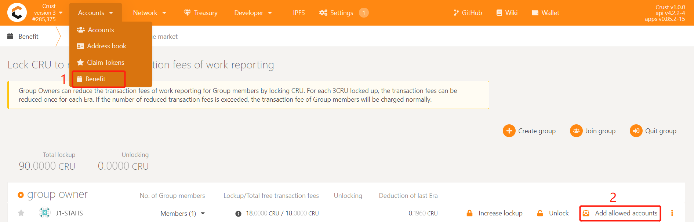
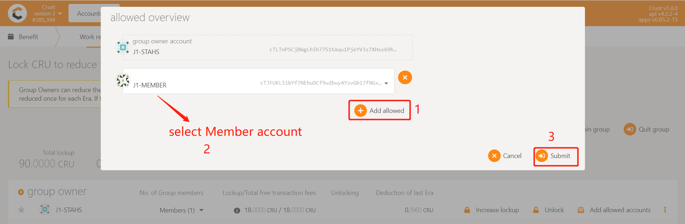
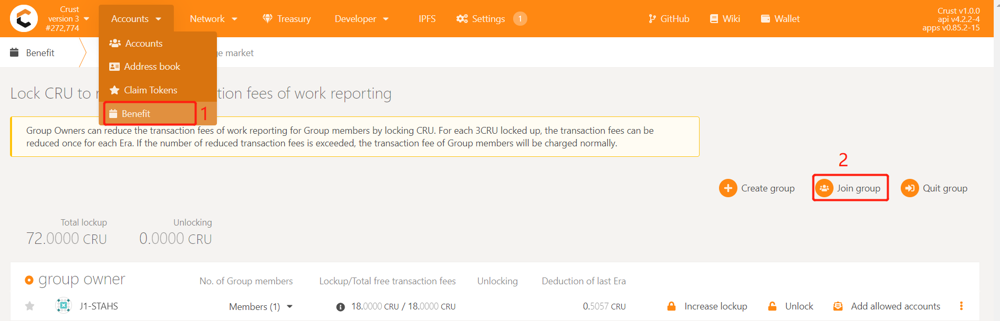
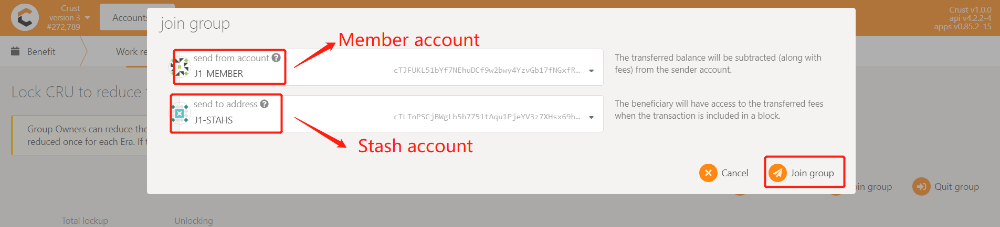
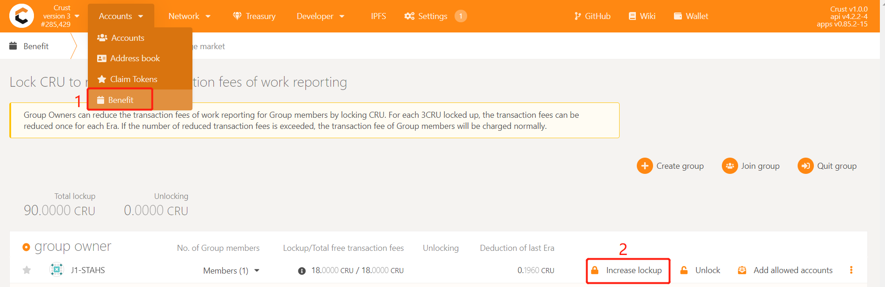
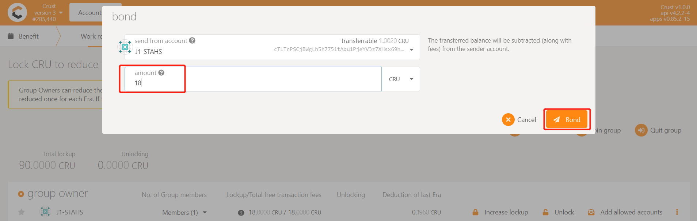

## 1. Overview

### 1.1 Node Responsibility

The Member node acts as the storage provider in Group. There can be multiple Member nodes in a Group, and their effective storage can be clustered on Owner to participate in block generation competition. Since Member nodes store files and perform trusted quantification, support for SGX is necessary. The Member node is connected to its account through configuring backup files.

### 1.2 Hardware Spec

The Member node runs chain modules (not participating in block generation), storage modules, IPFS, etc. It needs to be equipped with an SGX environment. Meantime, it stores user files, involving frequent network transmission, so the network bandwidth should also be in high standards. Refer to specific hardware recommended [here](nodeHardwareSpec#member-node).

## 2. Ready to Deploy

> Note: The account of Crust mainnet starting with the letter 'c'.

### 2.1 Create your Accounts

Refer to [this link](crust-account.md) to create a Member account (a single account). The Member node account needs to meet the following three requirements:

* Ensure Member account has 2~5 CRUs as a transaction fee (cannot be locked) for sending work reports. It is recommended you check the remaining status of reserves from time to time;
* Cannot be the account of Owner;
* The account should be unique, meaning that it cannot be those same as other Member accounts, that is, one chain account only for one machine;
* If you want to use the account on the Maxwell network, you need to import the backup file to the main network [APPs](https://apps.crust.network/) and re-export the new version of the backup file;

### 2.2 Setup BIOS

The SGX (Software Guard Extensions) module of the machine is closed by default. In the BIOS settings of your machine, you can set SGX to 'enable', and turn off Secure Boot (some types of motherboard do not support this setting). If your SGX only supports software enabled, please refer to this link [https://github.com/intel/sgx-software-enable](https://github.com/intel/sgx-software-enable)


### 2.3 Download Crust Node Package

a. Download

```plain
wget https://github.com/crustio/crust-node/archive/v1.0.0.tar.gz
```
b. Unzip
```plain
tar -xvf v1.0.0.tar.gz
```
c. Go to package directory
```plain
cd crust-node-1.0.0
```

### 2.4 Install Crust Service

Notices:

* The program will be installed under '/opt/crust', please ensure that the **system disk has more than 2TB** of SSD space. **If you do not want to use the system disk, but use other SSD, please create the '/opt/crust' directory in advance, and hang the SSD in this directory, pay attention to the read and write permissions of the directory**;

* If you have run a previous Crust testnet program on this device, you need to close the previous Crust Node and clear the data before this installation. For details, please refer to section 6.2;

* The installation process will involve the download of dependencies and docker images, which is time-consuming. Meantime, it may fail due to network problems. If it happens, please repeat the process until the installation is all complete.

Installation:

```plain
sudo ./install.sh
```
## 3. Node Configuration

### 3.1 Edit Config File

Execute the following command to edit the node configuration file:

```plain
sudo crust config set
```
### 3.2 Change Node Name

Follow the prompts to enter the name of your node, and press Enter to end:


### 3.3 Choose Mode

Follow the prompts to enter a node mode 'member', and press Enter to end:


### 3.4 Config Account

Enter the contents of the Member's backup file into the terminal, you can follow this: copy the contents of the Member's backup file generated when the account is created, copy it to the terminal, and enter. The backup file content setup result is shown below:


> Note 1: The account of Crust mainnet starting with the letter 'c'. For example, the value of "address" in the above picture is `cTJFUK...` which is a Crust mainnet account.

> Note 2: This backup file and its content is the credential of your account, it is very important, please do not disclose or lose it.

Enter the password for the backup file as prompted and press Enter to end:


### 3.5 Config Hard Disks

> Disk organization solution is not unitary. If there is a better solution, you can optimize it yourself.

With Crust as a decentralized storage network, the configuration of your hard disks becomes quite important. The node storage capacity will be reported to the Crust Network as reserved space, and this will determine the stake limit of this node.

**Base hard disk mounting requirements:**

* The order files and SRD (Sealed Random Data, the placeholder files) will be written in the /opt/crust/disks/1 ~ /opt/crust/disks/128 directory, depending on how you mount the hard disk. Each physical machine can be configured with up to 500TB of reserved space

* Please pay attention to the read and write permissions of the directory after mounting

**HDDs organization solution is not unitary. If there is a better solution, you can optimize it yourself**

* Single HDD: mount it directly to /opt/crust/disks/1
* Multiple HDDs (multi-directories): Mount the hard disks to the /opt/crust/disks/1 ~ /opt/crust/disks/128 directories respectively. For example, if there are three hard disks /dev/sdb, /dev/sdc and /dev/sdd, you can mount them to /opt/crust/disks/1, /opt/crust/disks/2, /opt/crust/disks/3 directories respectively. The efficiency of this method is relatively high, and the method is relatively simple, but the fault tolerance of the hard disk will be reduced
* Multiple HDDs (single directory): For hard disks with poor stability, using RAID/LVM/mergerfs and other means to combine the hard disks and mount them to the /opt/crust/disks/1 directory is an option. This method can increase the fault tolerance of the hard disk, but it will also bring about a drop in efficiency
* Multiple HDDs (mixed): Combine single directory and multiple directories to mount HDDs

You can use following command to view the file directory:

```plain
sudo crust tools space-info
```

### 3.6 External chain Configuration (Optional&recommend)

Enable local storage services to use external chain nodes for information collection, workload reporting, etc.

Advantage:
- Member nodes are more lightweight
- One chain node serves multiple members
- The reporting workload is more stable
- Avoid repeated synchronization of chain nodes

Disadvantages:
- The single point of failure
- The number of Member connections is limited (10 or less recommended)
- Additional machine (cloud server recommended)

Please refer to this [link](build-node.md#8-configure-external-source-chain) for configuration

## 4. Start Node

### 4.1 Preparation

To start with, you need to ensure that the following ports are not occupied: 30888 19944 19933 (occupied by crust chain), 56666 (occupied by crust API), 12222 (occupied by crust sWorker), and 5001 4001 37773 (occupied by IPFS).

Then open the P2P port:

```plain
sudo ufw allow 30888
```
### 4.2 Start

```plain
sudo crust start 
```
### 4.3 Check Running Status

```plain
sudo crust status
```

If the following five services are running, it means that Crust node started successfully.(The chain will not start when the external chain is configured)


### 4.4 Set Node Storage Capacity and Run SRD
Please wait about 2 minutes and execute the following commands.

1  Assuming that the HDDs have 1000G of space, set it as follows, sWorker will reserve some space and automatically determine the size of the SRD:

```plain
sudo crust tools change-srd 1000
```

2 These commands may fail to execute. This is because sworker has not been fully started. Please wait a few minutes and try again. If it still does not work, please execute the subordinate monitoring commands to troubleshoot the error:

```plain
sudo crust logs sworker
```

### 4.5 Monitor

Run following command to monitor your node, and press 'ctrl-c' to stop monitoring：

```plain
sudo crust logs sworker
```
The monitoring log is as follows:

* (1) Indicating that the block is being synchronized. The process takes a long time;
* (2) Having successfully registered your on-chain identity;
* (3) Storage capacity statistics calculation in progress, which takes place gradually;
* (4) Indicating that the storage status has been reported successfully. The process takes a long time, about an hour.


## 5. Joining Group

### 5.1 Add allowlist

Member accounts need to be added to the whitelist of the group before they can be added to the group. Enter [Crust APPS](https://apps.crust.network), select 'Account', select the 'Benefit' module, find the group created before (or contact the group manager for operation), and click 'Add allowed accounts', as follows:



Select the Member account that needs to be added to the group, click 'Submit' and send the transaction, and add the account to the whitelist of the Group


### 5.2 Join group

After the first work report,select 'Benefit', click on 'Join group',select the Member account and the Stash account, click 'Join group', enter the password of the Member account, and finally click 'Sign and Submit' to send the transaction




### 5.3 Lockup CRU to reduce the fee of the work report

**The work report in mainnet requires handling fees.** Under normal circumstances, each Member will perform 24 workload reporting transactions per day, which brings a lot of handling fees. For this reason, the Crust network provides a Benefit module that exempts workload reporting fees. Group owners can reduce or waive member handling fees by locking CRUs. **Each Member** needs to lock 18CRU for fee reduction. However, considering the unstable reporting of workload, it is recommended to lock 24CRU~30CRU to ensure that the fee is completely free.

Enter [Crust APPS](https://apps.crust.network), select 'Account', select the 'Benefit' module, find the group created before (or contact the group manager for operation), and click 'Increase lockup', as follows:



Enter the number of CRUs that **need to be added**, and sign the transaction, as follows:



## 6. Restart and Uninstall

### 6.1 Restart

If the device or Crust node related programs need to be somehow restarted, please refer to the following steps. 

**Please note**: This section only concerns restarting steps of Crust nodes, not including the basic software and hardware environment settings and inspection related information, such as hard disk mounting, IPFS configurations, etc. Please ensure that the hardware and software configuration is correct, and perform the following steps:

```plain
sudo crust reload
```

### 6.2 Uninstall and Data Cleanup

If you have run a previous version of Crust test chain, or if you want to redeploy your current node, you need to clear data from three sources:

* Delete basic Crust files under /opt/crust/data and /opt/crust/disks
* Clean node data under /opt/crust/crust-node by executing:

```plain
sudo /opt/crust/crust-node/scripts/uninstall.sh
```

