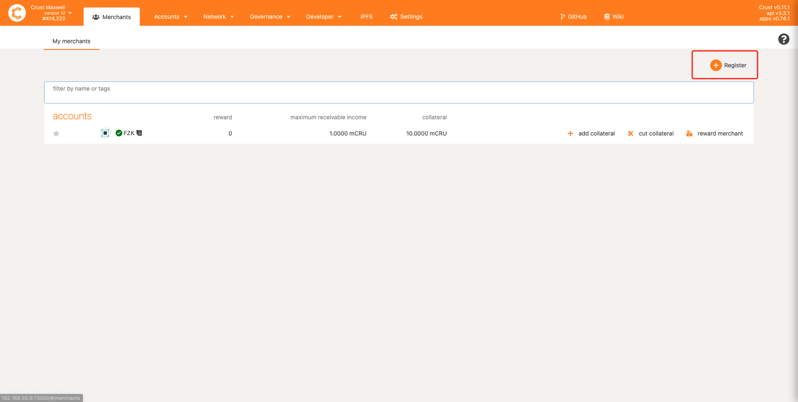
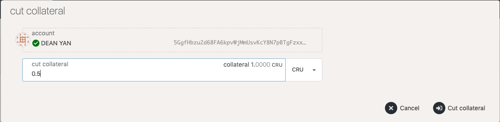
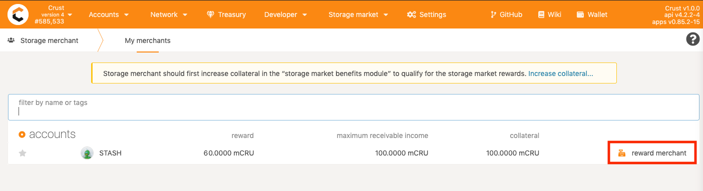

Group Owners can register as merchants, who will receive two additional benefits:
1. an increase in the stake limit for storing user data;
2. order rewards from the storage market.

> The storage market rewards mentioned in this document are order rewards only and do not include the increase in the stake limit for storing user files. To learn more about the rules for raising the stake limit, please refer to the [Economic White Paper](https://crust-data.oss-cn-shanghai.aliyuncs.com/crust-home/whitepapers/ecowhitepaper_en.pdf)

This document provides guidelines on how to register as merchants, how to configure order-taking strategies, and how to receive storage market rewards that will help new storage merchants navigate easily in the Crust Network.

## 1. To register as merchants

Go to [Crust Apps](apps.crust.network) -> DSM -> Storage Merchant and click on "Register" in the upper right corner, as shown below:

> Note: Before the registration, it needs to be made sure that the Group Owner should have over 0.01 basic CRU [Collateral] (#31 - Collateral Lock) locked in the account.

## 2. To configure order taking strategies

Coming soon.

## 3. To receive storage market rewards

Storage market rewards are from storage orders. 20% of the fees paid by users for storage orders will be awarded to the first four nodes that complete the storage sealing (the term "seal" can be found in the [glossary](glossary.md). Yet, the storage market rewards will not go directly to the account balance of merchants. In order to receive the storage market rewards, the merchants will need to complete three actions: to lock in the collateral, to settle order rewards, and to receive the storage market rewards.
 
### 3.1 Collateral lock

After the [order settlement](orderSettlement.md), the order rewards are actually in a to-be-collected state. And there is an upper limit to the total amount of to-be-collected rewards which is equal to the total amount of locked collateral.

> For example, if a merchant has locked in 10 CRUs, his storage order rewards will continue to grow as he keeps providing storage market services. New order rewards will be discarded till the total to-be-collected rewards reach 10 CRUs. At this point, the merchant will have two options.

    1. to collect the reward balance, after which the to-be-collected rewards will be cleared and can be re-accumulated;
    2. to lock in more collateral, which will expand the accumulating upper limit of the to-be-collected rewards.

The following involves a few collateral related actions:

#### 3.1.1 Add collateral

Go to  [Crust Apps](apps.crust.network) -> DSM -> Storage Merchant, click on the "Add collateral" button with a '+' icon in the GroupOwner account bar and fill in the amount of to-be-increased collateral in the pop-up box.

After successfully adding the collateral, you will find that the user's "maximum to-be-collected income" has also increased accordingly.

#### 3.1.1 Cut collateral

Also, merchants can reduce the amount of locked collateral by clicking on the "Cut collateral" button with a '-' icon in the GroupOwner account bar, and filling in the amount of to-be-reduced collateral in the pop-up box.

### 3.2 Order rewards settlement

The reward settlement is a pre-step for merchants to receive storage order rewards, after which the corresponding order rewards will be accumulated and added to the to-be-collected rewards of the merchants. The settlement conditions and steps can be found in the [Settlement Guide](orderSettlement.md).

### 3.3 Receive storage market rewards

If merchants have gone through the previous guidelines (having locked in enough collateral, finished the order settlement, and received the to-be-collected rewards), they can follow the steps below to get rewards.

Go to [Crust Apps](apps.crust.network) -> Network -> My merchant. The value in the "Income" column of your Merchant account represents the income of your storage market, and the rewards for order settlement will also be added to your "Income". You can click on "Get Reward" to obtain your storage market rewards.

