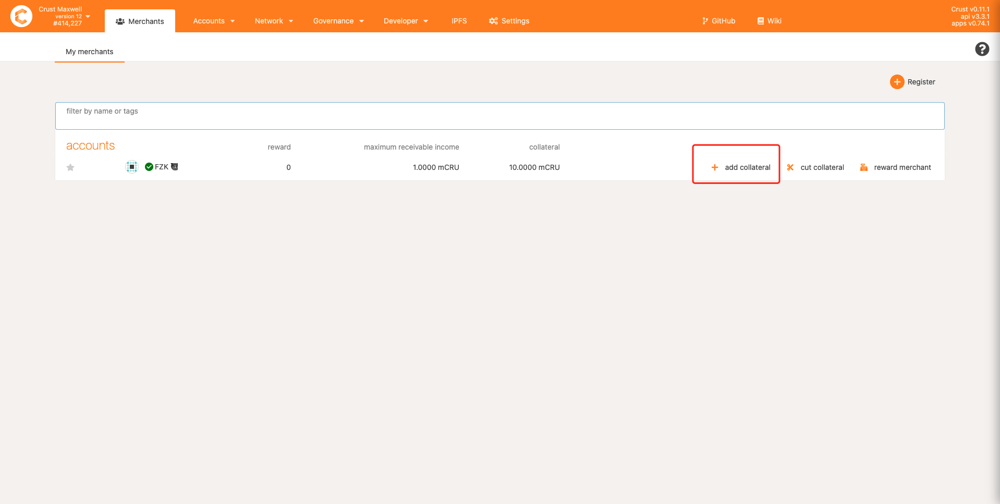
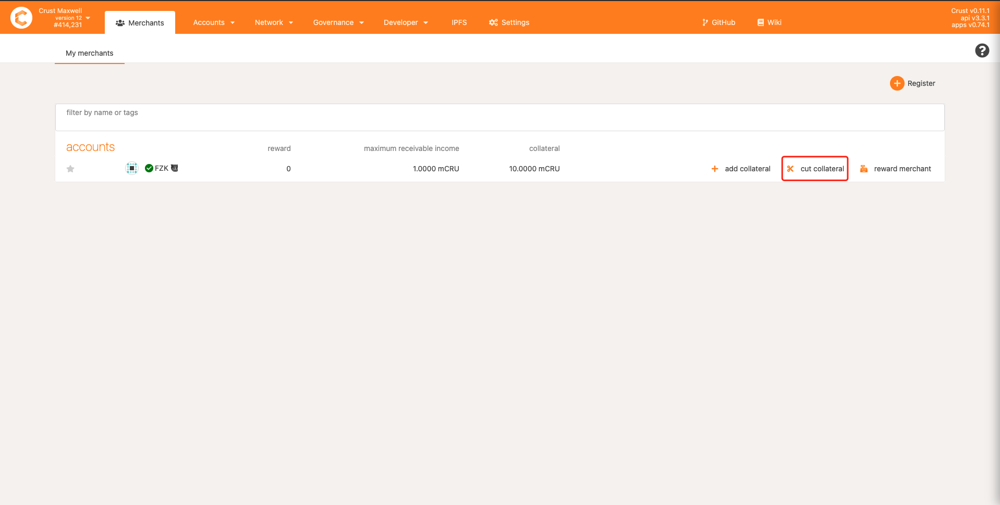
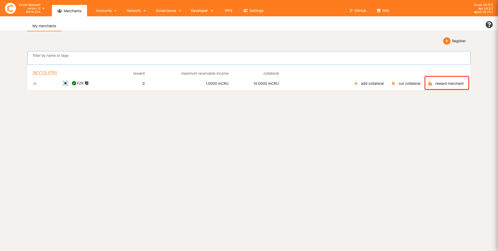
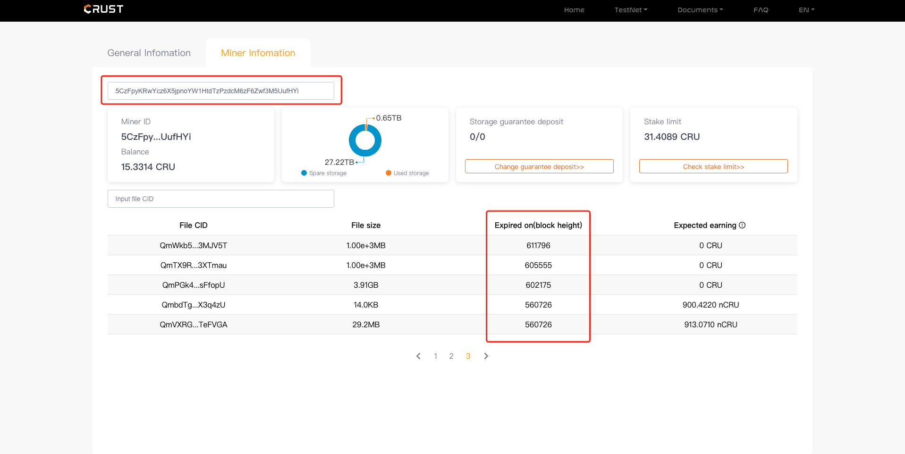
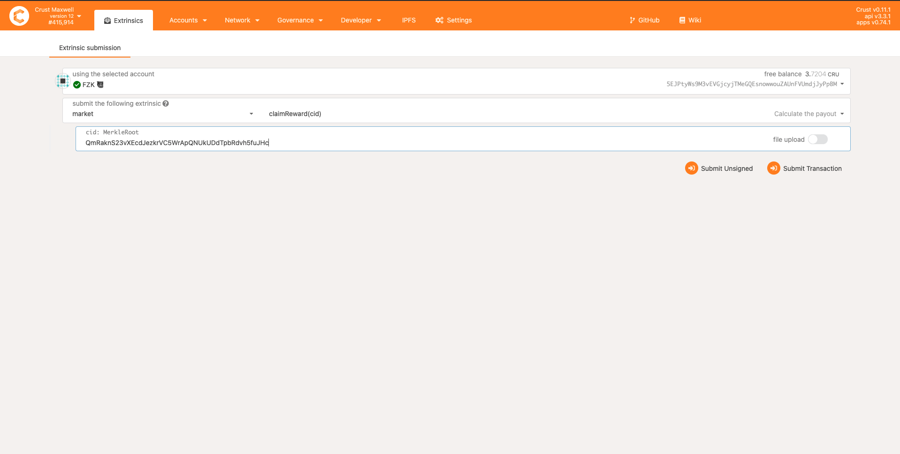
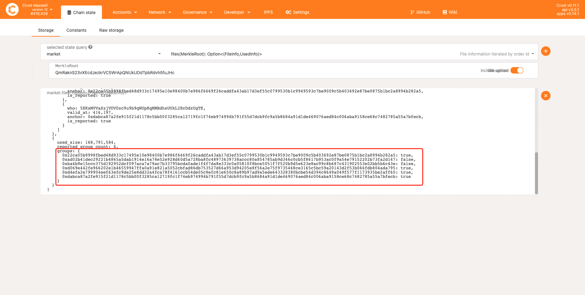

## Overview

You can get corresponding **order rewards** and **increase** your [stake limit](validator.md#staking-rewards) after having become a storage merchant and successfully stored user files.  

## Order taking

Storage Nodes (Member/Isolation) can take orders and report meaningful files to prove that they have successfully stored user files so as to obtain earnings and increase their stake limits by running [sManager(Storage Manager)](https://github.com/crustio/crust-smanager)  Technically, nodes can also have their own sManager order-taking strategies. The detailed development document is **upcoming**.

### 1. Run the default sManager order-taking strategy

```shell
sudo crust tools upgrade-image smanager
sudo crust reload smanager 
```

### 2. The default sManager order-taking strategy

1. Group repetition removal strategy
2. Automatic deletion of expired files
3. Replica examination (files with over 70 replicas will not be accepted)
4. Detection of full disk space
5. Dynamic IPFS pulling timeout
6. Order-taking upon probability

## Collateral and order rewards

### 1. Operations

The collateral determines the upper limit for merchants to receive the order rewards. **The exchange rate is set at 10:1.** This means that a merchant can get an order reward of 1 CRU by staking a collateral of 10 CRUs.

Merchants can log in the [Merchants](https://apps.crust.network/?rpc=wss%3A%2F%2Fapi.crust.network%2F#/merchants) page to check relevant features and perform procedures including:

1. Register

Click on the "Register" button. The registration requires a threshold collateral of no less than 0.01 CRU.


2. Add collateral



3. Cut collateral



4. Collect rewards



> ⚠️ Please be sure to have sufficient collateral. Since anyone can collect order rewards, it is stipulated that rewards will not be issued if the collateral is insufficient when a reward calculation is done.

### 2. Calculating order rewards

Order rewards **need to be calculated before collection**. Currently, there are 3 ways for merchants to calculate their order rewards:

1. Checking node order-taking information through [sPlorer](https://splorer.crust.network/home/mr)：



2. **For expired files (rewards for unexpired files cannot be calculated)**, sending the`claimReward` transaction in [Apps](https://apps.crust.network/?rpc=wss%3A%2F%2Fapi. crust.network%2F#/extrinsics) to calculate order rewards：



3. For those calculated order rewards, merchants can collect them (see [Collect rewards](#1-procedures)).

### 3. Order reward description

Merchants can receive 18% of an order's earnings, which are shared by the multiple order-taking merchants (ranked by their order of pulling), and are issued according to their effective duration of file storage. For specific order reward distribution strategies and the economic system design, please refer to the [Economic White Paper](https://crust.network/download/ecowhitepaper_en.pdf) for the description of Trading Market. Here are a few simple examples.

> If a user places an order `Qm123` and pays a total of 10 CRUs, among which 
>
> - **1.8 CRUs** flow to the order reward pool as order rewards;
> - **7.2 CRUs** flow to the stake reward pool as block generation and stake rewards in GPoS;
> - **1 CRU** flows to the tax pool for the use by the entire network;

For newly placed orders:

- The initial order reward count (`expected_replica_count`): 4
- File storage duration: 15 days

Therefore, the first 4 merchants that pull user files will receive order rewards which are affected by multiple factors:

1. ***Work report*** is the only way to prove that you have stored user files. If the work is not reported or user files are deleted, you will lose the order rewards, and your reward entitlement will also be handed to the next storage node;
2. Please do the [Order Reward Calculation](#2-calculating-order-rewards) and collect rewards timely. If the rewards are not collected for more than *15 days*, anyone can obtain them by sending `market.claimReward` transaction;
3. Renewing an order (placing another order for the same file) will also trigger the calculation of order rewards.

## Stake limit and Meaningful files

Storing meaningful files (user files) will effectively increase the stake limit. **Extending the stake limit is not affected by the reward count (`expected_replica_count`), but the repetition of files in the same group will be removed**. Specifically, The relationship between the stake limit of storing meaningful files and SRD files can be summarized as:

```shell
Stake limit of meaningful files = File replica mapping function * Stake limit of SRD files
```

In Maxwell, the Stake Limit of SRD files is 1TB to 1CRU, and the **File replica mapping function** is:

| Group file replica count | Multiple |
|-----------------|------|
| 1-10            | 2    |
| 11-20           | 4    |
| 21-30           | 6    |
| 31-40           | 8    |
| 41-70           | 10    |
| 71-80           | 8    |
| 81-90           | 6    |
| 91-100          | 4    |
| 101-200         | 2    |
| > 200           | 0    |

 **Group file replica count refers to the same file stored by different groups**, which can be accessed from the `UsedInfo.groups` through `market.Files` of [Chain state](https://apps.crust.network/?rpc=wss%3A%2F%2Fapi.crust.network%2F#/chainstate) in Apps.



For example, if a merchant successfully stores the file `Qm123` (file size 100G), assuming that the count of Group replicas of `Qm123` in the entire network is 50, the corresponding stake limit is:

```shell
Stake limit of meaningful files = 10 * 0.1 CRU（Stake limit of SRD files）= 1 CRU
```

## For your references

1. [Crust sManager](https://github.com/crustio/crust-smanager)
2. [Decentralized Storage Market](DSM.md)
3. [Crust Storage Explorer](crustStorageExplorer.md)
4. [Economic White Paper](https://crust.network/download/ecowhitepaper_en.pdf)
