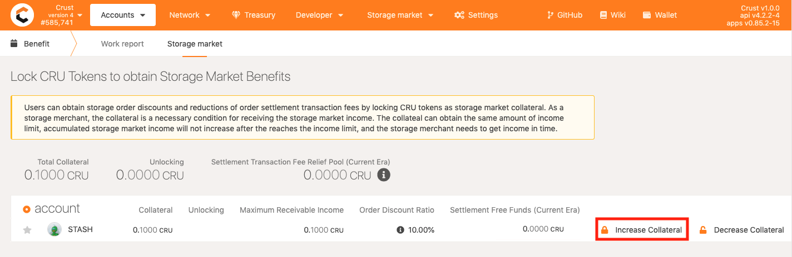

[Group Owners](ownerNode.md) can register as merchants, who will receive two additional benefits:

1. an increase in the stake limit for storing user data;
2. order rewards from the storage market.

> The storage market rewards mentioned in this document are order rewards only and do not include the increase in the stake limit for storing user files. To learn more about the rules for raising the stake limit, please refer to the [*Economic White Paper*](https://ipfs-hk.decoo.io/ipfs/QmRYJN6V5BzwnXp7A2Avcp5WXkgzyunQwqP3Es2Q789phF).

This document provides guidelines on how to register as new merchants, how to configure order-taking strategies, and how to lock in collateral and receive storage market rewards that will help new storage merchants navigate easily in the Crust Network.

## 1. To register as new merchants

To have collateral is a prerequisite for a Group Owner to become a merchant, and it is also a pre-step for merchants to receive storage market rewards.

Group Owners need to go to [Crust Apps](https://apps.crust.network) -> "Account" -> "Benefits" -> "Storage Market" and select the Group Owner Stash account. Then, they need to click on the "Add collateral" button right to the Stash account and fill in the corresponding amount of collateral as shown below:

After the collateral is locked in the account, they can go to [Crust Apps](https://apps.crust.network) -> "Storage Market" -> "Storage Merchant" -> "My Merchant" to check out the initial information of themselves as merchants. The "income" represents the to-be-collected order rewards (order rewards obtained from [order settlement](orderSettlement.md) will also be included in it), and the "maximum receivable income" represents the highest possible to-be-collected rewards.

The amount of the collateral determines the amount of storage market rewards that can be accumulated for a merchant . The relationship between to-be-collected income and collateral will be introduced in [*Getting Storage Market Rewards*](#3-Getting Storage Market Rewards).

## 2. **To configure order taking strategies**

sManager (Storage Manager) is a file picking bot that continuously picking and handling files from Crust Network. Node operators can customize this module to implement their own file handling strategy. [Check sManager's GitHub repo to learn more](https://github.com/crustio/crust-smanager#readme)

## 3. **To receive storage market rewards**

Storage market rewards are from storage orders. 20% of the fees paid by users for storage orders will be awarded to the first four nodes that complete the storage sealing (the term "seal" can be found in the [*Glossary*](glossary.md). Yet, the storage market rewards will not go directly to the account balance of merchants. In order to receive the storage market rewards, the merchants will need to

1. lock in the collateral;
2. settle order rewards;
3. collect the storage market rewards.

### 3.1 **Collateral lock**

After the [order settlement](orderSettlement.md), order rewards will not go directly into merchants' balance but are actually in a to-be-collected state.**There is an upper limit to the total amount of to-be-collected rewards which is equal to the total amount of locked collateral.**

> For example, if a merchant has locked in 10 CRUs, his storage order rewards will continue to grow as he keeps providing storage market services. New order rewards will be discarded until the total to-be-collected rewards reach 10 CRUs. At this point, the merchant will have two options.

    1. to collect the reward balance, after which the to-be-collected rewards will be cleared and can be re-accumulated;
    2. to lock in more collateral, which will expand the accumulating upper limit of the to-be-collected rewards.

The following involves a few collateral related actions:

#### 3.1.1 **Add collateral**

Go to [Crust Apps](https://apps.crust.network) -> Accounts -> Benefits -> Storage Market. Select the Group Owner's Stash account, click on the "Add collateral" button and fill in the amount of to-be-added collateral in the pop-up box.

After successfully adding the collateral, you will find that the user's "maximum to-be-collected reward" has also increased.

#### 3.1.1 **Cut collateral**

Also, merchants can reduce the amount of locked collateral by clicking on the "Cut collateral" button and filling in the amount of to-be-reduced collateral in the pop-up box.

### 3.2 **Order rewards settlement**

The reward settlement is a pre-step for merchants to receive storage order rewards, after which the corresponding order rewards will be accumulated and added to the to-be-collected rewards of the merchants. The settlement conditions and steps can be found in the [*Order Settlement Guide*](orderSettlement.md).

The Crust Network has set up a mechanism of storage market benefits, and merchants’ order settlement fees can also be reduced by themselves locking in collateral. You can refer to [*Storage Market Benefits Guide*](marketBenefits.md) for more information.

### 3.3 **Receive storage market rewards**

If merchants have gone through the previous guidelines (having locked in enough collateral, finished the order settlement, and received the to-be-collected rewards), they can follow the steps below to get rewards.

Go to [Crust Apps](apps.crust.network) -> Network -> My merchant. The value in the "Income" column of your Merchant account represents the income of your storage market, and the rewards for order settlement will also be added to your "Income". You can click on "Get Reward" to obtain your storage market rewards.

>Note: The collected rewards will go to the account balance, but will first be locked for 28 days before any transfer can be made.
