**The Work Report mechanism of Crust Network requires long-range transaction fees.** Each Storage Node will perform 24 Work Report transactions per day, which brings a lot of transaction fees. For this reason, Crust network provides an equity module, which can exempt the transaction fees for work reports.

Group owners or Isolation node owners can exempt the Work Report transaction fees of storage nodes by locking CRUs. Each storage node can lock any number of CRUs for the exemption. Locking 18 CRUs can exempt all the work report transaction fees for one storage node. If the number of locked CRUs is less than 18, the exemption amount will be proportional.

>For example, if 9 CRUs are locked for one storage node, 50% of the daily workload report fee will be exempted.

Because there will be multiple storage nodes (that is, Member nodes) in a Group, **each member** needs to lock 18 CRUs for a fee exemption. Considering the work report stability of the Group, It is recommended to lock 24CRUs~30CRUs for each member node to ensure that the work report transaction fee is completely exempted.

## Member node fee reduction process

### Create group

[New bond](new-bond.md) is a prerequisite for creating a group,enter [Crust APPS](https://apps.crust.network),select Account, select the Benefit module and click "Create group"

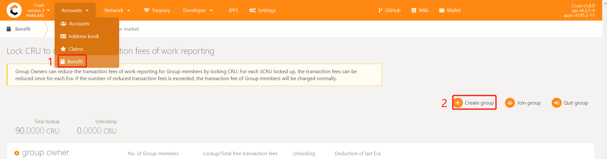

Select Stash account, click "Create"

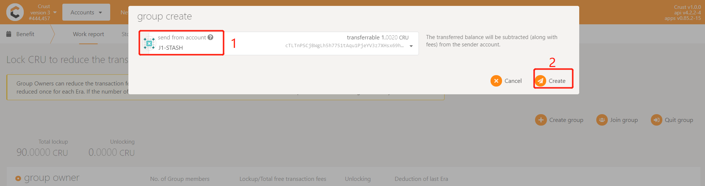

### Add allowed accounts

Member accounts need to be added to the whitelist of the group before they can be added to the group, enter [Benefit module](https://apps.crust.network/#/benefit), in the corresponding group, click "Add allowed accounts"

Click "Add allowed", select the target Member account, and click "Submit"

### Increase lockup

The CRU can be locked to reduce the workload report fee of the Member node. Each Member node can lock any number of CRUs for reduction or exemption. Locking 18 CRUs can reduce all workload reporting fees for a Member node. For example, if the group has 3 members, 54 CRUs need to be increased lockup and ensure that the Stash account has 54 transferable CRUs

Enter [Benefit module](https://apps.crust.network/#/benefit), in the corresponding group, click "Increase lockup"

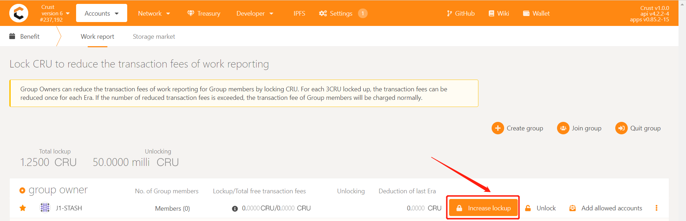

Select the Stash account of this group, enter the amount of locked position, and click "Bond"

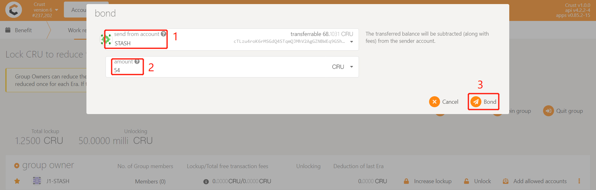

### Join group

Add the member account that has been added to the whitelist,ensure that the Member node has sent workreport,enter [Benefit module](https://apps.crust.network/#/benefit), and click "Join group"

Add the target Member account to the corresponding group, click "Join group"

## Exit the Member node fee reduction process

### Quit group

Enter [Benefit module](https://apps.crust.network/#/benefit), click "Quit group", and select the Member account that needs to be quited
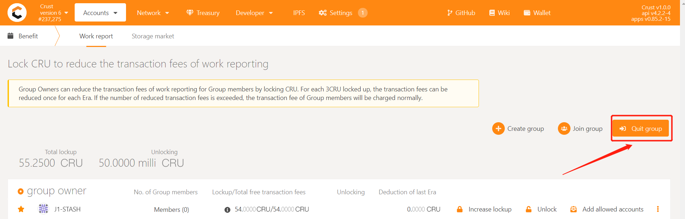
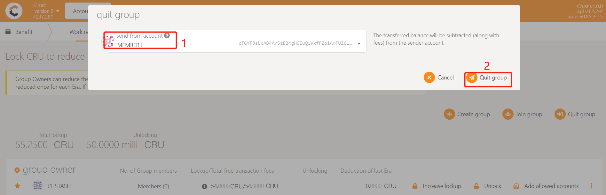

### Remove allowed accounts

Enter [Benefit module](https://apps.crust.network/#/benefit), in the corresponding group, click "Remove allowed accounts"

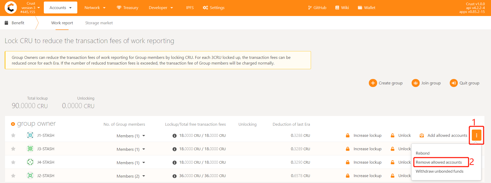

Click "Remove allowed", select the target Member account, and click "Submit"

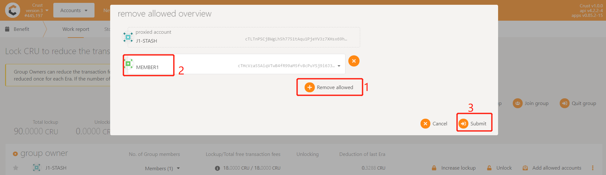

### Unlock

Enter [Benefit module](https://apps.crust.network/#/benefit), in the corresponding group, click "Unlock"

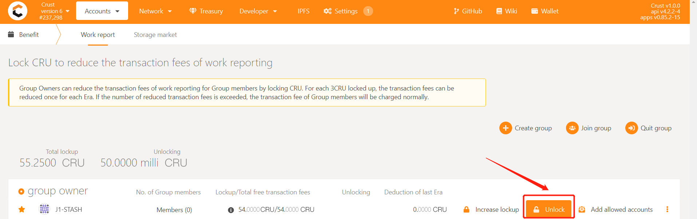

Select the Stash account of the group, enter the amount to be unlocked, and click "Unbond"

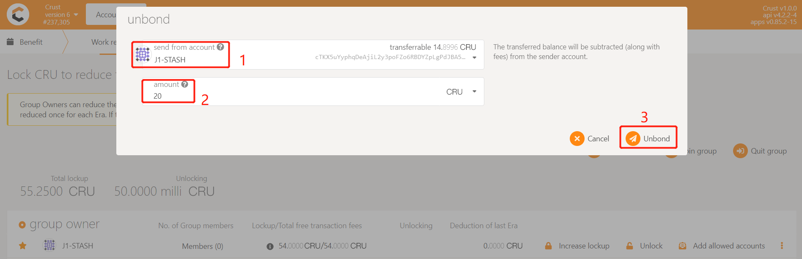

### Withdraw unbonded funds

The unlocked funds need to wait for 112 eras before they can be withdrawn, you can click "**!**" to view the unbinding progress

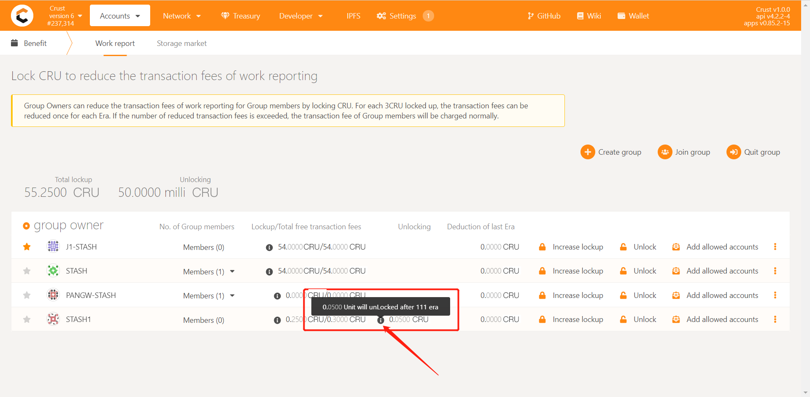

If the unlocking time exceeds 112 eras, enter [Benefit module](https://apps.crust.network/#/benefit), in the corresponding group, click "Withdraw unbonded funds" to withdraw unlocked funds

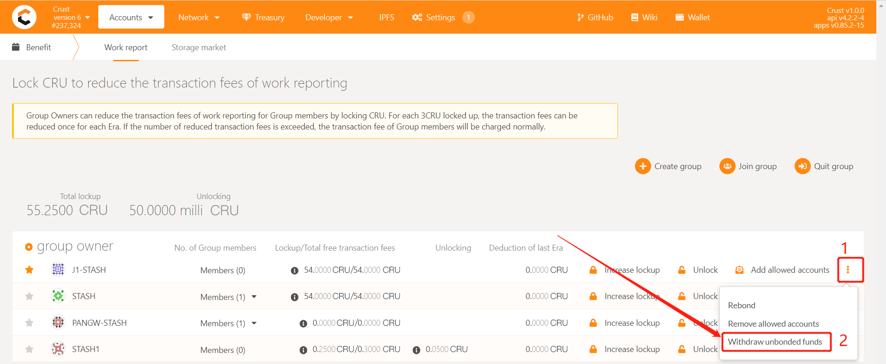

If you want to rebond the unlocking funds, re-use the membership fee reduction function, enter [Benefit module](https://apps.crust.network/#/benefit), in the corresponding group, click "Rebond" To enter the locked state

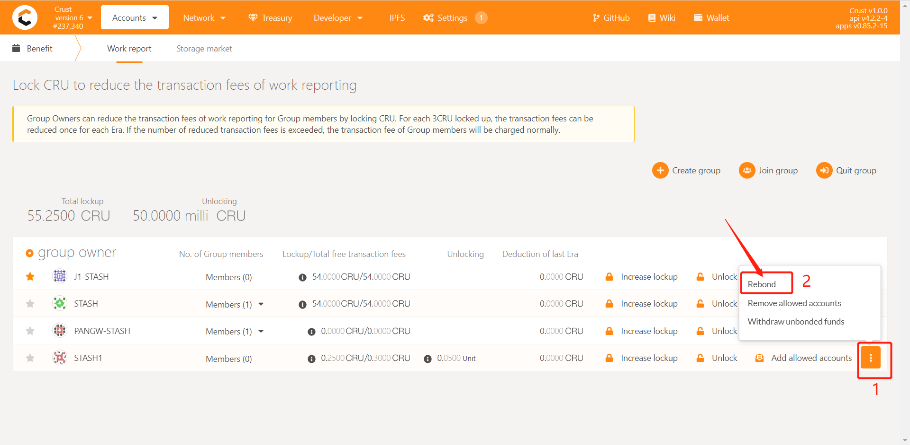
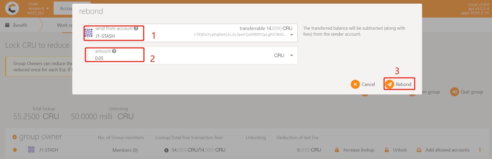
