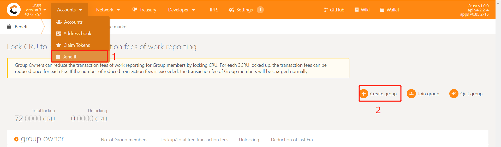

## 1. Overview

### 1.1 Node Responsibility

The Owner node is the initiator of and in charge of the Group, participating in block generation. Effective storage of the Member can be clustered on the Owner to participate in the block generation competition. Meantime, the organizers of the Owner node are accountable for the Group's strategy of receiving meaningful files to improve the Group's overall competitiveness. Since the Owner node itself does not store files, support for SGX is not necessary. The Owner node account is connected to block node through the session key. 

### 1.2 Hardware Spec

On Owner nodes run chain modules used for generating blocks, which is  similar to projects in Polkadot ecology, therefore, we strongly recommend that the block generation node use a fixed public network IP, otherwise it will be punished due to unstable block generation. If necessary, such node can also be configured in a cloud computer.  For detailed configuration requirements and recommendations, please refer to [this](node-Hard-wareSpec.md).

## 2. Ready to Deploy

### 2.1 Create your Accounts

The Owner node participates in the block generation competition. It needs to create accounts and be bonded to the Controller&Stash account group. For details, please refer to [this page](new-bond.md). 

Notices:

* The account should be unique and cannot be any other account for Owner, Member or Isolation;
* Be sure to reserve a small number of CRUs not locked in the Controller&Stash for sending transactions (about 1 CRU).

### 2.2 Create Group

Enter [Crust APPS](https://apps.crust.network/#/explorer), select 'Extrinsics', select the Owner Controller account, select 'swork' in the submit group, select createGroup( ), and click on 'Submit Transaction' to send the transaction and create Group.



### 2.3 Download Crust Node Package

a. Download

```plain
wget https://github.com/crustio/crust-node/archive/v0.9.0.tar.gz
```
b. Unzip
```plain
tar -xvf v0.9.0.tar.gz
```
c. Go to package directory
```plain
cd crust-node-0.9.0
```
### 2.4 Install Crust Service

Notice:

* The program will be installed under /opt/crust, please make sure this path is mounted with more than 250G of SSD space;

* If you have run a previous Crust testnet program on this device, you need to close the previous Crust Node and clear the data before this installation. For detailes, please refer to section 6.2;

* The installation process will involve the download of dependencies and docker images, which is time-consuming. Meantime, it may fail due to network problems. If it happens, please repeat the process until the installation is all complete.

Installation:

```plain
sudo ./install.sh
```
## 3. Node Configuration

### 3.1 Edit Config File

Execute the following command to edit the node configuration file:

```plain
sudo crust config set
```
### 3.2 Change Node Name

Follow the prompts to enter the name of your node, and press Enter to end:


### 3.3 Choose Mode

Follow the prompts to enter a node mode 'owner', and press Enter to end:


### 3.4 Review the Configuration (Optional)

Execute following command to view the configuration file:

```plain
sudo crust config show
```
## 4. Start Node

### 4.1 Preparation

To start with, you need to ensure that the following ports are not occupied: 30888, 19944, and 19933.

Then open the P2P port:

```plain
sudo ufw allow 30888
```
### 4.2 Start

```plain
sudo crust start 
```
### 4.3 Check Running Status

```plain
sudo crust logs chain
```
As detailed below, all is ready for synchronizing blocks. 


## 5. Blockchain Validate

### 5.1 Get session key

Please wait for the chain to synchronize to the latest block height, and execute the following command:

```plain
sudo crust tools rotate-keys
```
Copy the session key as shown below:


### 5.2  Set session key

Enter [CRUST APPs](https://apps.crust.network/), click on "Staking" button under "Network" in the navigation bar, and go to "Accoung action". Click on the setting button on the right of your stashes(a 3-dots button) and click on "Change session key".


Fill in the sessionkey you have copied, and click on “Set session key”.


### 5.3 Be a Validator/Candidate

Please follow the steps below:


After one era, you can find your account listed in the "Staking" or "Waiting" list, which means you have completed all the steps.


## 6. Restart and Uninstall

### 6.1 Restart

If the device or Crust node related programs need to be somehow restarted, please refer to the following steps. 

**Please note**: This section only concerns restarting steps of Crust nodes, not including the basic software and hardware environment settings and inspection related information, such as hard disk mounting, IPFS configurations, etc. Please ensure that the hardware and software configuration is correct, and perform the following steps:

```plain
sudo crust reload
```
### 6.2 Uninstall and Data Cleanup


If you have run a previous version of Crust test chain, or if you want to redeploy your current node, you need to clear data from three sources:

* Delete basic Crust files under /opt/crust/data
* Clean the SRD file under the "srd_paths" you configured (if you have run a version before 0.8.0)
* Clean node data under /opt/crust/crust-node by executing:

```plain
sudo /opt/crust/crust-node/scripts/uninstall.sh
```
