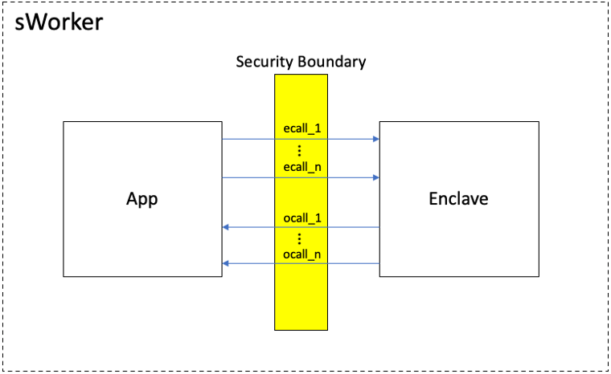
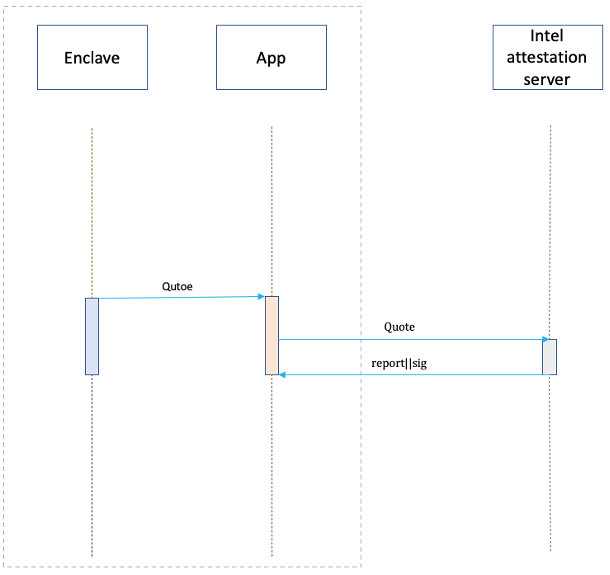
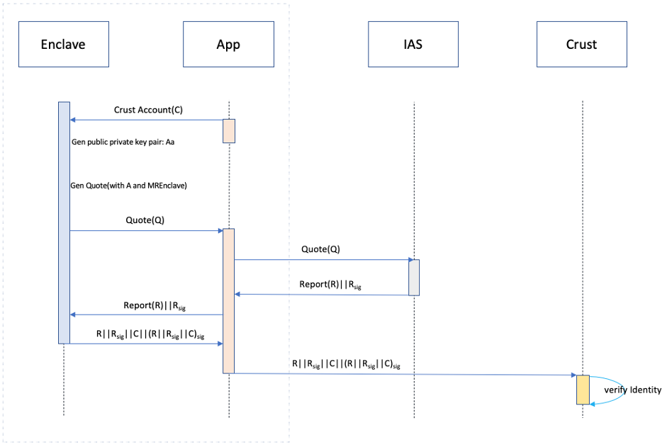

Netry network is the pre-step of joining in Crust storage network. This chapter will introduce the details and related concepts about entry network.

## SGX related concepts
Intel Software Guard Extensions(Intel SGX) is based on the 6th-generation Intel Core processors. It provides the capability of keeping data safe from malware for application. Before introducing entry network, there are some knowledges about SGX for a good understanding of concepts in sWorker. The key concepts are:

### Secure boundary
Generally a SGX project consists of two parts: app and enclave. App is developed with C/C++(or Rust) while enclave with Intel SGX SDK(or Apache Teaclave SDK). To be specific, enclave is a encrypted memory buffer guarded and protected by SGX, the secrets within enclave is not vulnerable to inspection by malicous actors---even when attacks originate from privileged software, whether that be a compromised operating system, a virtual memory manager or device drivers. But app’s data is not protected. The communication between app and enclave is through a seris of APIs called “Secure boundary”. Through secure boundary, app and enclave can exchange data with each other. Secure boundary is the only way which could lead to data leakage so that it must be carefully designed.

### Remote Attestation
How to check if an application is running in SGX? To deal with this problem, Intel provides Remote Attestation mechanism. The process of remote attestation can be described as: app gets a quote through SGX SDK API. The quote contains a signature signed with SGX hardware which can only be verified by Intel. Then the quote is sent to IAS(Intel Attestation Service) which would validate the Quote and generate a signed report. Everyone can verify the signature of the report through a certificate pulished by Intel. This signed report contains the validation result of the application generating the Quote, it could tell whether the application is running in SGX. Any faked quote cannot pass validation of IAS. In this way can an application be checked if running in SGX.

### MREnclave
MREnclave is another important concept. It can be treated as the hash of enclave code and stack data at runtime. An application can be checked if running in the right way through comparing runtime MREnclave with the indicated one. In this way can application protect its data from malware. By the way MREnclave is contained in Quote.

## Entry Network
In crust network every sWorker has a unique identity which is contained in work-report. Meanwhile, every crust node has its ID too. Since the storage power of crust node is represented by workload(about storage power, please refer to MPoW and GPoS), sWorker’ identity should be bonded with crust’s. In this way the workload reported by sWorker can be attributed to a specific crust node. Entry Network is the process that crust blockchain validates sWorker’s identity, and bonds it to a crust node. After entry network successfully a public-private key pair will be generated in sWorker that the public key  will be marked as sWorker’s ID in Crust chain while the private key will be used to sign work-report. The public key can be used to verify the signature of work-report sent by sWorker. Entry network has a significant impact on the safety of whole Crust network. To do entry network safely three points should be carefully confirmed:1 SGX environemnt identification which gives a guarantee that sWorker runs in SGX. 2 MREnclave identification which makes sure sWorker runs the right code. 3 Identity bond which is to bond sWorker’s ID with a crust node’s. The detail shows as follows:

1. sWorker(App) sends Crust chain account to enclave.
1. sWorker(Enclave) generates a public private key pair Aa(pulibc key:A, private key:a)
1. sWorker(Enclave) generates quote with public key A as argument.
1. sWorker(App) sends quote to IAS.
1. IAS verifies quote and returns a signed report.
1. sWorker(Enclave) packs report, signature of report, Crust chain account and the signature(short for Sa) of the first three signed with private key a as its identity.
1. sWorker(App) transacts identity in step 6 to Crust chain.
1. Entry network is successful if the identity passes Crust chain’s validation, failed if not.

Note that the quote generated in step 3 contains enclave’s MREnclave. If enclave’s code changes, the MREnclave changes too. After Crust starting, IAS certificate and an indicated MREnclave code will be set in Crust chain by democratic vote. In step 8, public key A is parsed from report, which is used to verify the signature of report. Secondly, through IAS certificate in Crust chain, report can be checked if it is valid. Verification of Report signature prevents attackers from forging IAS signature. Report also contains the validation result of sWorker platform which could tell whether it runs within a valid SGX hardware, which completes SGX environment identification. Thirdly, comparing MREnclave in report with the one in Crust chain completes MREclave identification. Finally Crust chain will bond sWorker identity to corresponding crust chain account so that the reported workload can be calculated to the indicated chain account.
