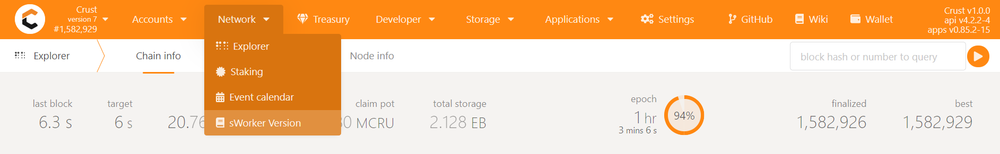
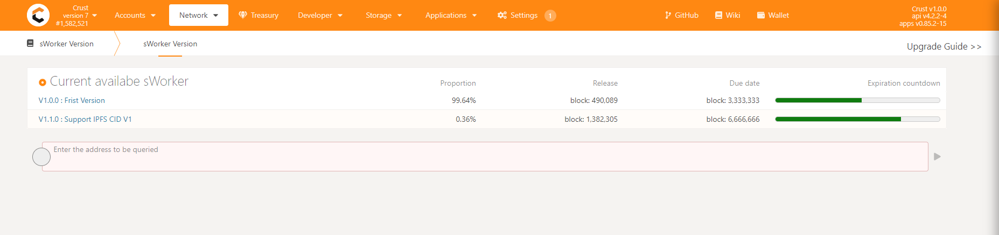
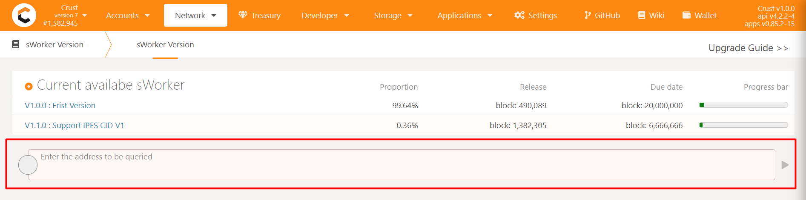
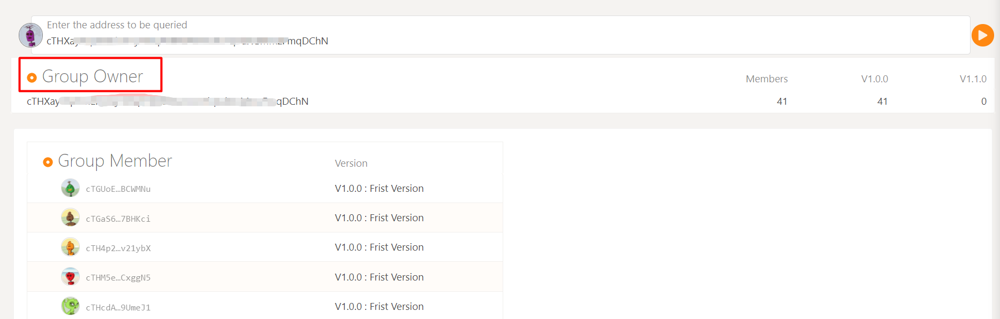
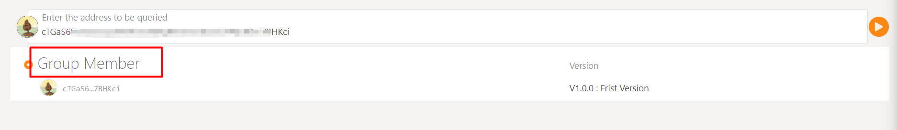
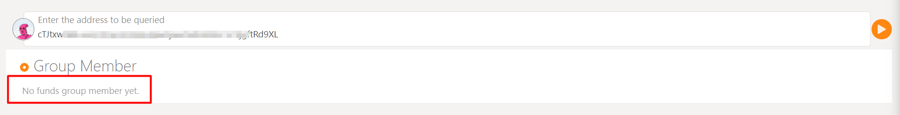

This is a user guide of the sWorker Version section in Crust Apps.

## The sWorker Version Page

There is a sWorker Version page in Crust Apps.

You can find this page in Crust Apps -> Network -> sWorker Version.

What you can get from this page:

a. to see all the current available sWorker Versions and their network status.

b. to query Crust Accounts for their Group Owner / Member status.

c. a practical guide to upgrade your sWorker version.

## Current Available sWorker Versions

This area displays all of the current available sWorker Version on Crust Network and their real-time on-chain status.

- Proportion: the percentage of this sWorker version's adoption on Crust mainnet.

- Release: the release block height of the sWorker version.

- Due date: the due date by block height of the sWorker version.

- Expiration countdown: a visualized indicator of the countdown to expiration date.

## Query for Group Owner / Member status

This area displays a query tool where you can enter a Crust Account and query for its Group Owner / Member status. 

- If the Account is a Group Owner:

The page will display its Group Owner identity and corresponding status, such as a full list of its Members and the sWorker version they are currently using.

- If the Account is a Group Member:

- If the Account is neither a Group Owner nor a Group Member:

## sWorker Version Upgrade Guide

Click the button upper right corner to see a detailed Upgrade Guide. 

Upgrade your sWorker version in time will bring advantages. Keep an eye on it!

