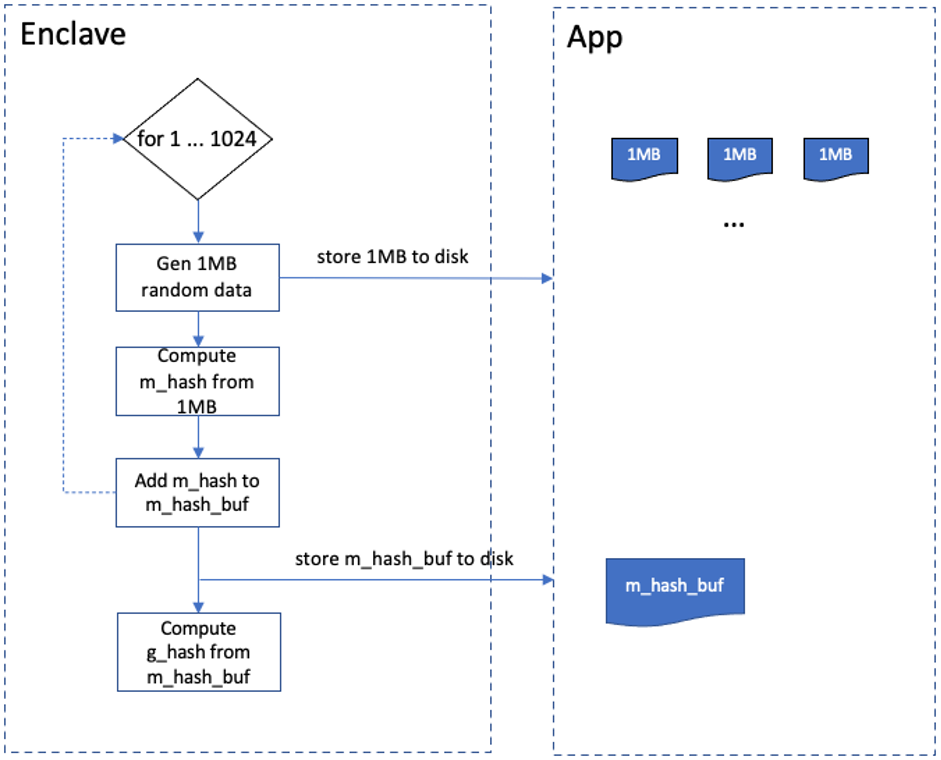
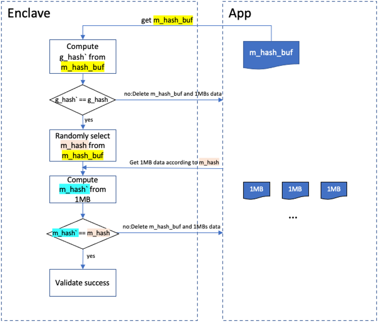
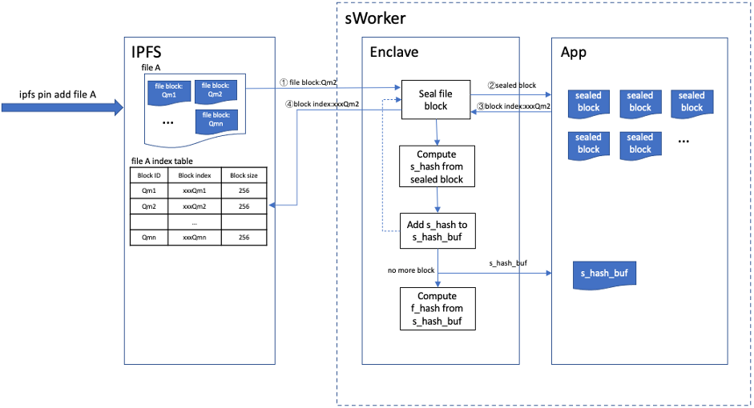
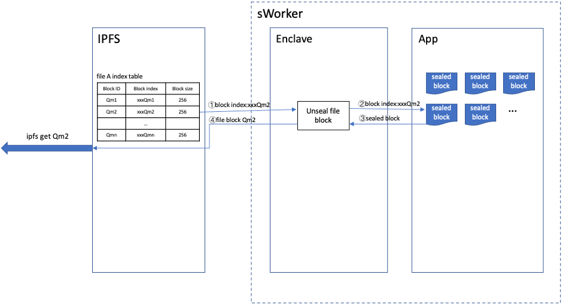
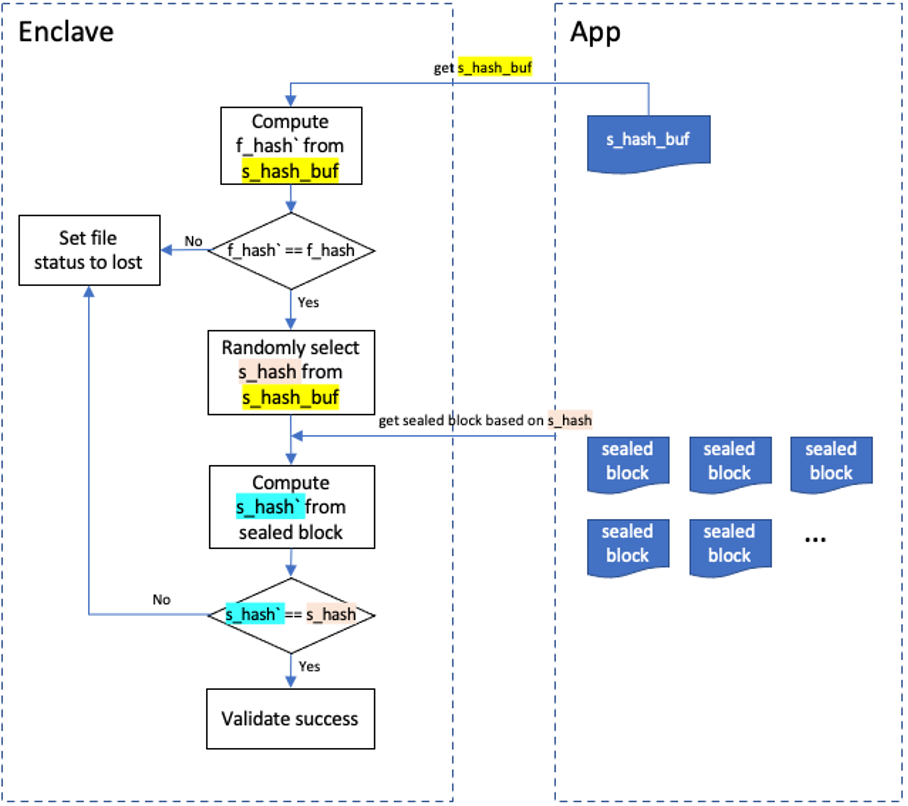

The workload of sWorker consists of two parts:SRD and meaningful file. This chapter will introduce the process of generation, validation of these two parts.

## SRD

### Generation
SRD(Sealed Random Data) is one of the two ways of producing workload. sWorker generates random data through seal algorithm and stores them to disk via secure boundary API. SRD can produce 1GB random data each time. The details shows as: Enclave generates 1MB random data and stores it to disk. Then compute the hash of this 1MB data marked as m_hash and stores it to m_hash_buf which is buffer. Repeat above process 1024 times, then get 1GB random data. m_hash_buf is stored to disk as this 1GB data’s metadata. At the same time compute the hash of m_hash_buf and mark it as g_hash which represents 1GB data’s proof and store it in Enclave.

### Validation
SRD data should be validated termly for preventing cheat. The validation process can be described as: compute a hash from a m_hash_buf which represents a SRD data read from disk, mark it as g_hash&#96;. Comparing g_hash&#96; with g_hash stored in Enclave, equality means successful while inequality means not. If failed, all related data will be deleted. If successful, choose a hash randomly from m_hash_buf and mark it as m_hash which is linked to a certain 1MB random data. Get this 1MB data from disk and compute its hash marked as m_hash&#96;. Comparing m_hash&#96; and m_hash, equality means successful while inequality means not. Delete all related data when failed. The speed of generating and validating SRD relies on hardware performance which means high performance hardware(CPU, memory, disk and so on.) brings high SRD performance.

## File

### Generation
Sealing meaningful file is another way to produce workload. sWorker uses IPFS as its transport layer.

> **IPFS** is a p2p storage network that every two nodes can exchange their data via DHT(Distributed Hash Table) protocol. In IPFS network a file is divided into numbers of blocks each has a unique CID(Content Identity). A file block contains its children’s CIDs. It can search and get the blocks by its children’s CIDs via DHT. This process runs recursively until a whole file downloaded.

Crust modifies the original IPFS to adapt crust storage protocol. In simple terms, file blocks received by IPFS are sent to sWorker to seal and store. IPFS doesn’t store the original file blocks any more. Instead, it stores the file block indexes returned by sWorker. IPFS can get the original file blocks by providing these block indexes to sWorker. The process of sealing file can be described as follows:
Every time IPFS gets a file block it will send it to sWorker to seal that block and gets a sealed file block marked as sealed_block. sWorker stores this sealed_block and returns a block_index to IPFS. A hash computed from sealed_block, marked as s_hash, is stored to s_hash_buf which is buffer. Having sealed all of the file blocks, sWorker computes a hash from s_hash_buf, marked as f_hash, which would be stored in Enclave as file’s proof, while s_hash_buf would be stored to disk as file’s metadata.

### Request
When a file block request coming, IPFS sends the corresponding file block_index to sWorker and gets the real file block data back. Then send this block data to the requested node.

### Validation
sWorker will validate files termly for preventing cheat. The details can be described as:Get s_hash_buf from disk and compute a hash from it, marked as f_hash&#96;. Comparing f_hash&#96; with f_hash, equality means successful while inequality means not. If successful, randomly choose a s_hash from s_hash_buf. Get corresponding sealed_block from disk according to s_hash. Compute a hash from sealed_block, marked as s_hash&#96;. Comparing s_hash&#96; with s_hash, equality means successful while inequality means not. If validation failed, related file would be marked as lost as well as corresponding storage power would be removed.

