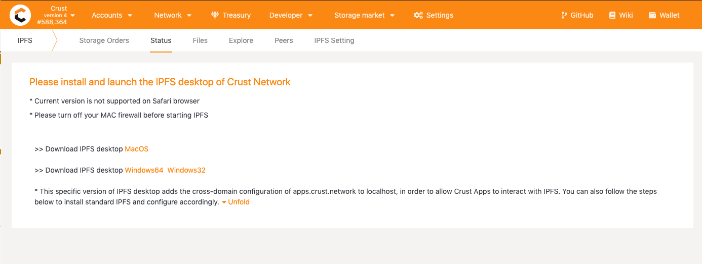

## Preface

This is a user guide to the **Storage User** section in [Crust Apps](https://apps.crust.network/).

>Note: **Storage User** is a [Crust Apps](https://apps.crust.network/) built-in application for native Crust users to upload files and place storage orders directly on-chain with CRU payment. Also, users can retrieve stored files from this application. For non-native Crust users, [Files](https://apps.crust.network/#/files) is highly recommended as it is designed for a wider Web3.0 user base.

To enter the application, go to [Crust Apps](https://apps.crust.network/) top bar -> Storage market -> Storage user.

For the first time you enter the Storage User page, you need to choose between the two working modes:

Choose the preferred working mode according to the guide on the page. If you do not have a locally installed IPFS client, please choose "Upload files by Gateway". 

>Note: Don't worry if you make a wrong decision. You can switch between the two working modes anytime afterwards.

## 1. For IPFS users / "Upload files by IPFS" Mode

### 1.1 Upload files

The purpose of this step is to upload the file you want to store to IPFS. This makes the file "on IPFS" so that Crust Network can process it. You can upload files via [Crust Apps](#111-Upload-files-via-Crust-Apps)'s built-in IPFS client or a standard standalone IPFS client like [IPFS Desktop](#112-Upload-files-via-IPFS).

If the file already exists "on IPFS", you can skip this step and go directly to [2.2 Place orders for remote files](#22-Place-orders).

#### 1.1.1 Upload files via Crust Apps

1. Install, configure and run IPFS in Crust Apps

Enter [Crust Apps](https://apps.crust.network) -> Storage User ->.  *If the following prompt appears, you need to install and run IPFS.*

For this, you have two options:

**Option 1: Install Crust-specific version IPFS**

You can click on the prompt link to install and run the Crust-specific version IPFS.

**Option 2: Use standard version IPFS**

If you have already installed a [Standard IPFS client](https://ipfs.io/#install), you need to follow a few configuration steps to adapt it to Crust Apps. You can click on **"Fold"** button on the page and follow the prompts to configure.

Whatever the way you install your IPFS, as long as the prompt no longer appears, your IPFS has been well configured for Crust Apps.

1. Upload files

You can upload your files or folders to IPFS by going to [Crust Apps](https://apps.crust.network) -> Storage Market -> Storage User. You need to click on Files, click on "Import" in the upper right corner, choose "File" or "Folder", and confirm.

The files or folders you just uploaded will appear in your file list.

>Note: The uploaded files/folders are still on your local IPFS, no other IPFS nodes have stored them.

#### 1.1.2 Upload files via IPFS

1. Install IPFS

You need to first install the [IPFS Desktop](https://docs.ipfs.io/install/ipfs-desktop/#windows) and start it.

The IPFS icon will show in the upper right corner after being started. Please click on the IPFS icon and click on "File" to enter the IPFS file system interface.

2. Upload files to IPFS

After entering the IPFS interface, click on "Import" in the upper right corner, click on "File" or "Folder", select the files/folders you want to upload from the pop-up window, and confirm.

You will find the files or folders you just uploaded shown in your file list.

>Note: The uploaded files/folders are still on your local IPFS, no other IPFS nodes have stored them.

### 1.2. Place orders

If you want to have Crust nodes to store your files, you need to create a **storage order** on the Crust Network. You can place storage orders for your local IPFS files or for remote IPFS files with known CIDs.

### 1.2.1 Place orders for local files using Crust Apps

The files or folders you have uploaded will be displayed at [Crust Apps](https://apps.crust.network/#/storage) -> IPFS -> Files. You need to click on "..." to the right of the files/folders, and click on "Order" to open the order page.

Select the account for payment. The order page will calculate the size of the corresponding file and automatically do the pricing. Make sure your account balance will cover the cost shown in "File price" column, then click on "Confirm". Enter the account password to authorize the transaction and generate the storage order.

> The "File price" is the cost that a user needs to pay for a file order on Crust Network, which is composed of **a basic file fee**, **a dynamic file adjustment fee** and **a tip**. The basic file fee and the fee for dynamic file adjustment are mandatory, while the tip is totally determined by the user depending on what extent the user wants the order to be prioritized in order list. Detailed descriptions on how order fees are calculated can be found in the [*Economic White Paper*](https://ipfs-hk.decoo.io/ipfs/QmRYJN6V5BzwnXp7A2Avcp5WXkgzyunQwqP3Es2Q789phF).

#### 1.2.2 Place orders for remote files

You can place orders for your remote files by providing the CIDs and sizes of the target files. Go to [Crust Apps](https://apps.crust.network/#/storage) -> Storage Market  -> Storage User -> Storage Orders and click on "Place an order".

In the order page, you need to select an account for placing the order and fill in the file CID, file size and tip, and confirm to generate the order.

#### 1.2.3 Check order status

You can view all the storage orders from a given account through the "Fetch" feature nestled at [Crust Apps](https://apps.crust.network/#/storage) -> Storage Market -> Storage User.

Click on the "Fetch" button, select an account and data source for the query, and confirm. A list of storage orders for the selected account will be displayed.

The order statuses displayed in Crust Apps are detailed as follows:

* "Waiting" indicates that the storage order is valid on-chain but the ordered file is still being fetched by Crust nodes (so currently there is no replicas on Crust Network). Normally, the status will be updated within 30 minutes. You may add storage fees if needed to attract more nodes to prioritize the action.
  

    > **_Note 1:_** Please do not close your IPFS client or delete the file in IPFS when in "Waiting" status. Otherwise, storage nodes may fail to fetch the file from your local IPFS.

    > **_Note 2:_** If the "Waiting" status remains for more than 30 minutes, please refer to [solutions](appsStorageIssue.md).

* "Success" suggests that the ordered file has been successfully fetched and stored by Crust nodes. Users can click on "Renew" to renew orders of this type.

* "Failed" suggests that an error has occurred to this order. The most common error occurs when you initiate an order but fill in an improper order size, thus resulting in an insufficient payment. If this happens, you can click on "Retry" button to re-generate an order. Please note to fill in the right file size and price this time. 

* "Expired" means that the order has expired. When expired, you will need to make sure that the file has a replica in the IPFS Network and then click on "Renew" to re-generate an order. 

#### 1.2.4 Renew the file pool balance

The file renewal pool mechanism is designed to help renew file services in Crust decentralized storage market. After placing an order for a file, a user can additionally deposit any amount of CRUs to the file's renewal pool. If storage order of the file expires (a file order expires 180 days after it is placed) and there are enough deposit left in the file renewal pool, any user who initiates a settlement for the file will re-activate the file order (regain a 180-day period) and in the meantime, the settlement initiator will receive a reward from the pool. Thus, as long as the file renewal pool balance is sufficient, there will always be someone motivated to settle files and renew corresponding orders timely.

The steps to add the pool balance are as follows:

1. Go to Crust Apps -> Storage Market -> Storage User -> Storage Orders page, check the file list and choose the file;

2. Click on "Add Balance";

3. Select the account, fill in the deposit amount and confirm in the pop-up box.

### 1.3 Retrieve

Once your files has been stored on Crust Network, you can access them anywhere, anytime as long as you have their CIDs.

#### 1.3.1 Retrieve files using Crust Apps

You can retrieve any file stored on IPFS or Crust Network using Crust Apps. The process is as follows.

Go to [Crust Apps](https://apps.crust.network/#/storage) -> Storage Market -> IPFS User, go to the "Files" list, click on "Import" and select "From IPFS" from the pop-up list.

The file(s) will be displayed in your file list when the retrieval is complete.

#### 1.3.2 Retrieve files using IPFS Desktop

To retrieve files via IPFS, please go to the "Files" page, click on "Import", select "From IPFS" as the import path, fill in the CIDs of the files you want to retrieve in the page that pops up, and click on "Import". IPFS will fetch the corresponding files from the Crust Network.

#### 1.3.3 Retrieve files using IPFS Gateway

If don't have IPFS installed, you can also access files through any IPFS Gateway. Some commonly used public IPFS Gateways can be found [here](https://ipfs.github.io/public-gateway-checker/).

> An example: If we want to access the file with CID: QmZcHFJy8wMpCH3gr6mEojszEv3k2MrSCF31PCVRQq3NQv through Crust Gateway, we can directly go to URL:`https://crustwebsites.net/ipfs/QmZcHFJy8wMpCH3gr6mEojszEv3k2MrSCF31PCVRQq3NQv`

## 2. For non-IPFS users / "Upload files by Gateway"

**"Upload files by Gateway" mode** is for users who do **NOT** have a local IPFS client. After placing a storage order, the ordered file will be uploaded to IPFS via a public IPFS gateway.

In the "Upload files by Gateway" mode, the application page look like this:

**Switch mode**: You can switch between "Upload files by IPFS" and "Upload files by Gateway" with this button.

**Select a gateway**: When a gateway is selected, file streaming (uploading and downloading) and wallet authentication will be processed by the selected gateway. For better performance, you can choose a gateway based on geographical distance.

**File List**: File List is a locally cached list to record the files you uploaded and ordered to store in the decentralized storage network of Crust. Enter any CID and you can check the file status based on Crust's on-chain data. You can also import or export file list (in JSON format), and fetch the full storage order history from your account.   

### 2.1 Upload

1. Selecet a Gateway

    For users who do not have IPFS, they need to upload the file to Gateway first. Users can choose a nearby Gateway.

    

2. Select a file

  Click on "Upload", select a file in the pop-up window.
  

3. File upload with wallet authorization

    Before uploading the file, a Web3 Gateway will verify the user's Crust account, and the user needs to sign with the Crust account in the pop-up window.

    >This authorization will not cost any transaction fee.

    

### 2.2 Place orders

After the file has been selected and uploaded, a file order page will appear. Then you need to fill in the corresponding tip and click on "Confirm" to place the order.

> The "File price" is the cost that a user needs to pay for a file order on Crust Network, which is composed of **a basic file fee**, **a dynamic file adjustment fee** and **a tip**. The basic file fee and the fee for dynamic file adjustment are mandatory, while the tip is totally determined by the user depending on what extent the user wants the order to be prioritized in order list. Detailed descriptions on how order fees are calculated can be found in the [*Economic White Paper*](https://ipfs-hk.decoo.io/ipfs/QmRYJN6V5BzwnXp7A2Avcp5WXkgzyunQwqP3Es2Q789phF).

To check out the order, please go to [Check storage order](#123-check-order-status).

### 2.3 Retrieve

To retrieve file, you can directly click on the **open files** button or **copy download link** button in File list's **Action** column to access to the files and even share them with your friends.

