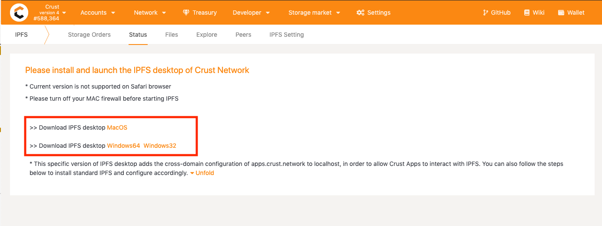
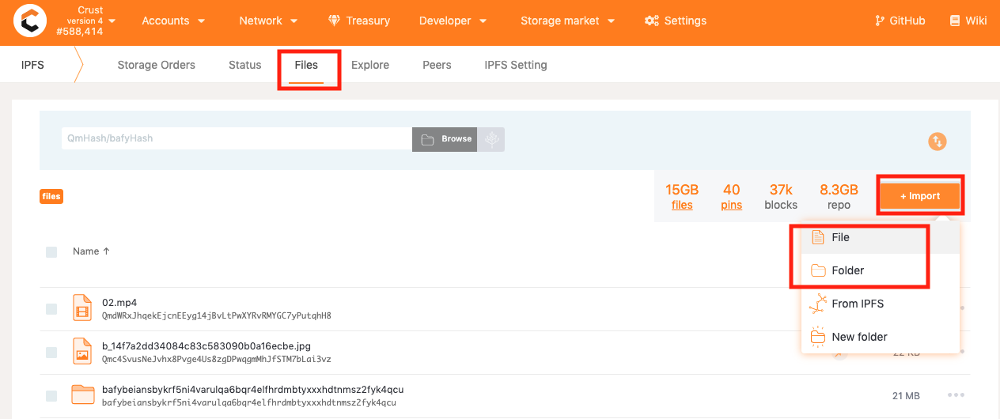
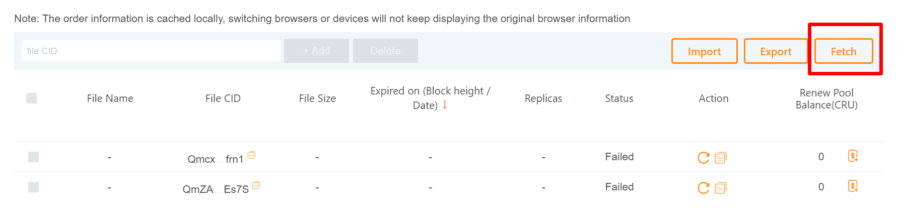

Users who use Crust are divided into users who have installed IPFS and users who have not installed IPFS. Among them, [users who have installed IPFS](#1-users-who-have-installed-ipfs) use Crust in the following three steps:

1. Upload. Users upload files to IPFS;

2. Place orders. Users generate storage orders on the Crust Network;

3. Retrieve. Users retrieve corresponding files through the IPFS Network.

For [users who have not installed IPFS](#2-users-who-have-not-installed-ipfs), also through the three steps of "upload", "order", and "retrieval", the difference is in the first step "upload": the user uploads the file to Crust network through the Gateway.

This guide describes the steps for ordinary Crust users to access data. Developers should go to [*Crust Developer Guide*](build-getting-started.md) for information.

## 1. Users who have installed IPFS

### 1.1 Upload

The purpose of this step is to allow you to upload files to IPFS. You can upload files through [Crust Apps](#111-Upload-files-via-Crust-Apps) or [IPFS Desktop](#112-Upload-files-via-IPFS).

If the file you want to store already exists on the IPFS Network and you have already obtained the CID of the file, you can skip this part and go directly to [2.2 Place orders for remote files](#22-Place-orders) to learn about more steps.

#### 1.1.1 Upload files via Crust Apps

1. Install, configure and run IPFS in Apps

Enter [Crust Apps](https://apps.crust.network) -> Storage User ->.  *If the following prompt appears, you need to install and run IPFS.*

For this, you have two options:

**Option 1: Install Crust-specific version of IPFS**

You can click on the prompt link to install and run the Crust-specific version of IPFS.

**Option 2: Use standard version of IPFS**

If you have already installed the [Standard IPFS](https://ipfs.io/#install), you need to follow a few configuration steps to adapt it to Crust Apps. You can click on the "Fold" button on the page and follow the prompts to configure accordingly.

The ways you install your IPFS may differ, but as long as the prompt no longer appears when you go to Crust Apps -> Files, it means your IPFS has been well configured.

2. Upload files

You can upload your files or folders to IPFS by going to [Crust Apps](https://apps.crust.network) -> Storage Market -> Storage User. You need to click on Files, click on "Import" in the upper right corner, choose "File" or "Folder", and confirm.

You will find the files or folders you just uploaded appear in your file list.

>Note: The uploaded files/folders are still on your local IPFS, and currently no node is there to help you store them.

#### 1.1.2 Upload files via IPFS

1. Install IPFS

You need to first install the [IPFS Desktop](https://docs.ipfs.io/install/ipfs-desktop/#windows) and start it.

The IPFS icon will show in the upper right corner after being started. Please click on the IPFS icon and click on "File" to enter the IPFS file system interface.

2. Upload files to IPFS

After entering the IPFS interface, you need to click on "Import" in the upper right corner, click on "File" or "Folder", select the files/folders you want to upload from the pop-up window, and confirm.

You will find the files or folders you just uploaded appear in your file list.

>Note: The uploaded files/folders are still on your local IPFS, and currently no node is there to help you store them.

### 1.2. Place orders

If you want to have Crust nodes to store your files, you need to first generate a storage order on the Crust Network. Users are enabled by the Crust Network to place orders for local files using Crust Apps and to generate orders for remote files only using file CIDs when the files are not locally available.

### 1.2.1 Place orders for local files using Crust Apps

The files or folders you have uploaded will be displayed here at [Crust Apps](https://apps.crust.network/#/storage) -> IPFS -> Files. You need to click on "..." to the right of the files/folders, and click on "Order" to open the order page.

Select the account for payment on the order page. The order page will calculate the size of the corresponding file and automatically displays the price to be paid. Please ensure that the account balance is larger than the File Price at the bottom, and click on "Confirm". Then enter the account password to authorize the transaction and generate the storage order.

> The "File Price" is the price that a user needs to pay for a file order, which includes the basic file fee, the fee for dynamic file adjustment and the tip. The basic file fee and the fee for dynamic file adjustment are mandatory, and the size of the tip is determined by the user which influences to what extent the order can be prioritized. Detailed descriptions on how order fees are calculated can be found in the [*Economic White Paper*](https://crust-data.oss-cn-shanghai.aliyuncs.com/crust-home/whitepapers/ecowhitepaper_en.pdf).

#### 1.2.2 Place orders for remote files

If your files are not available locally, you can place orders for your files on the Crust Network by using the CIDs and sizes of the files. To do so, you need to to go to [Crust Apps](https://apps.crust.network/#/storage) -> Storage Market  -> Storage User -> Storage Orders and click on "Place an order".

In the order page, you need to select an account for placing the order and fill in the file CID, file size and tip, and then click on “Confirm”. A storage order will be generated after you entering the password and confirming the action on the authorizing transaction page.

#### 1.2.3 Check order status

You can view all the storage orders of a given account through the "Fetch" feature nestled at [Crust Apps](https://apps.crust.network/#/storage) -> Storage Market -> Storage User.

After opening the Storage Orders page, you can click on "Fetch", select the account and data source for the query (developers can have their own data source for which they need to submit an application, and the approved data source will be displayed in the list for users to access) and click on the “Confirm”, and all orders of the account will be displayed.

The order statuses displayed in Crust Apps are detailed as follows:

* "Pending" indicates that the order file is being fetched by Crust nodes. Normally, the status will be updated within 30 minutes. But you can add storage fees to attract more nodes to prioritize the action.
  

    > **_Note 1:_** Please do not close IPFS or delete the file in IPFS when the "Pending" is in progress. Otherwise, storage nodes may fail to fetch the file.

    > **_Note 2:_** If the "Pending" status remains for more than 30 minutes, please refer to [solutions](appsStorageIssue.md).

* "Success" shows that the order file has been successfully stored by Crust nodes. Users can click on "Renew" to renew orders of this type.

* "Failed" suggests that an error has occurred to this order. The most common error occurs when you initiate an order but fill in an improper order size, thus resulting in an insufficient payment. If this happens, you can click on "Retry" button to re-generate an order. Please note to fill in the right file size and price this time. 

* "Expired" means that the order has expired. Under this circumstance, you will need to make sure that the file has a replica in the IPFS Network and then click on "Renew" to re-generate an order. 

#### 1.2.4 Renew the file pool balance

The file renewal pool mechanism is designed to help renew file services in Crust decentralized storage market. After placing an order for a file, a user can additionally deposit any amount of CRUs to the file's renewal pool. If storage order of the file expires (a file order expires 180 days after it is placed) and there are enough deposit left in the file renewal pool, any user who initiates a settlement for the file will re-activate the file order (regain a 180-day period) and in the meantime, the settlement initiator will receive a reward from the pool. Thus, as long as the file renewal pool balance is sufficient, there will always be someone motivated to settle files and renew corresponding orders timely.

The steps to add the pool balance are as follows:

1. Go to Crust Apps -> Storage Market -> Storage User -> Storage Orders page, check the file list and choose the file;

2. Click on "Add Balance";

3. Select the account, fill in the deposit amount and confirm in the pop-up box.

### 1.3 Retrieve

Once your files has been stored on Crust Network, you can access them via the file CIDs.

#### 1.3.1 Retrieve files using Crust Apps

You can retrieve any file stored on the IPFS or Crust Network using Crust Apps. The process is as follows.

Go to [Crust Apps](https://apps.crust.network/#/storage) -> Storage Market -> IPFS User, go to the "Files" list, click on "Import" and select "From IPFS" from the pop-up list.

The file(s) will be displayed in your file list when the retrieval is complete.

#### 1.3.2 Retrieve files using IPFS Desktop

To retrieve files through IPFS, please go to the "Files" page, click on "Import", select "From IPFS" as the import path, fill in the CIDs of the files you want to retrieve in the page that pops up, and click on "Import". IPFS will fetch the corresponding files from the Crust Network.

#### 1.3.3 Retrieve files using IPFS Gateway

If your device does not have IPFS installed, you can also access files stored on the Crust Network through any IPFS Gateway. Some common IPFS Gateways can be found [here](https://ipfs.github.io/public-gateway-checker/).

> An example: If we want to access the file whose CID is QmZcHFJy8wMpCH3gr6mEojszEv3k2MrSCF31PCVRQq3NQv through Crust Gateway, we can directly go to URL:`https://crustwebsites.net/ipfs/QmZcHFJy8wMpCH3gr6mEojszEv3k2MrSCF31PCVRQq3NQv`

## 2. Users who have not installed IPFS

If you do not have IPFS installed, you need to upload files to Crust through Crust Gateway.

To do so, you need to go to [Crust Apps](https://apps.crust.network/) -> Storage Market -> Storage User, and the page will be shown as follows.

There are 5 red-marked boxes in the above page.

1. The first box links to the entry of this page;
2. The second is a selection box for Gateways, from which you can choose the Gateway you want to use to upload files to Crust Network;
3. The third is the button for uploading;
4. The fourth contains "Import", "Export" and "Fetch". The "Import" and "Export" functions here can effectively save the cached file directory, while the "Fetch" function can obtain the orders placed by the user by querying on-chain information.
5. The fifth enables you to browse the status of previously placed orders and import new files to view the status;

### 2.1 Upload

1. Selecet a Gateway

    For users who do not have IPFS, they need to upload the file to Gateway first. Users can choose a nearby Gateway.

    

2. Select a file

  To upload files via the Storage User page, you need to click on "Upload", select a file in the pop-up window and open the file.
  

3. File upload with wallet authorization

    Before uploading the file, Gateway will verify the user's Crust account, and the user needs to sign with the Crust account in the pop-up window.

    >This authorization will not cost any transaction fee

    

### 2.2 Place orders

After the file has been selected and uploaded, a file order page will appear. Then you need to fill in the corresponding tip and click on "Confirm" to place the order.

> The "File Price" is the price that a user needs to pay for a file order, which includes the basic file fee, the fee for dynamic file adjustment and the tip. The basic file fee and the fee for dynamic file adjustment are mandatory, and the size of the tip is determined by the user which influences to what extent the order can be prioritized. Detailed descriptions on how order fees are calculated can be found in the [*Economic White Paper*](https://crust-data.oss-cn-shanghai.aliyuncs.com/crust-home/whitepapers/ecowhitepaper_en.pdf).

To check out the order, please go to [Check storage order](#123-check-order-status).

### 2.3 Retrieve

To retrieve file, please refer to [*Retrieve files*](#13-retrieve)

## 3. Order discount

Storage users can obtain a maximum 10% discount on storage orders by locking CRU tokens as a guarantee in the storage market equity module. For details, please refer to [Storage Market Equity](marketBenefits.md).
