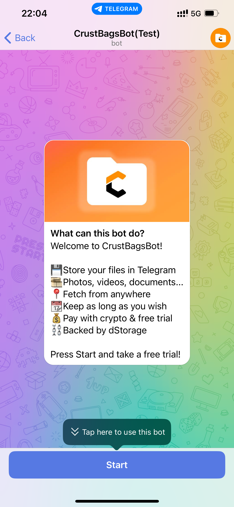
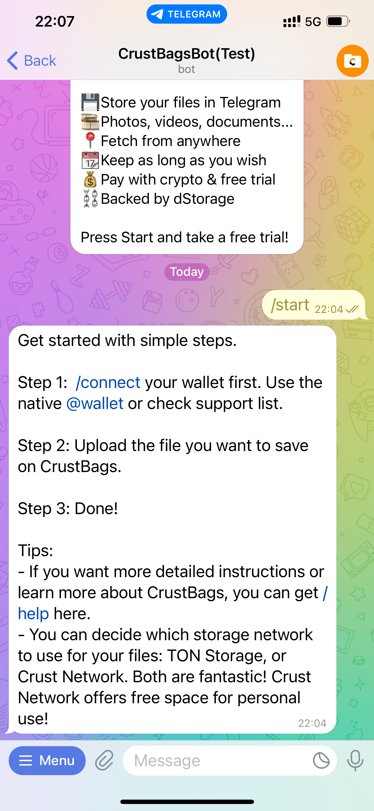
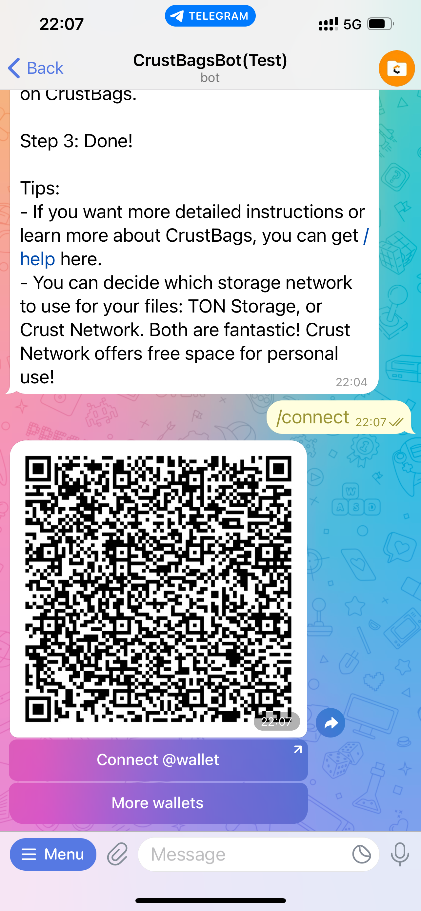
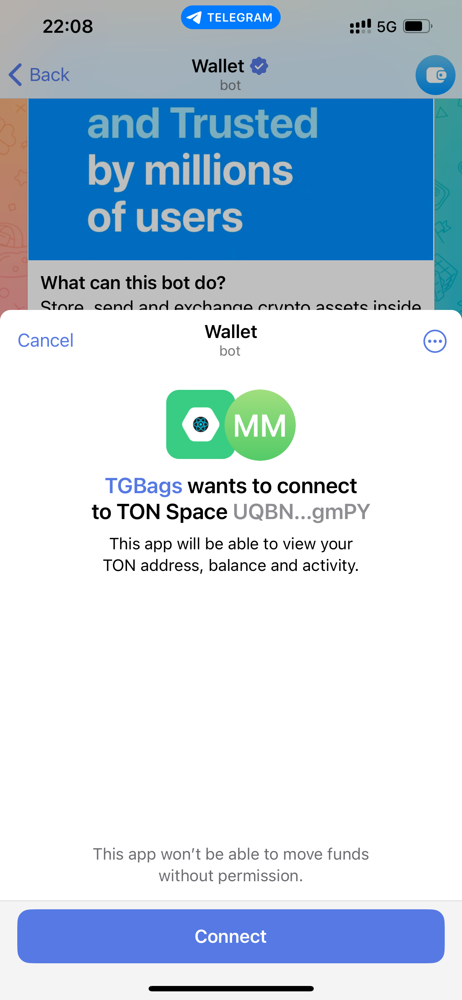
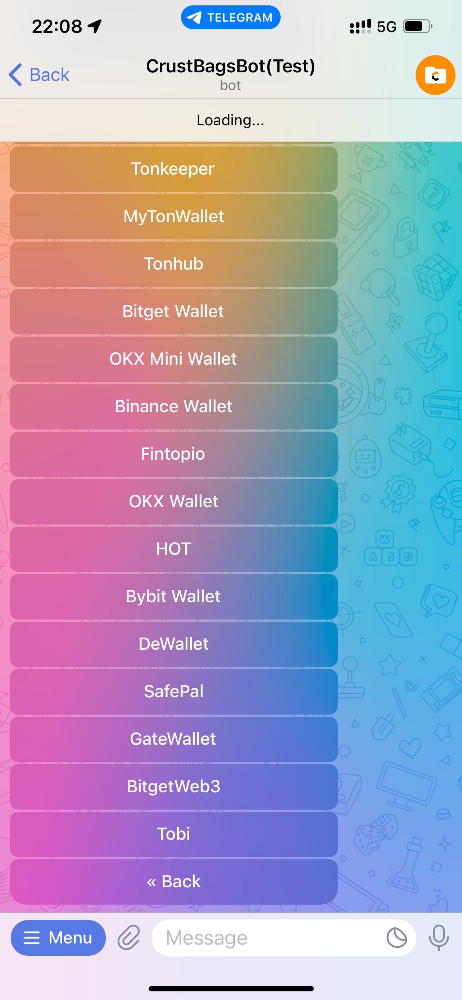
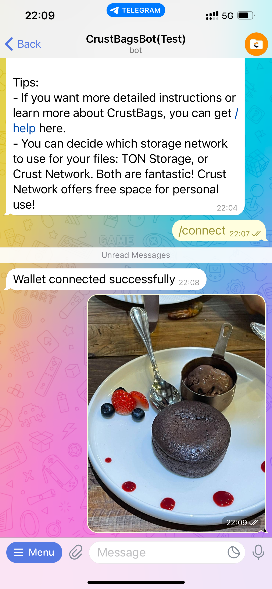
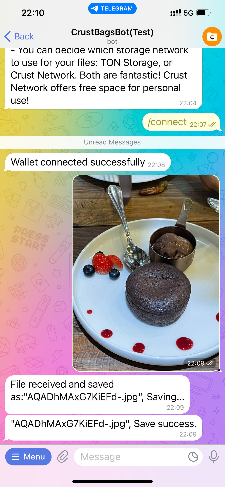
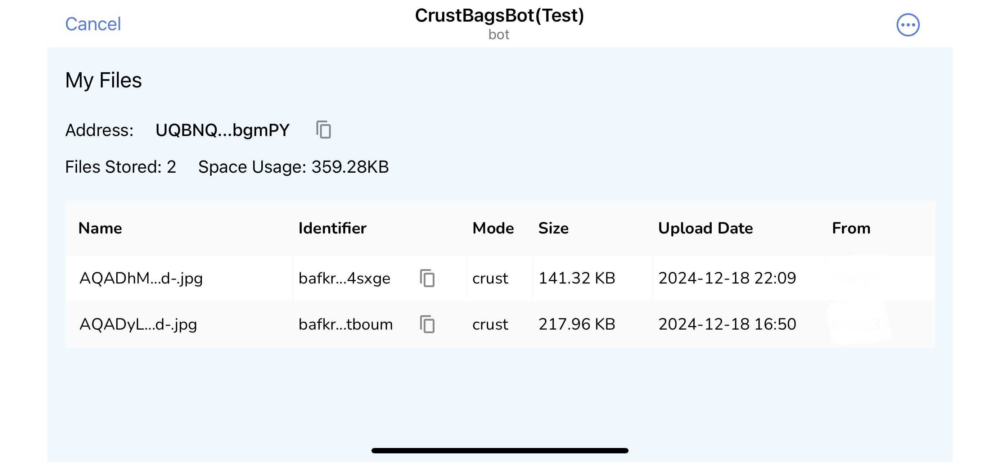

## I. About CrustBagsBot

### Introduction

A handy, easy-to-use Telegram bot is delivered to enhance end users experience with CrustBags in Telegram. Both mobile app and desktop app are supported. 

Search "CrustBagsBot" in Telegram and start to use the bot. Follow the steps would be pretty easy. In case you have any questions, please refer to the step-by-step instructions below. 

### Commands List

`/start` Show all commands.  

`/Connect` Connect to a wallet.

`/disconnect` Disconnect from the wallet (that has been connected).

`/my_wallet` Show the connect wallet and the exact address.

`/my_files` Show the list of my stored files inside of the miniapp. For any file stored in this bot, you will be able to view the file or download the file to your local devide anytime with CrustBagsBot.

`/mode` Manage storage mode. Currently two modes are provided: 1) `Ton Storage Mode`, which uses Ton Storage service providers for file storage. TON token shall be charged based on the file size. 2) `Crust Network Mode`, which uses the Crust Network for file storage. You will enjoy a free trial with this mode so that you will not be asked to pay for the file stored.  

`/help` Get help with the FAQ link or the user guidance link. Additionally, the telegram channel of Crust Network is displayed for further questions or bug reporting. 

## II. Step-by-step User Instruction

This is a step-by-step instruction for CrustBagsBot. You will find it friendly to use when you follow these steps. 

> Please make sure before use that you have installed a wallet inside your Telegram. Any wallet, including the native @wallet of Telegram, or the wallets that are supported by TON ecosystem, is good to go with the CrustBagsBot.  

#### Launch CrustBagsBot

Search "CrustBagsBot" and enter:  

Press `/start` and an instruction page with simple steps will be displayed. 

#### Connect a wallet  

Press `/connect` and you will find these options: 

  

The **QR code** provides a link for cross-device wallet connect, e.g. you are using desktop app but you need to connect your wallet installed in your mobile phone.  

The **Connect @wallet** option is for the native @wallet inside of Telegram. Click on the button and you will be redirected to the @wallet bot. Connect and go back.  

   

The **More wallets** option provides the full list of the wallets that are supported by TON ecosystem. Follow their user flows and complete the connect process.   

 

On successful wallet connect, you will be notified with a message. If you want to connect another wallet, just `/disconnect` and `/connect` your desired one.  

#### Upload a File  

Now you are ready to upload a file! Click on the **Attachment** button in the chat panel, choose from your gallery, and send the target file to the chat interface. In this example, a picture is sent to the chat. 

 

Once the file is sent to the bot, you will be notified with following messages on any updates of the storage status. The screen below show a successful storage execution:  

  
 
Remember, if you don't have enough balance in your wallet (in `Ton Storage Mode`), your storage execution will fail, and you will get an error message. 

####  View Your Files 

You can view the files stored by CrustBags with command `/my_files`:

  
 
You can either view or download the files to your local device.  

## III. FAQs

**Q: Where is my file stored?**

A: It depends on the storage mode you choose. In the `Ton Storage Mode`, your files are stored by storage providers of Ton Storage. In the `Crust Network Mode`, your files are stored by storage providers in the Crust Network. In the long term, Crust Network can provides storage backup for the Ton Storage.

**Q: Do I need to pay for the storage?**  

A: Still depends on the storage mode. In the `Ton Storage Mode`, you need to pay according to the pricing of Ton Storage, In the `Crust Network Mode`, you don't need to pay for small size files as a special bonus for community supporters. 

**Q: Why I have to connect my wallet even when I don't need to pay?**

A:  CrustBags uses Web3 Auth to verify user's identification. For every storage execution, CrustBags needs to check the signature from user's wallet even if there is no charge of storage fee. 

**Q: Will I lose my files if I delete the bot, or clear the chat history?**

A:  The files stored by CrustBags is secure by Ton Storage or Crust Network, both of which leverages peer2peer storage network and content addressable file system. You will always be able to retrieve your files with your wallet, regardless of the chat history.  

