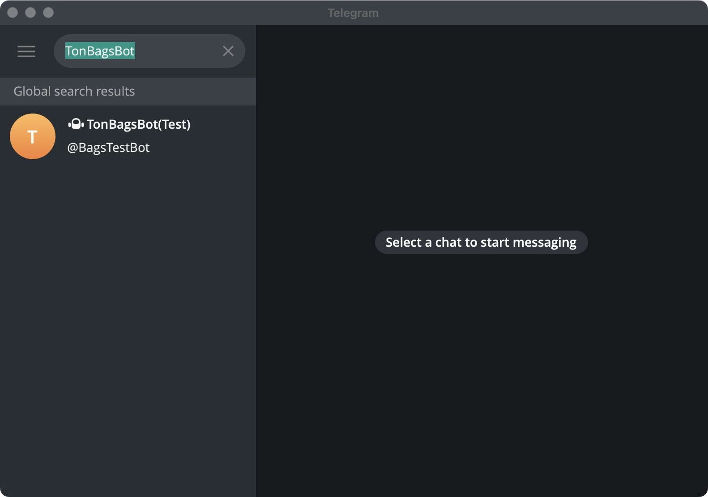
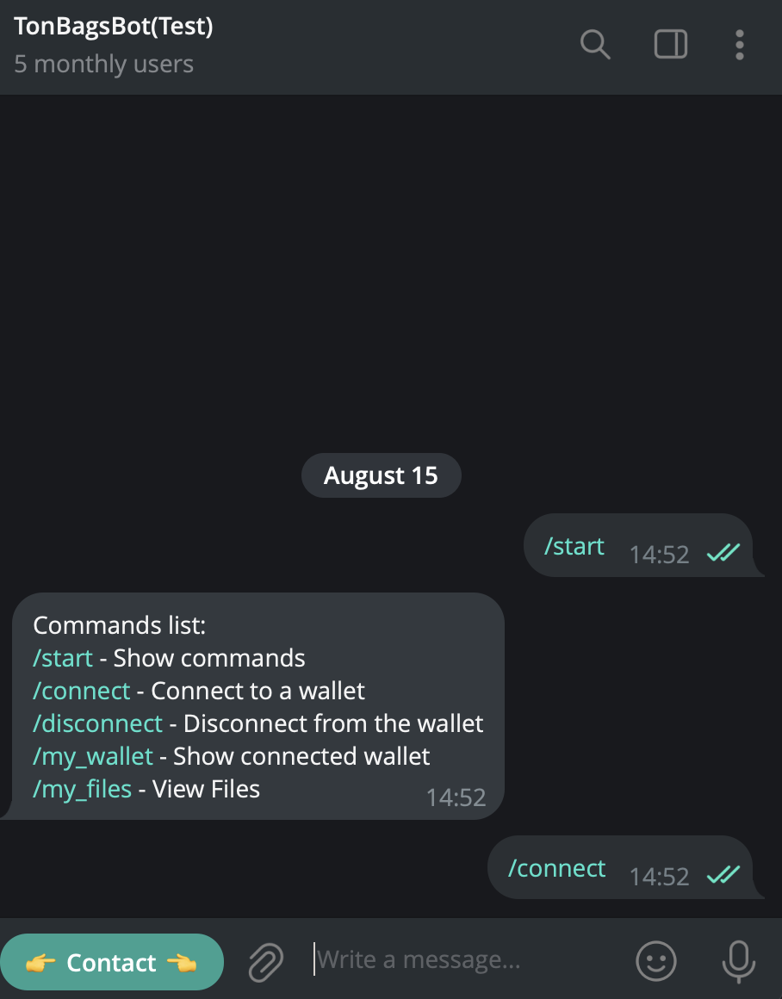
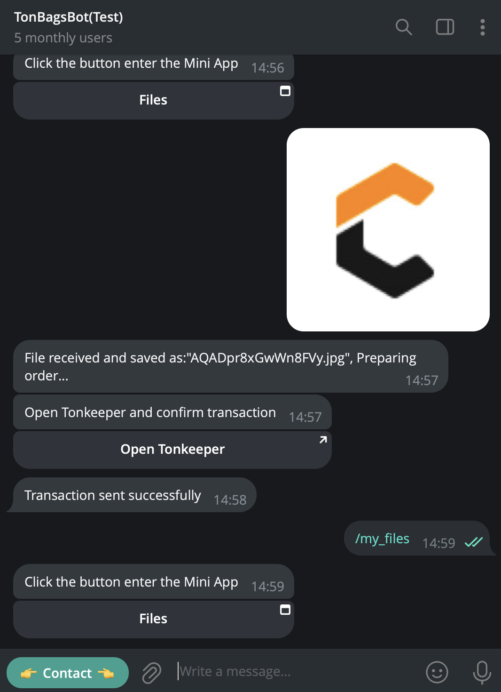
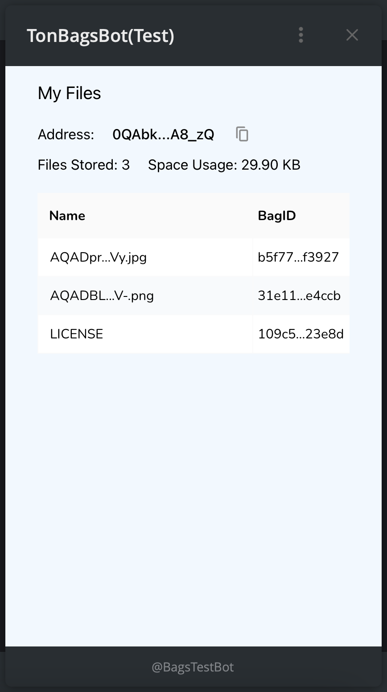

## I. Telegram Mini Apps

We have built a [Telegram Mini Apps](https://core.telegram.org/bots/webapps) for users to directly upload and store files to CrustBags in telegram.

1. In telegram, search and add TonBagsBot(Test)

   

2. Use '/connect' command to connect to your TON wallet

   

3. Select and upload some files. Confirm the transaction on the connected TON wallet.

4. Use '/my_files' command to launch the Mini Apps.

   

   