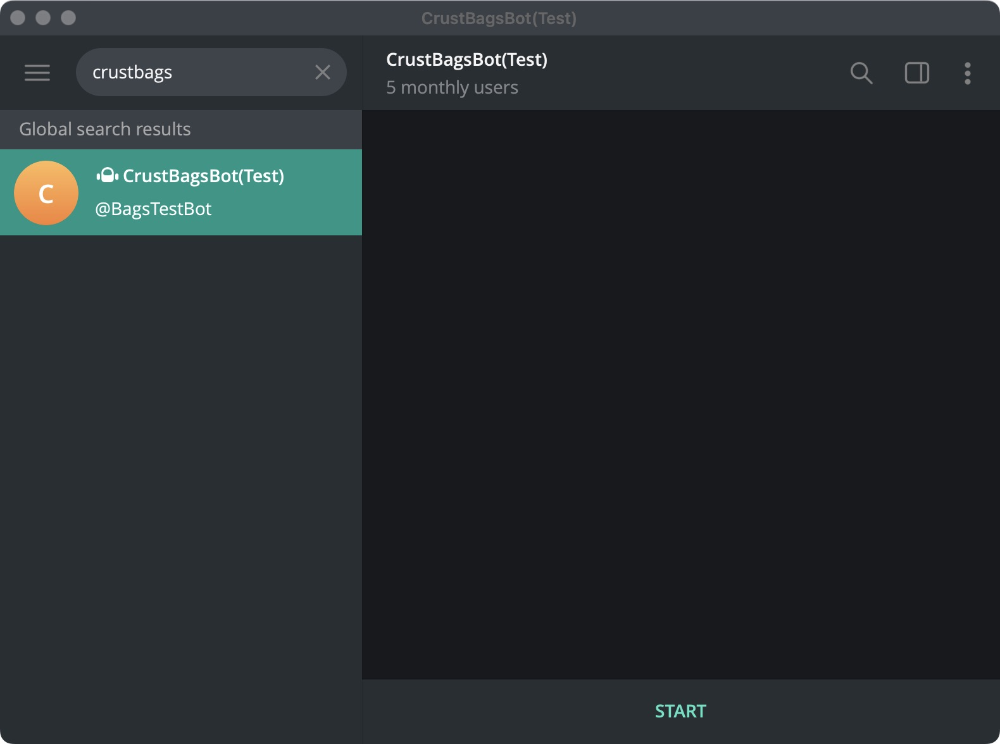
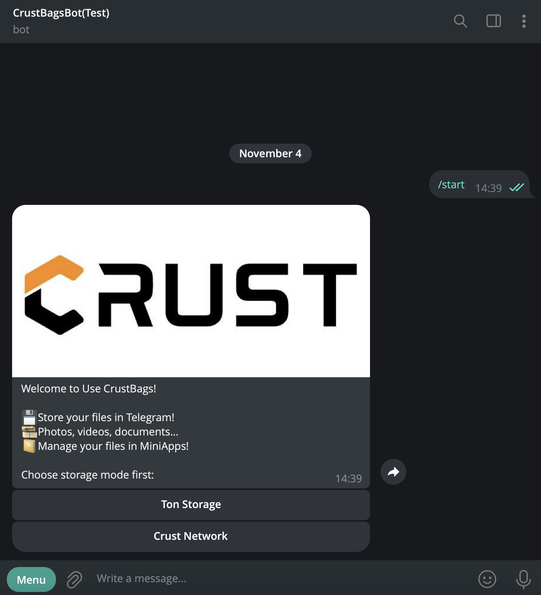
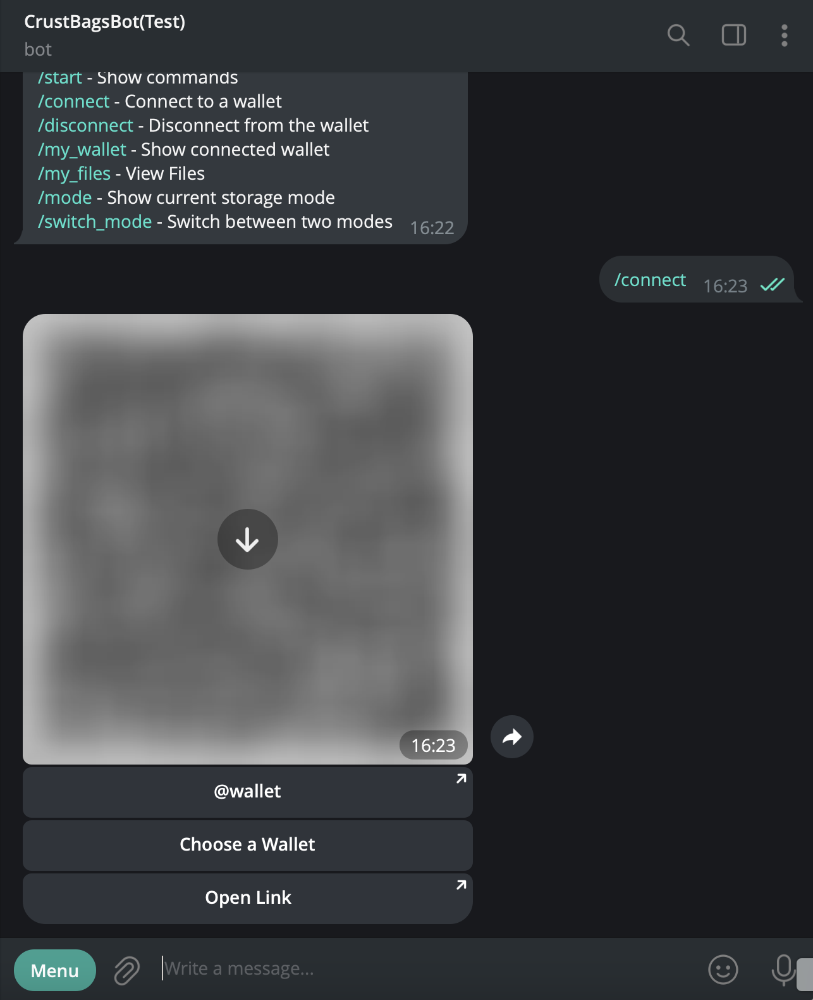
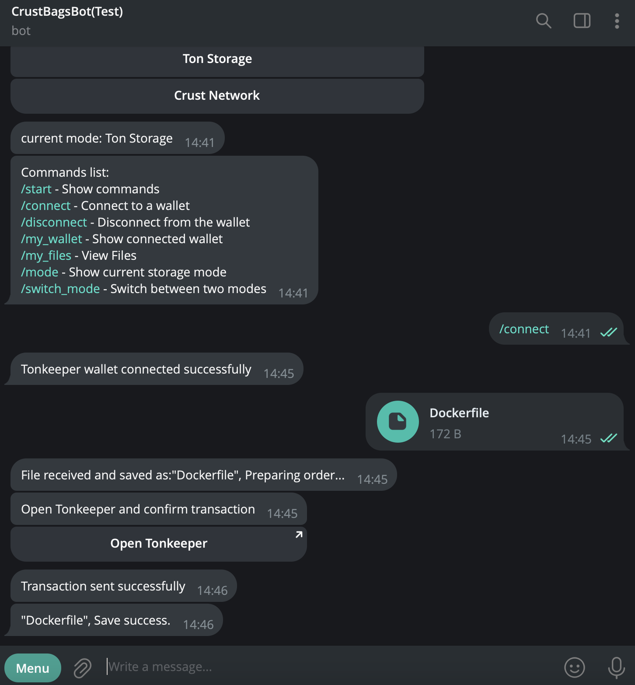
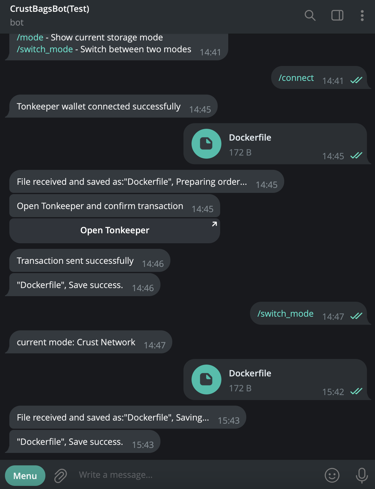
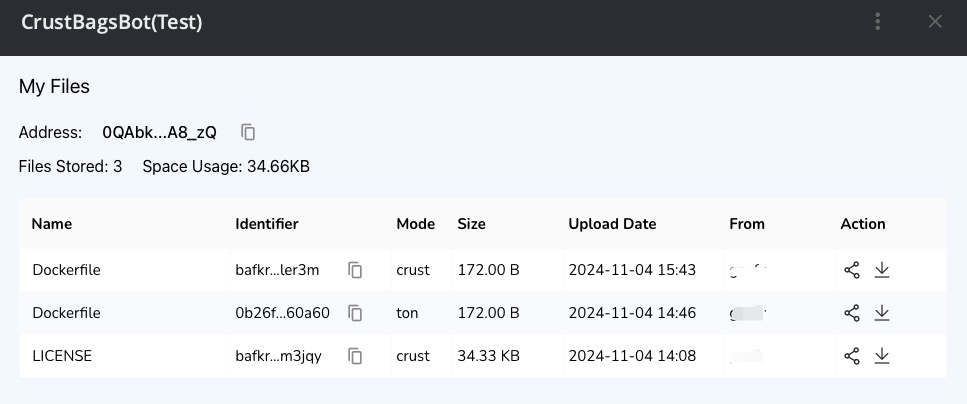

## I. Telegram Mini Apps

We have built a [Telegram Mini Apps](https://core.telegram.org/bots/webapps) for users to directly upload and store files to CrustBags (and optionally to Crust Network, for free) in telegram.

1. In telegram, search and add CrustBagsBot(Test)

   

2. Use '/start' command to select storage mode

   

3. Select 'Ton Storage' and use '/connect' command to connect to your TON wallet

   

4. Select and upload some files. Confirm the transaction on the connected TON wallet.

   

5. Uploading files in 'Ton Storage' mode requires to pay some $TON as storage fee. Optionally, you could use '/swith_mode' command to switch the mode to Crust Network and upload files for free.

   

6. Use '/my_files' command to launch the Mini Apps to view file list.

   